+++
date = '2026-09-18T12:00:00+03:00'
draft = false
title = 'Banner — HackMyVM'
tags = ["HackMyVM", "Linux", "Easy", "FTP", "SSH", "Hydra", "Pattern Recognition", "Sudo", "Privilege Escalation", "CTF Writeup"]
feature = 'feature.png'
showTableOfContents = true
+++

## Overview

Banner is a Linux machine from HackMyVM that rewards careful observation rather than relying only on automated enumeration. The attack chain started with an FTP banner that changed over time. By collecting the changing words and recognizing their structure, I recovered a clue that led to valid SSH credentials. After gaining access, a `sudo` rule and writable SSH configuration allowed me to restart `sshd` with root login enabled and authenticate as root using an SSH key.

## Step 1: Reconnaissance and Enumeration

I began with an Nmap service scan against the target at `192.168.56.116`.

```
nmap -sV -sC 192.168.56.116
```

```
PORT     STATE SERVICE VERSION
21/tcp   open  ftp     vsftpd 2.0.8 or later
22/tcp   open  ssh     OpenSSH 8.4p1 Debian 5+deb11u3
8080/tcp open  http    Werkzeug 3.1.6 (Python 3.9.2)
```

**Key Findings:**

- FTP was exposed on port 21, but anonymous access was not allowed.
- SSH allowed password authentication, making valid credentials a possible entry point.
- Port 8080 hosted a Python-based web application presenting a network security knowledge challenge.

### FTP

Although I could not authenticate to FTP anonymously, the server banner contained an unusual instruction:

```
220-Carefully observe the changes in the information above.
```

The three words displayed above the instruction changed between connections. For example, one banner displayed `Wild Elephants Love`, while another displayed `Clever Owls Make`.

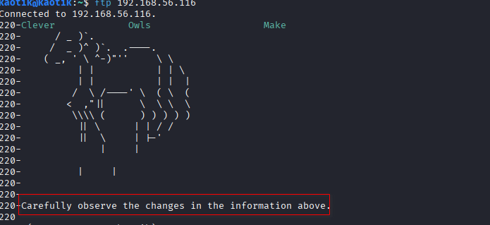

I also noticed that the service returned a different banner when I supplied different usernames, but each attempt still ended with a permission error.

### SSH

SSH was running on port 22 and accepted password authentication. I kept this in mind as a likely route once I identified the correct username and password.

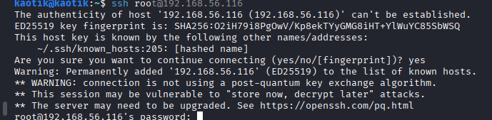

### HTTP

The service on port 8080 hosted a challenge site containing cybersecurity questions.

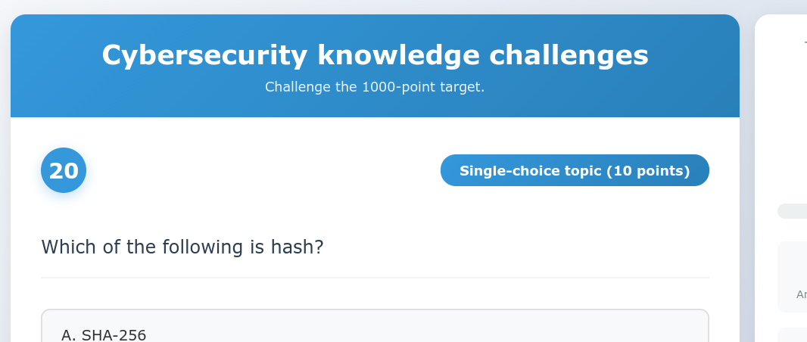

I used **Feroxbuster** to map the application:

```
feroxbuster -u http://192.168.56.116:8080 \\
  -w /usr/share/wordlists/dirbuster/directory-list-2.3-medium.txt \\
  -C 404
```

The scan revealed three interesting endpoints:

- `/console`
- `/api/questions`
- `/api/submit`

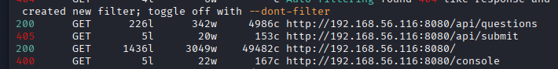

The `/console` endpoint returned `400 Bad Request` for both GET and POST requests. I could not determine the required parameters, so I returned to the changing FTP banner.

## Step 2: Initial Access

The FTP message told me to observe the changes, so I collected the banner words over several minutes. The first five responses were:

```
Wild       Elephants   Love
Clever     Owls        Make
Elephants  :           Mice
Amazing    Zebras      Eat
Snakes     Eat         Crickets
```

After the fifth response, the sequence repeated. I wrote a small script to collect each banner and build a unique wordlist.

```
#!/bin/bash

ip="192.168.56.116"
wordlist="ftp_words.txt"

for i in $(seq 1 15); do
  echo -n "$(date +%H:%M:%S) - "
  banner=$(echo "QUIT" | nc "$ip" 21 | grep "^220-" | head -1)
  echo "$banner"

  cleaned_words=$(echo "$banner" | sed 's/^220-//' | tr -d ':' | tr -s ' ' '\n' | grep -v '^$')

  if [ -n "$cleaned_words" ]; then
    while read -r word; do
      if ! grep -qx "$word" "$wordlist" 2>/dev/null; then
        echo "$word" >> "$wordlist"
        echo " [+] New word added to $wordlist: $word"
      fi
    done <<< "$cleaned_words"
  fi

  sleep 60
done
```

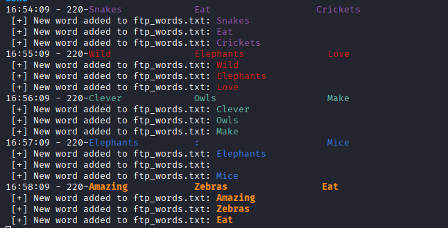

The collected words did not work as a straightforward username and password wordlist. I then compared the banner structure instead of treating each word independently. The first two lines contained three words each, while the third contained two words separated by a colon. Only the first letter of each word was capitalized.

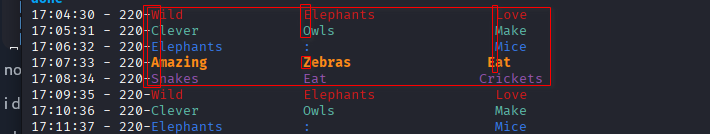

Reconstructing the pattern produced the phrase `WELCOME : MAZESEC`. I used `welcome` as the likely username and treated the second part as the password candidate. To avoid exposing the credential in this writeup, I have redacted it below.

I placed the two lowercase candidates in `list.txt`:

```
welcome
<REDACTED>
```

I tested the candidate combinations with Hydra:

```
hydra -L list.txt -P pass.txt ssh://192.168.56.116
```

The attack succeeded and provided SSH credentials. The password is intentionally omitted here as `<REDACTED>`.

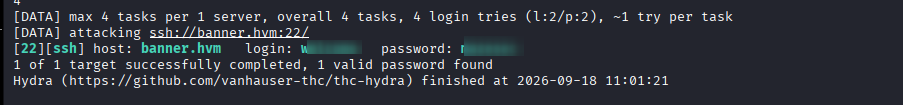

I used the recovered credentials to log in over SSH and gain initial access as `welcome`.

```
ssh welcome@192.168.56.116
```

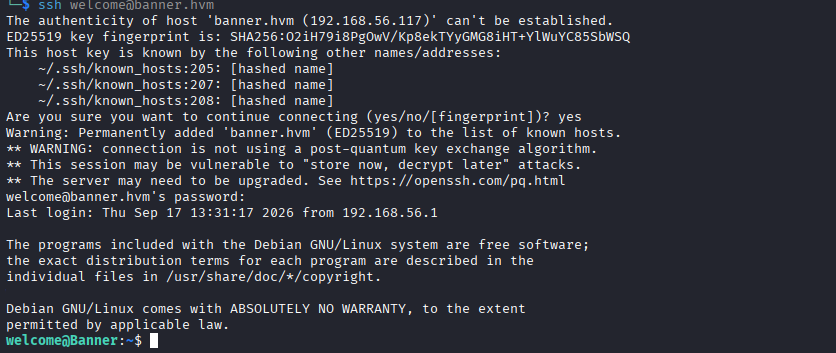

## Step 3: Privilege Escalation

Once logged in, I checked the commands available through `sudo`.

```
sudo -l
```

My account could restart the SSH service as root without entering a password:

```
/sbin/service sshd restart
```

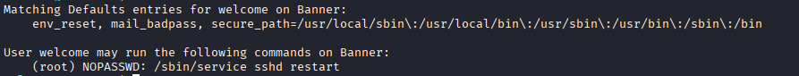

The restart permission alone was not enough, so I checked whether I could modify the SSH daemon configuration.

```
ls -la /etc/ssh/sshd_config
```

The file permissions confirmed that I could write to `sshd_config`.

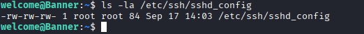

### Enabling Root SSH Login

I generated an SSH key pair for authentication. The private key contents are not included in this writeup.

```
ssh-keygen -t rsa
```

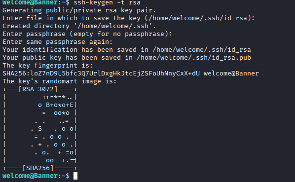

I replaced the writable SSH configuration with the following minimal settings:

```
PermitRootLogin yes
StrictModes no
AuthorizedKeysFile /home/welcome/.ssh/id_rsa.pub
```

This configuration enabled root login and instructed SSH to use my public key from the `welcome` user's home directory.

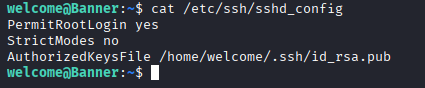

I restarted the SSH service using the permitted `sudo` command:

```
sudo /sbin/service sshd restart
```

Finally, I authenticated as root using the generated private key:

```
ssh -F /dev/null -i /home/welcome/.ssh/id_rsa root@localhost
```

This gave me a root shell on the target.

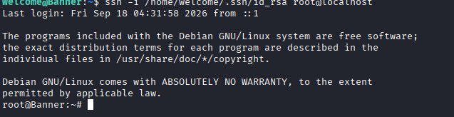

## Conclusion

The attack chain was:

1. Changing FTP banners revealed a structured word pattern.
2. Pattern reconstruction exposed a username and password clue for SSH.
3. SSH password authentication provided access as `welcome`.
4. A passwordless `sudo` rule allowed restarting `sshd`.
5. Writable SSH configuration enabled root login with a controlled public key.
6. SSH key authentication provided a root shell.

To secure the machine, I would recommend:

- Remove sensitive clues from service banners and keep banners static.
- Disable SSH password authentication after deploying key-based access.
- Prevent unprivileged users from modifying `/etc/ssh/sshd_config`.
- Restrict `sudo` permissions to the smallest required command set.
- Keep `PermitRootLogin` disabled and validate SSH configuration ownership and permissions.
