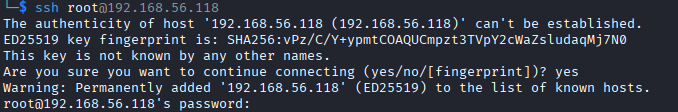
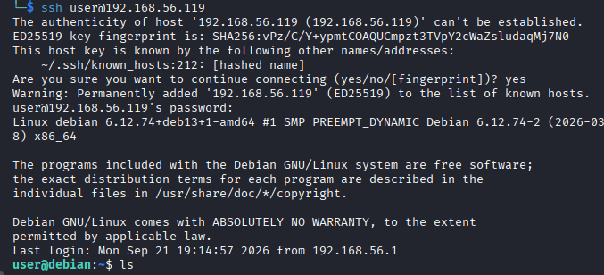
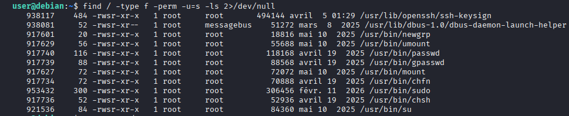
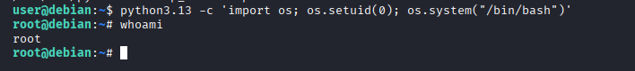

+++
date = '2026-09-21T10:30:00+03:00'
draft = false
title = 'Bonjour — HackMyVM'
tags = ["HackMyVM", "Linux", "Easy", "SSH", "mDNS", "ZeroConf", "DNS-SD", "Linux Capabilities", "CTF Writeup"]
feature = 'feature.png'
showTableOfContents = true
+++

## Overview

Bonjour is a Linux box that rewards patient, scope-expanding enumeration. A full TCP scan turned up only SSH, so I tested the service directly and then widened my sweep to UDP, where an mDNS responder on port 5353 leaked SSH credentials through a DNS service discovery (DNS-SD) TXT record. Once inside, the route to root was far from direct: sudo was denied, there were no crontabs, no other user to pivot to, and none of the SUID binaries could be weaponized. Only after exhausting those rabbit holes did a capability check reveal a `python3.13` binary carrying `cap_setuid`, which I abused to spawn a root shell.

## Step 1: Reconnaissance and Enumeration

### Initial TCP Scan

The assessment began with a full TCP port scan against the target (192.168.56.118) to map the attack surface.

```
nmap -sV -sC -p- 192.168.56.118
```

```
PORT   STATE SERVICE VERSION
22/tcp open  ssh     OpenSSH 10.0p2 Debian 7+deb13u2 (protocol 2.0)
```

**Key Findings:**

- Only port 22 (SSH) is exposed over TCP.
- OpenSSH 10.0p2 is not affected by any known vulnerability.
- Nothing else is listening on the host.

There wasn't much to work with: a single service, no known CVE for the version, and a completely silent picture beyond it. The only avenue left was SSH itself, so I decided to interact with the service before committing further effort.

### SSH Password Authentication Test

Even though the version has no known vulnerability, I connected over SSH to see how the server would respond and whether password authentication was actually accepted on the system.

```
ssh root@192.168.56.118
```



The login prompt confirmed that password authentication is allowed, meaning the server was willing to accept a password. SSH could be a viable route into this box, but only if I found credentials to use it with.

### UDP Enumeration

With the TCP route looking thin and offering nothing to attack directly, I decided to run a second scan, this time over UDP. The initial sweep immediately caught my attention by revealing two services running over UDP.

```
sudo nmap -sU -A 192.168.56.118
```

```
PORT     STATE         SERVICE
68/udp   open|filtered dhcpc
5353/udp open          zeroconf
```

Port 5353 stood out immediately. ZeroConf, also known as multicast DNS or mDNS, is used for service discovery on local networks, and it's not something you typically see on a CTF box. Its presence confirmed that more services were running over UDP than the TCP scan had shown, so I decided to redo the scan, this time targeting the top 100 UDP ports with aggressive detection.

```
sudo nmap -sU --top-ports 100 192.168.56.118 -A
```

```
PORT     STATE SERVICE VERSION
5353/udp open  mdns    DNS-based service discovery
| dns-service-discovery:
|   22/tcp ssh:
|     ipv4: 192.168.56.118
|     name: debian SSH
|     hostname: debian
|     TXT:
|_      username=user password=<REDACTED>
```

The aggressive scan on port 5353 paid off. The DNS service discovery (DNS-SD) records not only confirmed that the host runs an SSH service, but the TXT entry leaked what looked like potential credentials for SSH authentication.

## Step 2: Initial Access

Using the credentials I recovered from the mDNS leak, I gained SSH access to the target as `user`.

```
ssh user@192.168.56.118
```



## Step 3: Privilege Escalation

### Internal Enumeration

With a low-privileged foothold secured, I began enumerating for escalation vectors, working through the standard checklist and chasing down several rabbit holes along the way.

First, I checked whether my account could execute commands with sudo. Though the system's language is French, the output left no doubt that `user` cannot use sudo at all.

```
sudo -l
```

```
user@debian:~$ sudo -l
[sudo] Mot de passe de user :
Désolé, l'utilisateur user ne peut pas utiliser sudo sur debian.
```

With sudo ruled out, I checked for any scheduled tasks that might run with higher privileges.

```
user@debian:~$ crontab -l
no crontab for user
```

I then looked for other users on the system I could pivot into. The result gave me nothing to work with. `/home` contains only `user`, so lateral movement between local accounts wasn't an option.

```
user@debian:/home$ ls
user
```

### Looking for SUID Binaries

That left me with nothing but basic information, so next I checked for any SUID binaries that would enable an escalation.

```
find / -type f -perm -u=s -ls 2>/dev/null
```



The search returned results, but on close inspection I didn't find anything I could weaponize. The setuid binaries were all stock system utilities with no known abuse path on this Debian release, so this one turned into another rabbit hole.

### Checking for Capabilities

With the SUID path dead, I decided to check for any Linux capabilities on the system before falling back to a full LinPEAS sweep. My first attempt to run `getcap` hit a wall. The command wasn't found through my shell, which suggested it either wasn't installed or simply wasn't in my PATH.

```
user@debian:~$ getcap
-bash: getcap : commande introuvable
```

So I first confirmed whether the command was actually installed on the system at all.

```
find / -name getcap 2>/dev/null
```

It turned out `getcap` was installed all along, it just lives in `/usr/sbin`, a directory that isn't in my PATH. To use it I had to specify the full path to the binary.

```
/usr/sbin/getcap -r / 2>/dev/null
```


The check was a hit. The Python 3.13 binary at `/usr/bin/python3.13` was found to have the `cap_setuid` capability set with effective and permitted flags (`ep`). This capability allows a process to arbitrarily change its user ID, including setting it to 0 (root), without requiring SUID root privileges. That was exactly the escalation path I'd been looking for.

Abusing it to spawn a root shell:

```
python3.13 -c 'import os; os.setuid(0); os.system("/bin/bash")'
```



## Conclusion

This lab showed how a misconfigured network service and a loose file capability can lead to full root compromise. Taking my time and sticking to a methodical enumeration flow paid off here, because the box has a minimal attack surface:

1. TCP enumeration revealed only SSH, so I tested the service and then widened the scope with a UDP scan.
2. A UDP sweep exposed mDNS on port 5353.
3. DNS service discovery leaked SSH credentials for the `user` account.
4. Post-exploitation enumeration dead-ended through sudo, crontabs, other users, and SUID binaries.
5. Linux capability enumeration found `python3.13` with `cap_setuid` set.
6. The `cap_setuid` capability was abused to impersonate root and spawn a shell.

To secure the environment, the following remediations are recommended:

- **Disable or restrict mDNS/ZeroConf** on servers and ensure DNS service discovery does not expose service credentials in TXT records.
- **Remove service credential metadata** from network discovery responses and manage service configuration through a secured toolchain.
- **Audit Linux capabilities:** remove unnecessary capabilities such as `cap_setuid` from binaries and files.
- **Enforce least privilege** on the public attack surface and reduce exposed services to those strictly required.