+++
date = '2026-06-30T15:00:00+03:00'
draft = false
title = 'Cyborg — TryHackMe'
tags = ["tryhackme", "linux", "boot2root", "borgbackup", "privilege escalation", "squid", "md5"]
feature = 'feature.png'
showTableOfContents = true
+++

## Overview

Cyborg is a Linux box that involves discovering exposed directories on a web server, cracking an MD5 hash to access a Borg backup archive, recovering credentials from inside the backup, and escalating privileges via a sudo-backed script with command injection.

## Step 1: Reconnaissance and Enumeration

An nmap scan revealed two open ports: SSH (22) and HTTP (80) running Apache.

```
nmap -sV -sC 10.48.145.65
```

```
PORT   STATE SERVICE REASON         VERSION
22/tcp open  ssh     syn-ack ttl 62 OpenSSH 7.2p2 Ubuntu 4ubuntu2.10 (Ubuntu Linux; protocol 2.0)
| ssh-hostkey:
|   2048 db:b2:70:f3:07:ac:32:00:3f:81:b8:d0:3a:89:f3:65 (RSA)
|   256 68:e6:85:2f:69:65:5b:e7:c6:31:2c:8e:41:67:d7:ba (ECDSA)
|   256 56:2c:79:92:ca:23:c3:91:49:35:fa:dd:69:7c:ca:ab (ED25519)
80/tcp open  http    syn-ack ttl 62 Apache httpd 2.4.18 ((Ubuntu))
|_http-title: Apache2 Ubuntu Default Page: It works
|_http-server-header: Apache/2.4.18 (Ubuntu)
```

Port 22 supports password authentication.

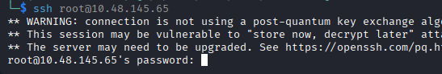

### Directory Busting

**Gobuster** discovered two interesting endpoints: `/admin` and `/etc`.

```
gobuster dir -u http://10.48.145.65/ -w /usr/share/wordlists/dirbuster/directory-list-2.3-small.txt
```

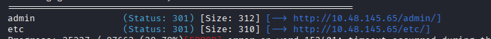

### /admin Endpoint

The `/admin` directory contained Borg backup archive files, and revealed three users: **Alex**, **Josh**, and **Adam**.

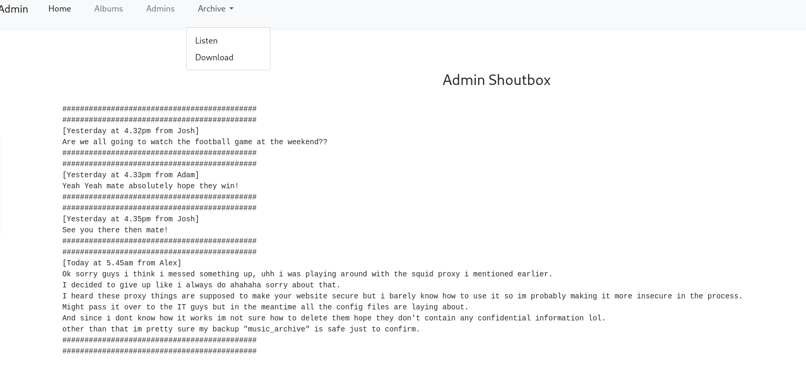

### /etc Endpoint

The `/etc` directory exposed a `squid` folder with configuration files.

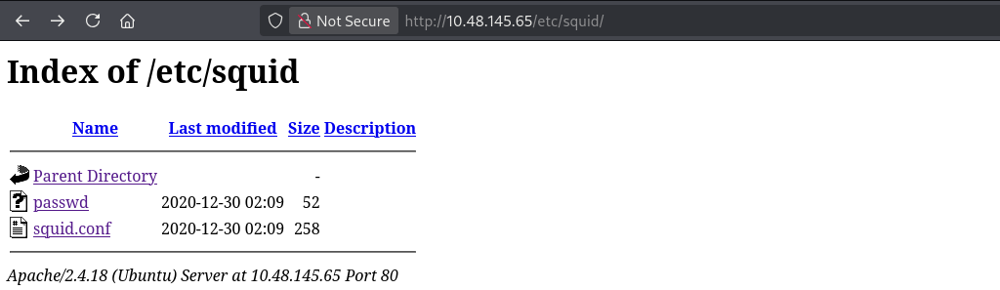

A `passwd` file contained credentials.

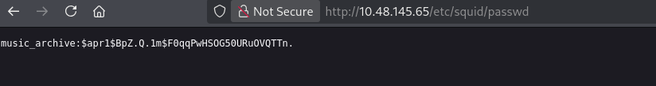

The `squid.conf` configuration file contained an MD5 hash embedded in it.

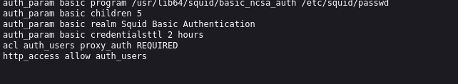

## Step 2: Initial Access

### Cracking the Hash

The MD5 hash from `squid.conf` was cracked to reveal the password.

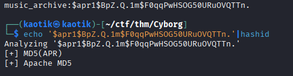
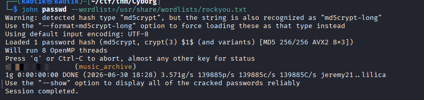

### Borg Backup Extraction

Using the cracked password, the Borg backup archive for user **alex** was extracted.

```
borg extract /path/to/archive::alex
```

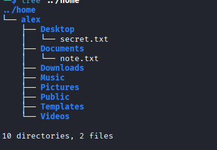

The extracted files contained notes with Alex's SSH password.

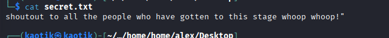
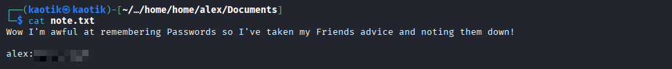

### SSH Access

Using the recovered credentials, an SSH session was established as **alex**.

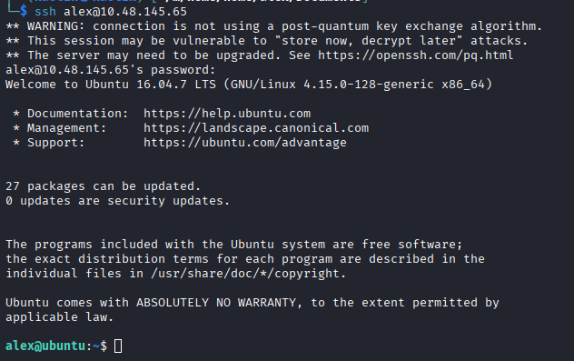

## Step 3: Privilege Escalation

### Sudo Permissions

Checking sudo access revealed that **alex** could run `/etc/mp3backups/backup.sh` as root without a password.

```
sudo -l
```

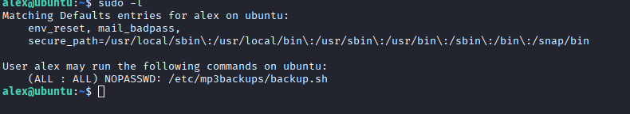

### Analysing backup.sh

The backup script had a `-c` flag that executed arbitrary commands via `$command`:

```bash
while getopts c: flag
do
        case "${flag}" in
                c) command=${OPTARG};;
        esac
done

cmd=$($command)
echo $cmd
```

### File Permissions

Alex owned the file, so write permission was granted.

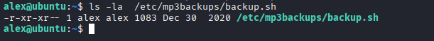

```
chmod +w /etc/mp3backups/backup.sh
```

### Command Injection

A command was injected via the `-c` flag to spawn a root shell.

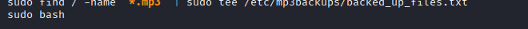

```
sudo /etc/mp3backups/backup.sh -c 'bash'
```

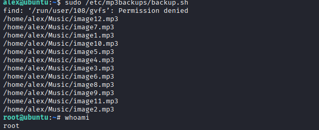

## Conclusion

Cyborg demonstrates the importance of restricting directory listing on web servers, using strong unique passwords for archive encryption, and auditing sudo permissions. The attack chain exploited information disclosure via directory traversal, a weak MD5 hashed password, and a command injection vulnerability in a script running with elevated privileges. Remediations include disabling directory listing in Apache, using strong encryption passphrases for Borg backups, and avoiding command execution patterns in sudo-allowed scripts.
