+++
date = '2026-09-07T10:00:00+03:00'
draft = false
title = 'Drifting Blues — HackMyVM'
tags = ["HackMyVM", "Linux", "Easy", "Apache", "Directory Bruteforcing", "John the Ripper", "DirtyCow", "Privilege Escalation", "CTF Writeup"]
feature = 'feature.png'
showTableOfContents = true
+++

## Overview

Drifting Blues is a HackMyVM CTF machine that demonstrates a classic web application attack chain leading to full system compromise. The attack started with enumeration of a single web server running Apache, which led to discovering a hidden Textpattern CMS installation through robots.txt. A password-protected ZIP archive found via directory bruteforcing contained credentials for the CMS, allowing file upload of a reverse shell. After gaining initial access as www-data, I exploited a vulnerable kernel version using the DirtyCow exploit to escalate privileges to root.

## Step 1: Reconnaissance and Enumeration

I started with an nmap scan against the target to identify running services.

```
nmap -sV -sC -p- 192.168.56.113
```

```
PORT   STATE SERVICE REASON         VERSION
80/tcp open  http    syn-ack ttl 64 Apache httpd 2.2.22 ((Debian))
| http-methods: 
|_  Supported Methods: GET HEAD POST OPTIONS
|_http-server-header: Apache/2.2.22 (Debian)
|_http-title: driftingblues
| http-robots.txt: 1 disallowed entry 
|_/textpattern/textpattern
```

**Key Findings:**

- Only port 80 was open, running Apache 2.2.22 on Debian.
- The `robots.txt` file revealed a disallowed entry pointing to `/textpattern/textpattern`.

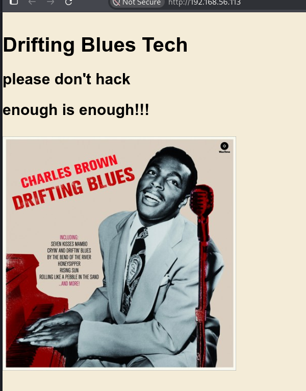

Visiting the landing page confirmed the server was running.

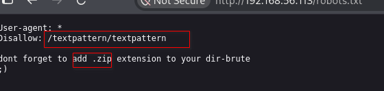

The `robots.txt` file contained a hint pointing to a directory bruteforce with a `.zip` extension to include.

## Step 2: Directory Bruteforcing

With the hint from `robots.txt`, I ran a directory bruteforce using **Feroxbuster**.

```
feroxbuster -u http://192.168.56.113 -w /usr/share/wordlists/dirbuster/directory-list-2.3-medium.txt -x .zip
```

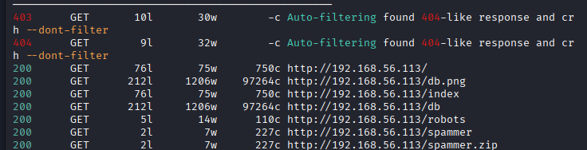

The scan discovered a file called `/spammer.zip`.

## Step 3: Gaining Credentials

I visited the path listed in `robots.txt` and discovered a Textpattern login page.

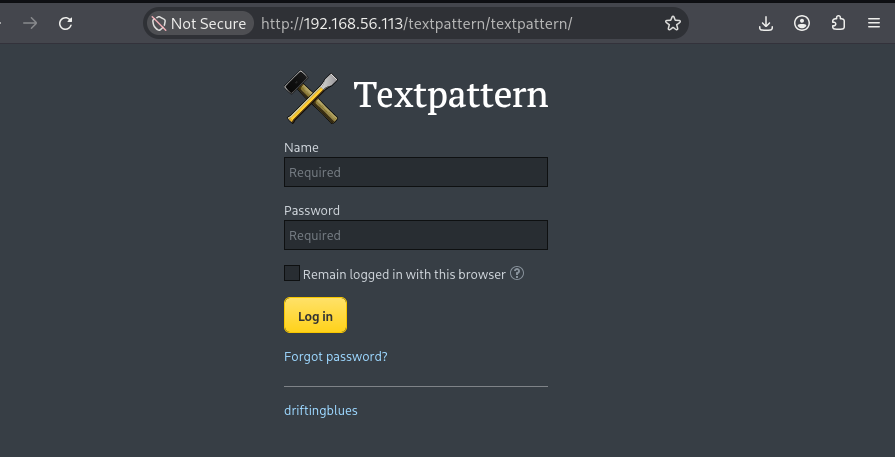

I needed credentials to access the site. After downloading the `spammer.zip` file, I attempted to unzip it but it was password protected. However, it contained an interesting file called `creds.txt`.

I extracted the password hash using **zip2john**.

```
zip2john spammer.zip > hash
```

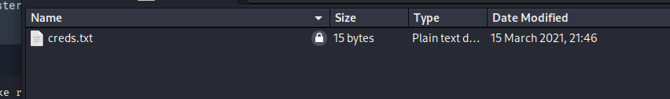

I cracked the hash using **John the Ripper** and obtained the password.

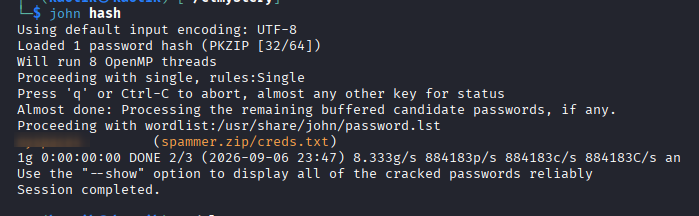

After unzipping with the recovered password, I found a single pair of words which were potential username and password.

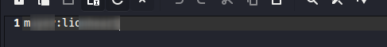

## Step 4: Initial Access

I used the recovered credentials to successfully log into the Textpattern CMS.

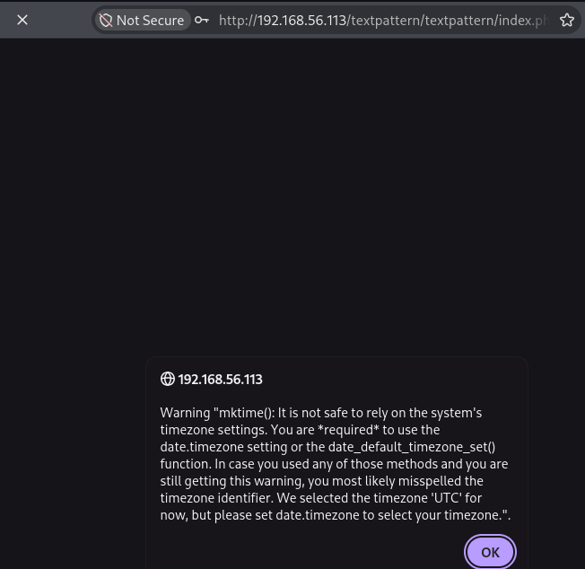

The site appeared to be a blog writing platform.

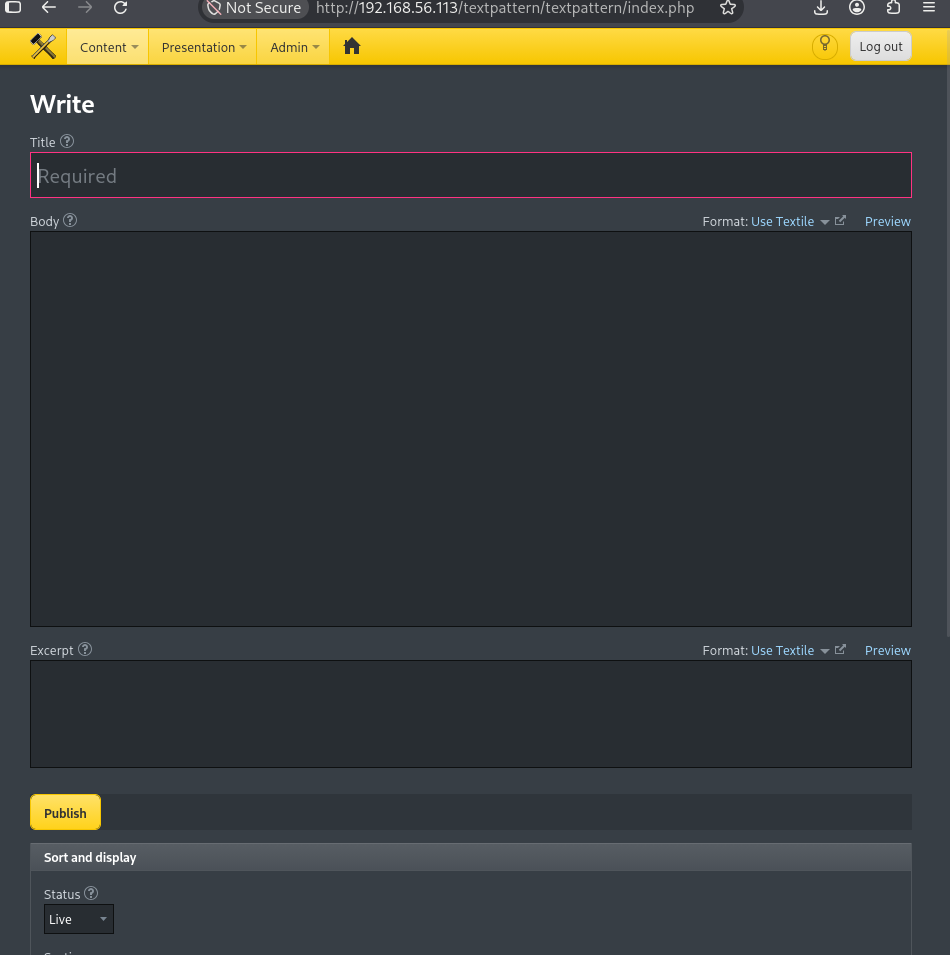

Exploring the site under the Content menu, I discovered a file upload functionality.

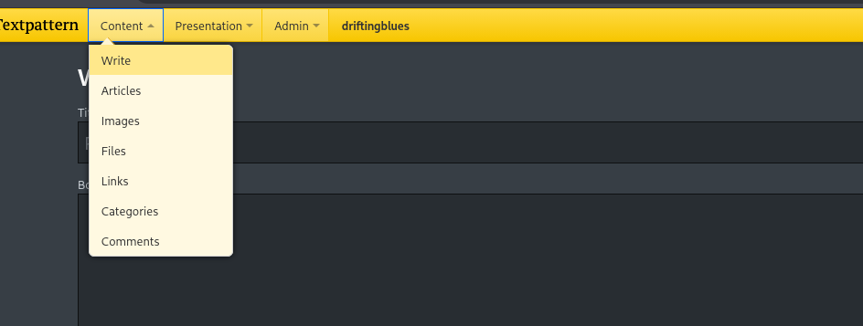

Visiting the Files section, I uploaded a PHP reverse shell.

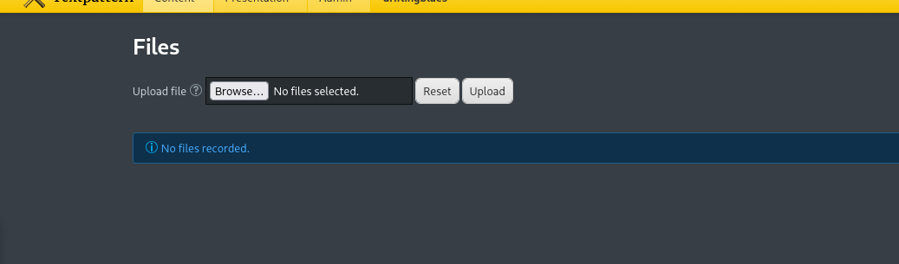

There were no validation checks in place, so the file was successfully uploaded.

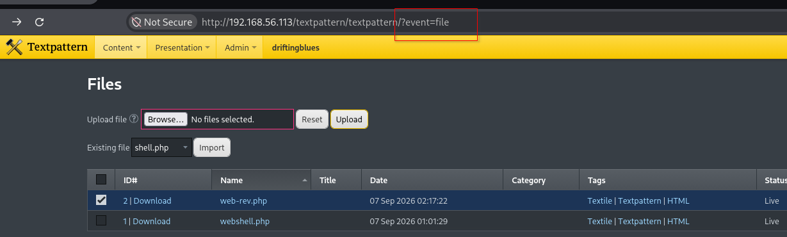

The uploaded file was saved in the Files directory.

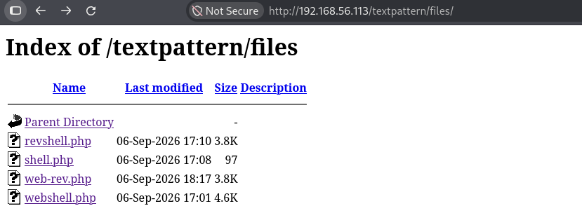

I caught the incoming shell using **Penelope**.

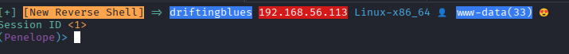

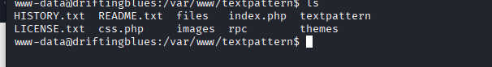

## Step 5: Enumeration

I had a shell as `www-data`.

```
www-data@driftingblues:/var/www/textpattern$ id
uid=33(www-data) gid=33(www-data) groups=33(www-data)
```

Since the `www-data` user doesn't have a home folder, I checked if there were any other users with bash access.

```
cat /etc/passwd | grep 'bash'
```

Only root had a bash shell.

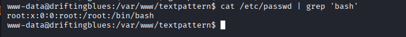

## Step 6: Privilege Escalation

I started by checking for sudo access.

```
www-data@driftingblues:/var/www/textpattern$ sudo
bash: sudo: command not found
```

Next, I checked the kernel version.

```
uname -a
```

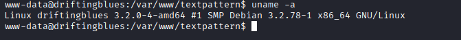

The kernel version was vulnerable to the DirtyCow exploit.

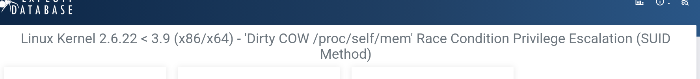

I downloaded the DirtyCow exploit code, compiled it, and ran it to gain root access.

```
gcc exploit.c -pthread
```

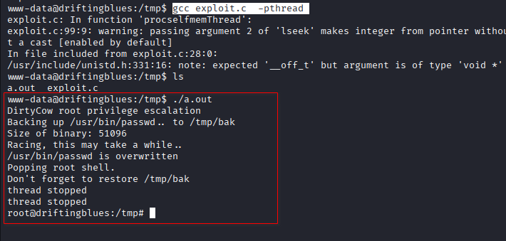

## Conclusion

This machine demonstrated a straightforward web application attack chain leading to full system compromise:

1. Directory bruteforcing with a `.zip` extension revealed a password-protected archive.
2. Cracking the ZIP password exposed CMS credentials.
3. Textpattern CMS allowed unrestricted file upload, enabling a reverse shell.
4. The vulnerable kernel version (DirtyCow) permitted privilege escalation to root.

To secure the environment, the following remediations are recommended:

- **Remove sensitive files from web-accessible directories** — ZIP archives containing credentials should never be placed on public web servers.
- **Implement file upload validation** — Restrict allowed file types and scan uploads for malicious content.
- **Update the kernel and system packages** — The DirtyCow vulnerability was patched in 2016; ensure all systems run current, supported versions.
- **Use principle of least privilege** — The web server should run with minimal permissions and have no access to sensitive files.
